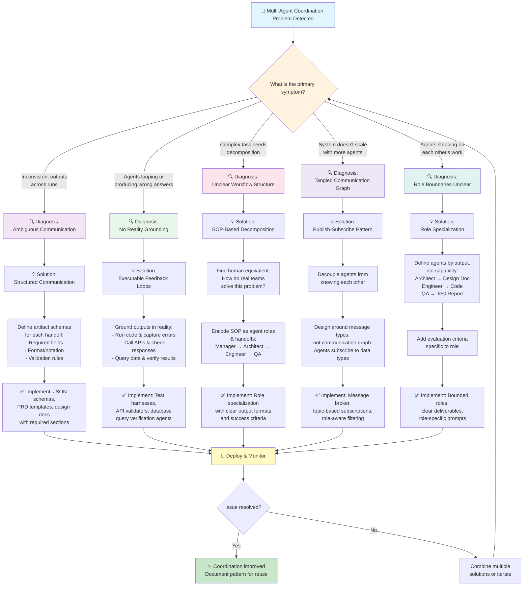

# Multi-Agent System Decision Tree

```mermaid
flowchart TD
    A["🎯 Multi-Agent Coordination Problem Detected"] --> B{What is the primary symptom?}
    
    B -->|Inconsistent outputs<br/>across runs| C["🔍 Diagnosis:<br/>Ambiguous Communication"]
    B -->|Agents looping or<br/>producing wrong answers| D["🔍 Diagnosis:<br/>No Reality Grounding"]
    B -->|Complex task needs<br/>decomposition| E["🔍 Diagnosis:<br/>Unclear Workflow Structure"]
    B -->|System doesn't scale<br/>with more agents| F["🔍 Diagnosis:<br/>Tangled Communication Graph"]
    B -->|Agents stepping on<br/>each other's work| G["🔍 Diagnosis:<br/>Role Boundaries Unclear"]
    
    C --> C1["💡 Solution:<br/>Structured Communication"]
    C1 --> C2["Define artifact schemas<br/>for each handoff:<br/>- Required fields<br/>- Format/notation<br/>- Validation rules"]
    C2 --> C3["✅ Implement: JSON schemas,<br/>PRD templates, design docs<br/>with required sections"]
    
    D --> D1["💡 Solution:<br/>Executable Feedback Loops"]
    D1 --> D2["Ground outputs in reality:<br/>- Run code & capture errors<br/>- Call APIs & check responses<br/>- Query data & verify results"]
    D2 --> D3["✅ Implement: Test harnesses,<br/>API validators, database<br/>query verification agents"]
    
    E --> E1["💡 Solution:<br/>SOP-Based Decomposition"]
    E1 --> E2["Find human equivalent:<br/>How do real teams<br/>solve this problem?"]
    E2 --> E3["Encode SOP as agent roles<br/>& handoffs:<br/>Manager → Architect → Engineer → QA"]
    E3 --> E4["✅ Implement: Role specialization<br/>with clear output formats<br/>and success criteria"]
    
    F --> F1["💡 Solution:<br/>Publish-Subscribe Pattern"]
    F1 --> F2["Decouple agents from<br/>knowing each other"]
    F2 --> F3["Design around message types,<br/>not communication graph:<br/>Agents subscribe to data types"]
    F3 --> F4["✅ Implement: Message broker,<br/>topic-based subscriptions,<br/>role-aware filtering"]
    
    G --> G1["💡 Solution:<br/>Role Specialization"]
    G1 --> G2["Define agents by output,<br/>not capability:<br/>Architect → Design Doc<br/>Engineer → Code<br/>QA → Test Report"]
    G2 --> G3["Add evaluation criteria<br/>specific to role"]
    G3 --> G4["✅ Implement: Bounded roles,<br/>clear deliverables,<br/>role-specific prompts"]
    
    C3 --> H["🚀 Deploy & Monitor"]
    D3 --> H
    E4 --> H
    F4 --> H
    G4 --> H
    
    H --> I{Issue resolved?}
    I -->|Yes| J["✨ Coordination improved<br/>Document pattern for reuse"]
    I -->|No| K["Combine multiple<br/>solutions or iterate"]
    K --> B

    style A fill:#e1f5ff
    style B fill:#fff3e0
    style C fill:#f3e5f5
    style D fill:#e8f5e9
    style E fill:#fce4ec
    style F fill:#ede7f6
    style G fill:#e0f2f1
    style H fill:#fff9c4
    style J fill:#c8e6c9
```
