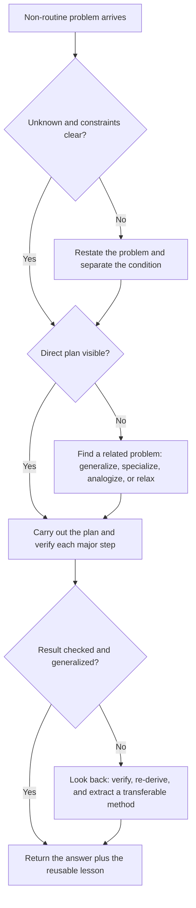

# How to Solve It

Use this skill when the main challenge is not raw execution, but figuring out what problem you are actually solving and what move unlocks it.

## When to Use

- The goal is clear enough to matter but not clear enough to act on safely.
- Repeated attempts keep failing in the same place, suggesting the process is wrong rather than the effort level.
- The problem looks too large, too vague, or too tangled to attack directly.
- You need a method for turning one solved problem into reusable judgment instead of a one-off result.
- The user needs an explicit reasoning path, not just a final answer.

## NOT for Boundaries

- Routine execution where the method is already known and the real work is just carrying it out.
- Safety-critical specialized domains where heuristics must defer to established protocols, laws, or professional judgment.
- Situations where the bottleneck is missing factual knowledge rather than unclear problem structure.
- Purely mechanical checklist enforcement where there is no meaningful planning or transfer question.

## Core Mental Models

### Start from the unknown

Before mobilizing data, identify what kind of answer is actually required. The unknown determines which prior patterns are worth retrieving.

### Hard problems are usually solved through a neighboring problem

If the direct route is blocked, look for a related problem you can solve by generalizing, specializing, analogizing, or dropping part of the condition.

### Heuristic reasoning is provisional, not fake

A plausible direction is not a proof, but it is often the only way forward before the structure is fully visible. Treat heuristics as scaffolding that must later be checked.

### Review is where expertise compounds

The "looking back" phase is not optional cleanup. It is where a solved problem becomes a reusable method.

## Decision Points

1. Have you stated the unknown, the givens, and the condition in your own words?
2. If direct attack has failed, which neighboring problem changes the structure enough to make progress visible?
3. Is the current step a heuristic probe or a validated argument, and are you labeling it honestly?
4. After solving, what part of the method generalizes beyond this case?

## Failure Modes

| Failure mode | What it looks like | Recovery move |
| --- | --- | --- |
| Skipping understanding | Work starts immediately, but later it becomes obvious the answer targets the wrong question | Rewrite the unknown, givens, and condition before making the next move |
| Treating data as the starting point | The solver drowns in facts without identifying what kind of answer is needed | Re-anchor the search around the unknown and similar prior problems |
| Confusing heuristic with proof | A promising guess gets reported as settled fact | Label the move as provisional and add an explicit verification pass |
| Skipping looking back | The task finishes, but no method, pattern, or diagnostic transfers to the next case | Ask what alternative derivation, check, or generalization should be stored before closing |

## Worked Examples

### Example: Debugging a migration that keeps failing

- Novice move: Retry the migration with slightly different commands until it stops failing.
- Expert move: Clarify the unknown first. Is the real question "how do I apply this migration" or "which invariant is violated by the schema transition"? Then solve a related smaller problem, such as reproducing the failure on one table or one constraint, before expanding back out.

### Example: Preparing a solution strategy for an unfamiliar math or coding problem

- Novice move: Start manipulating formulas or writing code immediately because "progress" feels safer than ambiguity.
- Expert move: Separate the condition, ask what kind of answer is needed, recall a familiar problem with the same shape of unknown, then carry forward only the parts of that old method that survive contact with the new constraints.

## Quality Gates

- The problem statement is paraphrased into unknown, givens, and conditions before substantive execution begins.
- At least one related problem or reduction strategy is named when the direct path is unclear.
- Heuristic steps are marked as provisional and followed by a real check.
- The final answer includes at least one transferable lesson, verification, or alternate framing from the review phase.
- Detailed examples and long-form explanation stay in `references/` instead of bloating the wrapper.

## References

Read [references/INDEX.md](references/INDEX.md) first.

- Use `polya-four-phase-problem-solving.md` when the whole process is muddled.
- Use `polya-look-at-the-unknown.md` when the team keeps starting from the data instead of the actual target.
- Use `polya-auxiliary-problems-and-stepping-stones.md` when the direct attack is stuck.
- Use `polya-looking-back-and-knowledge-compounding.md` when the goal is to preserve learning, not just finish once.

## Shibboleths

- Someone using Polya well talks about the type of unknown and the shape of related problems, not just "breaking it into steps."
- They can say exactly which move is heuristic and which move is demonstrative.
- They do not treat review as arithmetic checking; they use it to extract a reusable method.
