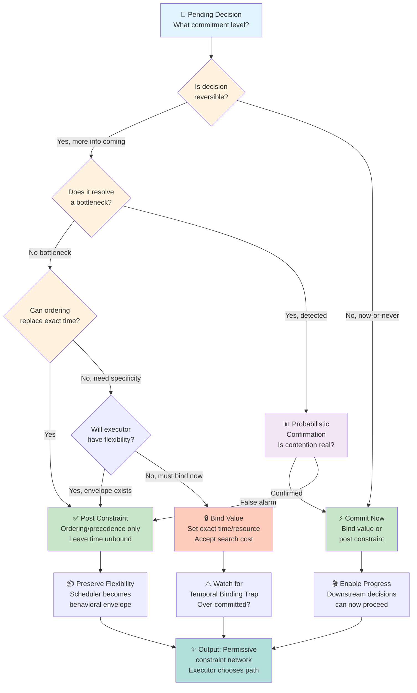

# Decision Framework: When to Commit to a Choice

```mermaid
graph TD
    A["🎯 Pending Decision<br/>What commitment level?"] --> B{Is decision<br/>reversible?}
    
    B -->|Yes, more info coming| C{Does it resolve<br/>a bottleneck?}
    B -->|No, now-or-never| D["⚡ Commit Now<br/>Bind value or<br/>post constraint"]
    
    C -->|No bottleneck| E{Can ordering<br/>replace exact time?}
    C -->|Yes, detected| F["📊 Probabilistic<br/>Confirmation<br/>Is contention real?"]
    
    E -->|Yes| G["✅ Post Constraint<br/>Ordering/precedence only<br/>Leave time unbound"]
    E -->|No, need specificity| H{Will executor<br/>have flexibility?}
    
    F -->|Confirmed| D
    F -->|False alarm| G
    
    H -->|Yes, envelope exists| G
    H -->|No, must bind now| I["🔒 Bind Value<br/>Set exact time/resource<br/>Accept search cost"]
    
    G --> J["📦 Preserve Flexibility<br/>Scheduler becomes<br/>behavioral envelope"]
    D --> K["🎬 Enable Progress<br/>Downstream decisions<br/>can now proceed"]
    I --> L["⚠️ Watch for<br/>Temporal Binding Trap<br/>Over-committed?"]
    
    J --> M["✨ Output: Permissive<br/>constraint network<br/>Executor chooses path"]
    K --> M
    L --> M

    style A fill:#e1f5ff
    style B fill:#fff3e0
    style C fill:#fff3e0
    style E fill:#fff3e0
    style F fill:#f3e5f5
    style D fill:#c8e6c9
    style G fill:#c8e6c9
    style I fill:#ffccbc
    style M fill:#b2dfdb
```
