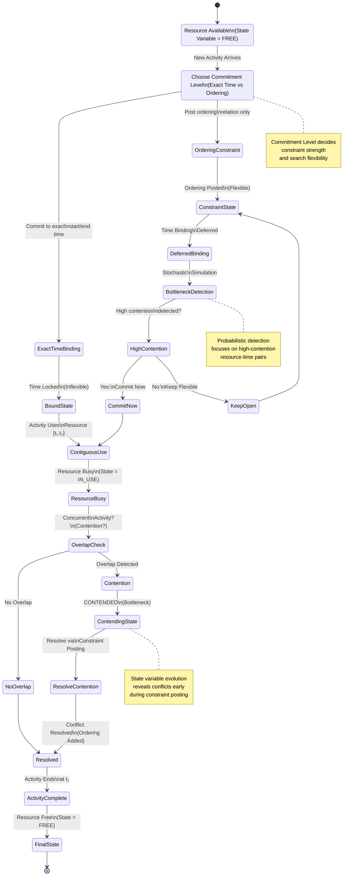

# State Variable Evolution and Resource Contention Over Time

```mermaid
stateDiagram-v2
    [*] --> InitialState
    
    InitialState: Resource Available\n(State Variable = FREE)
    
    InitialState --> CommitmentDecision: New Activity Arrives
    
    CommitmentDecision: Choose Commitment Level\n(Exact Time vs Ordering)
    
    CommitmentDecision --> ExactTimeBinding: Commit to exact\nstart/end time
    CommitmentDecision --> OrderingConstraint: Post ordering\nrelation only
    
    ExactTimeBinding --> BoundState: Time Locked\n(Inflexible)
    OrderingConstraint --> ConstraintState: Ordering Posted\n(Flexible)
    
    BoundState --> ContiguousUse: Activity Uses\nResource [t₁,t₂]
    ConstraintState --> DeferredBinding: Time Binding\nDeferred
    
    DeferredBinding --> BottleneckDetection: Stochastic\nSimulation
    
    BottleneckDetection --> HighContention: High contention\ndetected?
    
    HighContention --> CommitNow: Yes:\nCommit Now
    HighContention --> KeepOpen: No:\nKeep Flexible
    
    CommitNow --> ContiguousUse
    KeepOpen --> ConstraintState
    
    ContiguousUse --> ResourceBusy: Resource Busy\n(State = IN_USE)
    
    ResourceBusy --> OverlapCheck: Concurrent\nActivity?\n(Contention?)
    
    OverlapCheck --> NoOverlap: No Overlap
    OverlapCheck --> Contention: Overlap Detected
    
    Contention --> ContendingState: CONTENDED\n(Bottleneck)
    
    ContendingState --> ResolveContention: Resolve via\nConstraint Posting
    
    ResolveContention --> Resolved: Conflict Resolved\n(Ordering Added)
    
    NoOverlap --> Resolved
    
    Resolved --> ActivityComplete: Activity Ends\nat t₂
    
    ActivityComplete --> FinalState: Resource Free\n(State = FREE)
    
    FinalState --> [*]
    
    note right of CommitmentDecision
        Commitment Level decides
        constraint strength
        and search flexibility
    end note
    
    note right of BottleneckDetection
        Probabilistic detection
        focuses on high-contention
        resource-time pairs
    end note
    
    note right of ContendingState
        State variable evolution
        reveals conflicts early
        during constraint posting
    end note
```
