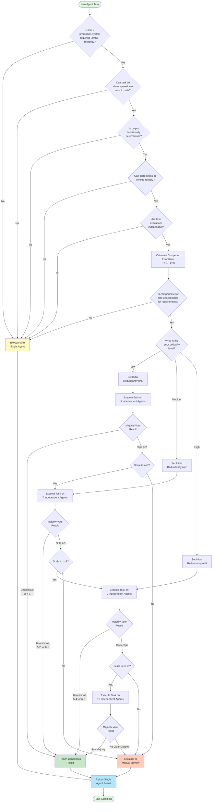

# Six Sigma Agent Decision & Execution Flow

```mermaid
flowchart TD
    Start([New Agent Task]) --> Q1{Is this a<br/>production system<br/>requiring 99.9%+<br/>reliability?}
    
    Q1 -->|No| SingleAgent["Execute with<br/>Single Agent"]
    Q1 -->|Yes| Q2{Can task be<br/>decomposed into<br/>atomic units?}
    
    Q2 -->|No| SingleAgent
    Q2 -->|Yes| Q3{Is output<br/>functionally<br/>deterministic?}
    
    Q3 -->|No| SingleAgent
    Q3 -->|Yes| Q4{Can correctness be<br/>verified reliably?}
    
    Q4 -->|No| SingleAgent
    Q4 -->|Yes| Q5{Are task<br/>executions<br/>independent?}
    
    Q5 -->|No| SingleAgent
    Q5 -->|Yes| CalcError["Calculate Compound<br/>Error Rate:<br/>P = 1 - p^m"]
    
    CalcError --> Q6{Is compound error<br/>rate unacceptable<br/>for requirements?}
    
    Q6 -->|No| SingleAgent
    Q6 -->|Yes| Q7{What is the<br/>error criticality<br/>level?}
    
    Q7 -->|Low| SetN5["Set Initial<br/>Redundancy n=5"]
    Q7 -->|Medium| SetN7["Set Initial<br/>Redundancy n=7"]
    Q7 -->|High| SetN9["Set Initial<br/>Redundancy n=9"]
    
    SetN5 --> Execute5["Execute Task on<br/>5 Independent Agents"]
    SetN7 --> Execute7["Execute Task on<br/>7 Independent Agents"]
    SetN9 --> Execute9["Execute Task on<br/>9 Independent Agents"]
    
    Execute5 --> Vote5{Majority Vote<br/>Result}
    Execute7 --> Vote7{Majority Vote<br/>Result}
    Execute9 --> Vote9{Majority Vote<br/>Result}
    
    Vote5 -->|Unanimous<br/>or 4-1| Success["Return Consensus<br/>Result"]
    Vote5 -->|Split 3-2| Q8{Scale to n=7?}
    
    Vote7 -->|Unanimous,<br/>5-2, or 6-1| Success
    Vote7 -->|Split 4-3| Q9{Scale to n=9?}
    
    Vote9 -->|Unanimous,<br/>5-4, or 6-3+| Success
    Vote9 -->|Close Split| Q10{Scale to n=13?}
    
    Q8 -->|Yes| Execute7
    Q8 -->|No| Escalate["Escalate to<br/>Manual Review"]
    
    Q9 -->|Yes| Execute9
    Q9 -->|No| Escalate
    
    Q10 -->|Yes| Execute13["Execute Task on<br/>13 Independent Agents"]
    Q10 -->|No| Escalate
    
    Execute13 --> Vote13{Majority Vote<br/>Result}
    Vote13 -->|Any Majority| Success
    Vote13 -->|No Clear Majority| Escalate
    
    SingleAgent --> Output["Return Single<br/>Agent Result"]
    Success --> Output
    Escalate --> Output
    Output --> End([Task Complete])
    
    style Start fill:#e1f5e1
    style End fill:#e1f5e1
    style Success fill:#c8e6c9
    style Escalate fill:#ffccbc
    style SingleAgent fill:#fff9c4
    style Output fill:#b3e5fc
```
