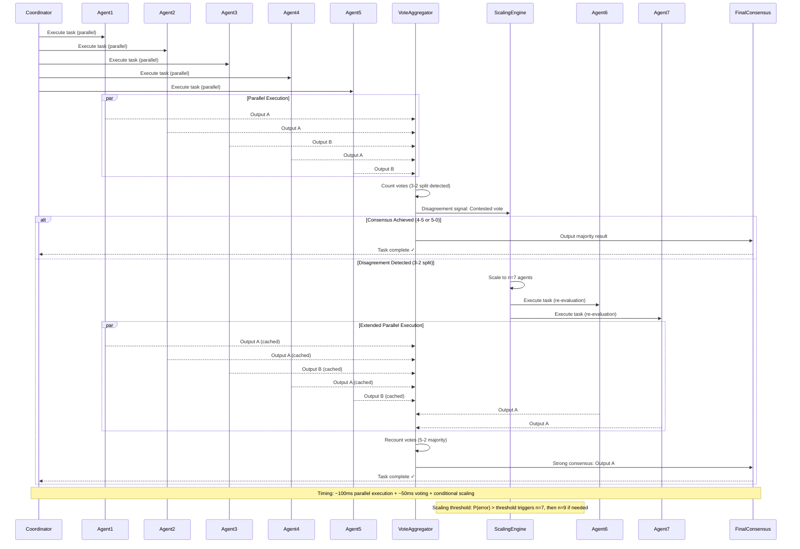

# Consensus Voting Execution Protocol with Dynamic Scaling

```mermaid
sequenceDiagram
    participant Coordinator
    participant Agent1
    participant Agent2
    participant Agent3
    participant Agent4
    participant Agent5
    participant VoteAggregator
    participant ScalingEngine
    participant Agent6
    participant Agent7
    participant FinalConsensus

    Coordinator->>Agent1: Execute task (parallel)
    Coordinator->>Agent2: Execute task (parallel)
    Coordinator->>Agent3: Execute task (parallel)
    Coordinator->>Agent4: Execute task (parallel)
    Coordinator->>Agent5: Execute task (parallel)

    par Parallel Execution
        Agent1-->>VoteAggregator: Output A
        Agent2-->>VoteAggregator: Output A
        Agent3-->>VoteAggregator: Output B
        Agent4-->>VoteAggregator: Output A
        Agent5-->>VoteAggregator: Output B
    end

    VoteAggregator->>VoteAggregator: Count votes (3-2 split detected)
    VoteAggregator->>ScalingEngine: Disagreement signal: Contested vote

    alt Consensus Achieved (4-5 or 5-0)
        VoteAggregator->>FinalConsensus: Output majority result
        FinalConsensus-->>Coordinator: Task complete ✓
    else Disagreement Detected (3-2 split)
        ScalingEngine->>ScalingEngine: Scale to n=7 agents
        ScalingEngine->>Agent6: Execute task (re-evaluation)
        ScalingEngine->>Agent7: Execute task (re-evaluation)

        par Extended Parallel Execution
            Agent1-->>VoteAggregator: Output A (cached)
            Agent2-->>VoteAggregator: Output A (cached)
            Agent3-->>VoteAggregator: Output B (cached)
            Agent4-->>VoteAggregator: Output A (cached)
            Agent5-->>VoteAggregator: Output B (cached)
            Agent6-->>VoteAggregator: Output A
            Agent7-->>VoteAggregator: Output A
        end

        VoteAggregator->>VoteAggregator: Recount votes (5-2 majority)
        VoteAggregator->>FinalConsensus: Strong consensus: Output A
        FinalConsensus-->>Coordinator: Task complete ✓
    end

    Note over Coordinator,FinalConsensus: Timing: ~100ms parallel execution + ~50ms voting + conditional scaling
    Note over ScalingEngine: Scaling threshold: P(error) > threshold triggers n=7, then n=9 if needed
```
