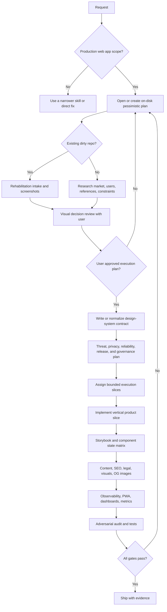

# Ideal Web App Builder

Build real web apps as product systems, not screenshots. Treat design, content,
frontend architecture, accessibility, performance, operations, and verification
as one contract.

## NOT for

- Throwaway prototypes where the user explicitly wants speed over quality.
- Backend-only services, native apps, or isolated bug fixes unrelated to the web
  app surface.
- Copying a fashionable UI kit without research, product fit, or token
  normalization.
- Producing placeholder content, fake testimonials, fake quotes, or generic
  marketing copy.

## Operating Rules

- Say plainly when the work needs multiple complete sessions, agents, or days.
  Do not compress a full product into a one-turn promise.
- For nontrivial builds, create a pessimistic plan on disk before broad edits.
  Start from `templates/pessimistic-plan.md`, then update the plan as the
  project changes.
- For dirty existing repos, run a rehabilitation intake before edits: preserve
  user work, inventory current state, capture screenshots, identify drift, and
  present a visual decision review for user approval.
- Do not execute large design, architecture, or cleanup decisions until the user
  has reviewed the visible plan: before screenshots, proposed direction,
  component/token map, route impacts, risks, and execution slices.
- If the repo uses Port Daddy, start with `pd status`, `pd briefing`, and a
  session. Leave notes, claim files, and use tuples or background agents when
  they make the work faster or safer.
- If the user authorized agent work and the environment supports it, run
  research and adversarial sidecars early: design archive, competitive map,
  implementation worker, accessibility/performance reviewer, and visual drift
  reviewer.
- Use many cheaper subagents for bounded execution after the visual decision
  review, not for unbounded taste or architecture calls. Each subagent gets a
  disjoint write set, model/budget ceiling, acceptance gate, and handoff.
- Research current standards before choosing libraries, design references,
  search strategy, pricing/content claims, legal pages, or observability setup.
- Treat security, privacy, reliability, release, analytics, i18n, and
  sustainability as product foundations. Do not add them as vague launch
  polish after the design is done.
- Do not ship without a verification pass. If a gate cannot run, document why
  and keep the risk visible.

## Core Process

## Required Contract

Before large implementation, produce these artifacts in the repo:

- Product brief: audience, primary jobs, conversion or workflow goals, platform,
  content model, legal/compliance context, and launch standard.
- Research memo: competitor map, visual archive, type and color rationale,
  chosen design-system family, and rejected alternatives.
- Design-system contract: token layers, typography roles, color roles, spacing,
  radii, elevation, motion, focus, density, breakpoints, and component state
  matrix.
- Component architecture: React hierarchy from base primitives to composites to
  page assemblies. Vanilla HTML appears only in base primitives.
- Verification matrix: tests, Storybook stories, a11y, mobile, performance,
  content, SEO, observability, PWA, and adversarial review.
- Trust and resilience packet: threat model, privacy/data map, auth/session
  model, dependency/supply-chain plan, reliability targets, backup/restore or
  data-recovery plan, incident path, and rollback strategy.
- Product truth packet: claims ledger, analytics event taxonomy, support path,
  pricing/billing truth when relevant, consent model, dark-pattern review,
  i18n/localization posture, sustainability posture, and AI-risk register when
  the app uses generative or agentic AI.
- Dirty-repo rehabilitation packet when applicable: git/worktree status,
  current architecture, dependency and test health, screenshots, drift map,
  preserve/replace decisions, migration sequence, rollback points, and
  user-approved visual decision board.

## Non-Negotiables

- Tailwind must have a three-layer token model: source tokens, semantic aliases,
  and component/application roles. Components use role tokens, not raw values.
- Color literals are forbidden in production components. Hex, RGB, HSL, and
  OKLCH values may exist only in isolated token-source files or generated
  platform files with provenance.
- Spacing and radius are integral systems. No arbitrary pixel drift unless the
  plan records a measured exception.
- Use Radix UI or Headless UI for custom interactive primitives. Hand-roll only
  base semantic HTML primitives.
- Every component has Storybook coverage for default, hover/focus-visible,
  active, disabled, loading, error, empty, selected, dark mode, and responsive
  states where applicable.
- Dark mode is first-class. High-contrast mode is required for apps with dense
  data, compliance, health, finance, education, or public-service surfaces.
- Typography must be deliberately chosen for the brand and domain. Use variable
  fonts and `font-optical-sizing: auto` when supported; if manual `opsz` is
  used, bind it to type roles and verify at normal and high-DPI screenshots.
- Motion must use Motion or Framer Motion only when it serves orientation,
  causality, or comprehension. Respect reduced motion.
- Server code is documented, typed, and tested. Route handlers, server actions,
  loaders, mutations, and scheduled jobs need explicit tests.
- Security is not optional: validate authorization boundaries, input/output
  handling, cookies/sessions, CSRF where applicable, dependency risk, secure
  headers, CSP feasibility, secrets handling, and abuse paths.
- Privacy is a design input: collect the minimum data, document each processor,
  separate essential from optional tracking, make consent reversible, and keep
  observability from capturing sensitive data.
- Reliability is product UX: define loading, failure, retry, offline or
  online-only behavior, stale data, backups, restore tests, migrations,
  rollback, and incident communication.
- Internationalization is considered before layout hardens: language metadata,
  locale formatting, text expansion, bidirectional text risk, time zones,
  currency, units, names, addresses, and culturally localizable imagery.
- Sustainability is a quality axis: avoid wasteful payloads, fonts, media,
  polling, hydration, and analytics. Prefer durable, measurable reductions over
  green claims.
- AI features need explicit controls for prompt injection, output validation,
  data leakage, excessive agency, overreliance, cost denial of service, and
  human escalation.
- Production folders do not contain non-design-system UI code. New surface code
  must compose from primitives, components, and page patterns.
- Legal, privacy, SEO, blog/editorial, diagrams, visuals, dashboards, metrics,
  Sentry or equivalent, favicons, and OG images are product scope when the app
  needs them, not polish to add later.

## Expert Cues

- If implementation starts before tokens, the app will drift.
- If a page looks good only with perfect fake data, the component is not done.
- If keyboard focus is hard to see in a screenshot, it will fail in real use.
- If mobile is checked only by resizing a desktop viewport, assume touch,
  viewport height, safe area, and text wrapping defects remain.
- If the plan has no pessimistic sequencing, it is hiding work.
- If all colors are one hue family, the system is underdesigned.
- If the blog, terms, privacy, or FAQ is thin, the site is not market-ready.
- If observability starts after launch, the first real user becomes the monitor.
- If security or privacy has no owner, the app has an unowned product risk.
- If analytics events are not named before launch, dashboards will become
  contradictory folklore.
- If release cannot roll back, every deploy is a live migration.

## Anti-Patterns

### Fake Design System

Novice: Define a few CSS variables after building pages.

Expert: Tokens are the build substrate. Generate components from the contract,
then audit production code for drift.

### Screenshot-First UI

Novice: Optimize the first viewport until it looks impressive.

Expert: Verify navigation, states, content fit, mobile, keyboard, loading,
empty, error, and data-dense cases before judging quality.

### Accessibility Theater

Novice: Add ARIA labels after custom controls are already written.

Expert: Start from semantic HTML, Radix, or Headless UI; test keyboard behavior,
focus, names, contrast, reduced motion, and screen-reader expectations.

### Content Stubs

Novice: Use lorem ipsum, fake quotes, generic promises, and an empty blog.

Expert: Research editorial angles, write complete pages, cite real sources, and
ship truthful content that would survive expert review.

### Optimistic Plan

Novice: Promise a complete premium app in one pass.

Expert: Plan pessimistically, split the work into verifiable slices, and keep
the plan updated until the final gate closes.

## References

- `references/INDEX.md`: Load first when choosing which deep reference to open.
- `references/design-system-contract.md`: Load before token, typography, color,
  primitive, Storybook, or component architecture work.
- `references/research-and-positioning.md`: Load before brand, design-family,
  competitive, TypeUI, or content-positioning decisions.
- `references/existing-repo-rehabilitation.md`: Load before touching a dirty
  existing website repo, normalizing drift, or proposing a repair sequence.
- `references/quality-gates.md`: Load before implementation review, test
  planning, CI, accessibility, performance, SEO, PWA, or observability gates.
- `references/security-privacy-reliability.md`: Load before auth, data,
  security headers, privacy, AI features, reliability, backup, or incident
  planning.
- `references/operations-and-release.md`: Load before analytics, dashboards,
  SLOs, release engineering, rollback, feature flags, environments, or runbooks.
- `references/product-truth-and-governance.md`: Load before claims, pricing,
  content governance, consent UX, support, changelog, admin, or product metrics.
- `references/sustainability-i18n-and-inclusion.md`: Load before locale,
  language, inclusive UX, sustainability, low-bandwidth, or low-power decisions.
- `references/agent-orchestration.md`: Load before using Port Daddy, background
  agents, research agents, adversarial agents, or multi-session planning.
- `references/content-and-seo.md`: Load before terms, privacy, blog, editorial,
  visual, diagram, metadata, favicon, or OG-image work.
- `templates/pessimistic-plan.md`: Copy into the target app before large work.
- `scripts/audit_web_app_contract.py`: Run against target apps to detect common
  design-system and production-readiness violations.
- `agents/adversarial-auditor.md`: Use when assigning an independent reviewer.

## Quality Gates

- On-disk plan exists and matches current scope.
- Dirty existing repos have an intake, screenshots, preserve/replace decisions,
  and visual decision review accepted by the user before large edits.
- Research memo and design contract exist before broad UI implementation.
- No raw visual literals or arbitrary Tailwind values in production components.
- Radix or Headless UI backs complex interactive components.
- Storybook exists and covers component states.
- Automated and manual a11y checks are recorded.
- Core Web Vitals targets are credible for mobile and desktop.
- Sentry or equivalent is configured with release, environment, source maps,
  privacy-aware replay/tracing policy, and a verified test event.
- Security, privacy, dependency, secure-header, and abuse-path checks are
  recorded, with OWASP/NIST/W3C sources versioned when used.
- Reliability, rollback, backup/restore, incident, analytics, and dashboard
  evidence exists for production apps.
- I18n, inclusive UX, and sustainability decisions are explicit; unsupported
  locales or low-bandwidth modes are recorded as intentional constraints.
- SEO metadata, canonical URLs, sitemap, robots, favicons, and per-page OG
  images are implemented where applicable.
- Terms, privacy, editorial content, visuals, diagrams, and references are real,
  complete, and appropriate to the market.
- `scripts/audit_web_app_contract.py <app-root>` has been run and reviewed.
