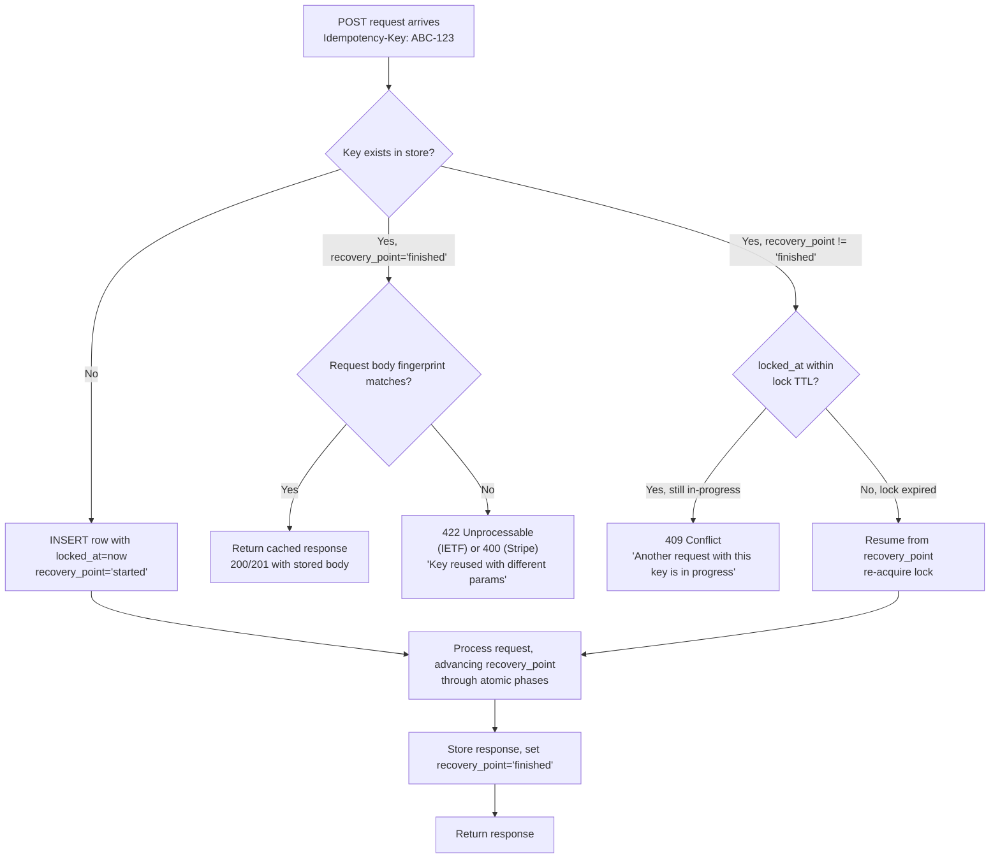

# Idempotency Key Patterns

> **TL;DR**: Client generates a unique key (UUID v4 recommended), sends it as `Idempotency-Key` header on a POST. Server stores `(key, request fingerprint, response, recovery_point)` for ~24h. Retries with the same key return the cached response. Same key + different body → 422 (IETF) / 400 (Stripe). Concurrent retry while original is in-flight → 409. Without the **fingerprint check** + **in-progress lock** + **recovery-point state machine**, you don't have idempotency — you have a cache that pretends to be one.

---

## Jump to your fire

| Symptom | Section |
|---|---|
| "Customer got double-charged on a network retry" | [The full pattern](#1-the-full-pattern-stripes-canonical-shape) |
| "Need a Postgres schema, not just a cache" | [Schema with recovery points](#3-the-canonical-postgres-schema-brandur-leach) |
| "Two retries hit at the same time — race condition" | [In-progress lock](#4-the-in-progress-lock-and-409-response) |
| "Worker crashed mid-request, key is stuck" | [Recovery points](#5-recovery-point-state-machine) |
| "What status code for key reuse?" | [Status codes](#2-status-codes-stripe-vs-ietf-draft) |

---

## Decision diagram



---

## 1. The full pattern: Stripe's canonical shape

From [Stripe: Designing robust APIs with idempotency](https://stripe.com/blog/idempotency):

> Clients [pass] a unique value in with the special `Idempotency-Key` header.

> On a response failure (i.e. the operation executed successfully, but the client couldn't get the result), the server simply replies with a cached result.

The full pattern has three ingredients that work together. Drop any one and you have a leak:

| Ingredient | What it prevents |
|---|---|
| **Key persistence** with response cache | Duplicate side effects on simple retry |
| **Fingerprint check** (request body hash) | Buggy clients reusing a key for a *different* request and getting the wrong cached response |
| **In-progress lock** with TTL | Two concurrent retries both executing the work |

A "key persistence + cache" without the other two is the most common shipped-broken implementation.

---

## 2. Status codes: Stripe vs IETF draft

There's a real divergence here.

**Stripe ([API reference](https://docs.stripe.com/api/idempotent_requests))**:
- Same key + different params → **HTTP 400** with: *"Keys for idempotent requests can only be used with the same parameters they were first used with..."*
- Concurrent retry while in-progress → **HTTP 409**: *"There is currently another in-progress request using this Idempotent Key..."*
- Max key length: **255 characters**
- Retention: **24 hours**

**IETF [draft-ietf-httpapi-idempotency-key-header](https://datatracker.ietf.org/doc/draft-ietf-httpapi-idempotency-key-header/)**:
- Same key + different payload → **HTTP 422 Unprocessable Content**
- Concurrent retry → **HTTP 409 Conflict**
- Missing key on documented idempotent endpoint → **HTTP 400 Bad Request**

The IETF draft says:

> The idempotency key MUST be unique and MUST NOT be reused with another request with a different request payload.

> It is RECOMMENDED that a UUID or a similar random identifier be used.

> Idempotency-Key is an Item Structured Header. Its value MUST be a String.

Pick one (Stripe's is the most-deployed; IETF's will become the standard) and document the choice in your API reference. **Don't invent a third.**

---

## 3. The canonical Postgres schema (Brandur Leach)

The de facto canonical implementation reference is [Brandur Leach (Stripe), "Implementing Stripe-like Idempotency Keys in Postgres"](https://brandur.org/idempotency-keys). The schema:

```sql
CREATE TABLE idempotency_keys (
  id              BIGSERIAL PRIMARY KEY,
  created_at      TIMESTAMPTZ NOT NULL DEFAULT now(),

  -- Per-tenant uniqueness
  user_id         BIGINT      NOT NULL,
  idempotency_key TEXT        NOT NULL CHECK (char_length(idempotency_key) <= 100),

  -- Lock + retention
  last_run_at     TIMESTAMPTZ NOT NULL DEFAULT NOW(),
  locked_at       TIMESTAMPTZ,    -- NULL = unlocked, set = in progress

  -- Fingerprint check inputs
  request_method  TEXT        NOT NULL CHECK (char_length(request_method) <= 10),
  request_path    TEXT        NOT NULL CHECK (char_length(request_path)   <= 100),
  request_params  JSONB       NOT NULL,

  -- Cached response
  response_code   INT,
  response_body   JSONB,

  -- Recovery point state machine
  recovery_point  TEXT        NOT NULL CHECK (char_length(recovery_point) <= 50)
);

CREATE UNIQUE INDEX idempotency_keys_user_id_idempotency_key
  ON idempotency_keys (user_id, idempotency_key);
```

Field semantics (verbatim from the post):

- `idempotency_key`: "the user-specified idempotency key... constrain the field's length so that nobody sends us anything too exotic." Uniqueness is **scoped per `(user_id, idempotency_key)`** so different tenants can't collide.
- `locked_at`: "indicates whether this idempotency key is actively being worked. The first API request that creates the key will lock it automatically, but subsequent retries will also set it to make sure that they're the only request doing the work."
- `request_params`: "stored mostly so that we can error if the user sends two requests with the same idempotency key but with different parameters." (The fingerprint check.)
- `recovery_point`: "a text label for the last phase completed for the idempotent request... Gets an initial value of `started` and is set to `finished` when the request is considered to be complete."

---

## 4. The in-progress lock and 409 response

Atomic phase 1 — upsert the key with a lock:

```sql
INSERT INTO idempotency_keys
  (user_id, idempotency_key, request_method, request_path, request_params,
   recovery_point, locked_at)
VALUES
  ($1, $2, $3, $4, $5, 'started', now())
ON CONFLICT (user_id, idempotency_key) DO UPDATE
  SET locked_at = now(),
      last_run_at = now()
  WHERE idempotency_keys.locked_at IS NULL  -- only re-lock if currently unlocked
     OR idempotency_keys.locked_at < now() - interval '90 seconds'  -- or stale
RETURNING *;
```

Three branches from the result:

| Result | Branch |
|---|---|
| Returned row, `recovery_point = 'finished'`, fingerprint matches | Return cached response |
| Returned row, `recovery_point = 'finished'`, fingerprint mismatch | Return 422/400 |
| Returned row, `recovery_point != 'finished'` (we got the lock) | Continue to phase 2 |
| **No row returned** (UPDATE filtered out: lock held by another live request) | Return **409 Conflict** |

The 90-second TTL on the stale-lock check covers crashed workers — they'll be re-acquired by the next retry. Tune to your worst-case request latency.

**Two layers of defense**: the unique index + the `locked_at` check. The index prevents two INSERTs racing on a fresh key. The `locked_at` check prevents two UPDATEs racing on an already-existing key.

---

## 5. Recovery point state machine

The hard problem: a worker crashes mid-request after charging the customer's card but before recording the order. A naive retry double-charges. A naive "reject all retries on partial state" loses the order.

Brandur's pattern: each foreign side effect commits its own atomic phase, advancing `recovery_point`:

```
started → ride_created → charge_created → finished
   ↑          ↑                ↑              ↑
   tx1        tx2: insert      tx3: charge    tx4: send email,
              local row        Stripe API      mark finished
                               + advance RP
```

Each phase:

1. Begins a DB transaction.
2. Performs at most **one** foreign side effect (or none).
3. Updates `recovery_point` to the next state.
4. Commits.

On retry, you read `recovery_point` and resume from there. Because each phase is atomic, you either did the side effect *and* advanced the marker, or did neither. No double-charges.

The post puts it concisely:

> Each foreign state mutation (charge Stripe, send email) gets its own phase. Each phase commits a new `recovery_point` so a crashed retry resumes mid-flow rather than restarting.

**The discipline**: at most one external side effect per atomic phase. Two side effects in one phase reintroduces the dual-write hazard.

---

## 6. Storage tradeoffs: Redis vs Postgres

A common mistake: using Redis as the *only* idempotency store. Redis is great for the in-progress lock (TTL'd lease, auto-expires on crash) but lossy for the response cache (eviction, persistence configs vary).

The pragmatic split:

| Layer | Backend | Why |
|---|---|---|
| In-progress lock | Redis with `SET key NX EX 90` | TTL'd, fast, auto-cleanup on crash |
| Durable record | Postgres (the schema above) | ACID, unique constraint as last-line defense |
| Response cache | Postgres `response_body` column | Read on retry within retention window |

Or just Postgres for everything (Brandur's choice) — simpler if your throughput allows it. Use Redis only when you have hard latency budgets that rule out a DB roundtrip on the hot path.

---

## 7. Retention and cleanup

24 hours is the canonical window (Stripe). Reasons it's not "forever":

- Storage cost grows unbounded
- Old keys with stale fingerprints are debugging hazards
- Audit history belongs in a separate `audit_records` table, not the idempotency table

A reaper job:

```sql
DELETE FROM idempotency_keys
WHERE created_at < now() - interval '24 hours';
```

If your domain table references `idempotency_keys.id` (e.g., `orders.idempotency_key_id`), use `ON DELETE SET NULL` so the reaper doesn't cascade-delete real records.

---

## Anti-patterns

| Anti-pattern | Why it bites | Fix |
|---|---|---|
| Server generates the key | Defeats the purpose — can't survive a network retry | Client generates UUID v4 *before* the request |
| No fingerprint check | Buggy client reuses key with different body → returns wrong response | Always check `request_params` matches; 422/400 if not |
| In-progress lock with no TTL | Crashed worker → key stuck "in progress" forever | TTL on the lock (Redis EX, or `locked_at < cutoff` check) |
| One atomic phase containing 2+ external side effects | Crash between them → re-execute on retry → double-charge | One side effect per phase; advance `recovery_point` between them |
| PII as the key (email, phone) | Logs leak; legitimately different requests collide | Random opaque UUID |
| Retention < 1 hour | Mobile clients on flaky networks can't retry | 24h is the floor; tune up for offline-first apps |
| Permanent retention as audit log | Conflates two concerns; fingerprint hashes outlive their utility | Separate `audit_records` table for compliance/audit |
| Treating GET/PUT/DELETE as needing idempotency keys | They're already idempotent per HTTP semantics | Only POST and other unsafe mutators benefit |
| Returning the cached response without checking the *user* matches | One tenant's key collides with another's; data leak | Scope uniqueness per `(user_id, key)` |

---

## Novice / Expert / Timeline

| | Novice | Expert |
|---|---|---|
| **First "idempotent endpoint"** | Stores key + response in a hash | Schema with fingerprint + recovery_point + per-tenant scope |
| **On concurrent retry** | Both run, double-side-effect | 409 from in-progress lock; second retry waits for first to finish |
| **On worker crash mid-request** | Permanently stuck in-progress | Stale lock detection; resume from recovery_point |
| **On client bug reusing key** | Returns stale response | 422/400 with explicit error |
| **Storage** | Redis-only (loses keys on eviction) | Postgres-durable + Redis-fast-lock |
| **Cleanup** | None — table grows forever | 24h reaper, audit table separate |

**Timeline test**: simulate a network partition during a payment request. An expert system either succeeds exactly once or returns a clean retryable error. A novice system charges the customer twice — and the postmortem reveals there was no fingerprint check.

---

## Quality gates

An idempotency implementation ships when:

- [ ] **Test:** Same key + same body twice → both responses identical (the second is the cache hit). Verified with integration test.
- [ ] **Test:** Same key + different body → 422 (or 400, per chosen flavor). Integration test for the fingerprint mismatch case.
- [ ] **Test:** Two concurrent requests with the same key → exactly one succeeds, the other gets 409. Verified with a controlled race (e.g., `pg_advisory_lock` to gate the second).
- [ ] **Test:** Worker killed mid-phase → next retry resumes from the correct recovery point and does not re-execute the prior phase's side effect. Manual fault-injection test.
- [ ] **Test:** Unique index on `(user_id, idempotency_key)` exists; verified by EXPLAIN of the upsert.
- [ ] **Test:** Reaper job actually runs and respects retention window.
- [ ] **Test:** Naturally idempotent methods (GET, PUT, DELETE) do **not** require the header — verified by hitting them without one.
- [ ] **Manual:** API docs document the chosen status codes (Stripe 400 or IETF 422) and the retention window.

---

## NOT for this skill

- Distributed transactions / sagas (use `sagas-garcia-molina-salem-1987` or `cqrs-event-sourcing-architect`)
- Event-stream exactly-once delivery (use `kafka-eos-design`)
- Database-side idempotency (use unique constraints; not the same problem)
- Webhook delivery deduplication (related but inverse direction — use `webhook-receiver-design`)
- Outbox pattern for event publication (use `outbox-pattern-implementation`)
- General retry/backoff strategy (use `circuit-breaker-and-retries`)

---

## Sources

- Stripe: [Designing robust APIs with idempotency](https://stripe.com/blog/idempotency) — original conceptual blog post, `Idempotency-Key` header
- Stripe: [API reference — Idempotent requests](https://docs.stripe.com/api/idempotent_requests) — 255-char limit, 24h retention, status codes
- IETF: [draft-ietf-httpapi-idempotency-key-header](https://datatracker.ietf.org/doc/draft-ietf-httpapi-idempotency-key-header/) — Item Structured Header, MUST/SHOULD requirements, 409/422 codes
- Brandur Leach (Stripe engineer): [Implementing Stripe-like Idempotency Keys in Postgres](https://brandur.org/idempotency-keys) — full schema + recovery-point state machine
- Luca Palmieri: [An In-Depth Introduction To Idempotency](https://lpalmieri.com/posts/idempotency/) — Rust/Postgres implementation, concurrency edge cases
