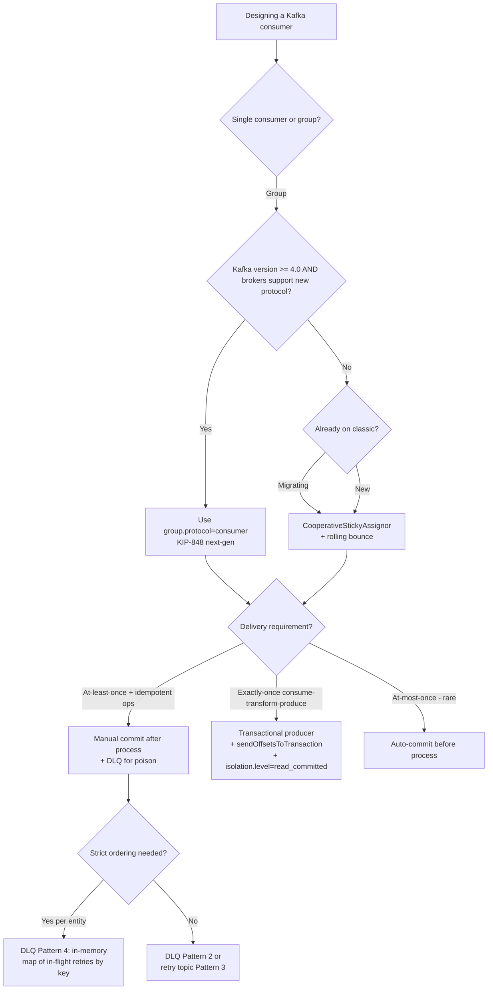

# Kafka Consumer Group Design

A Kafka consumer group is a coordination protocol, not a load balancer. Picking the wrong assignment strategy or heartbeat tuning produces "rebalance storms" that pause the entire group for tens of seconds. Picking the wrong commit pattern produces silent data loss or silent duplicates. This skill encodes the protocol-level rules and the version-specific gotchas — including the 2024-GA KIP-848 next-gen rebalance protocol that replaces the global synchronization barrier.

## When to use this skill



## Rebalance Protocols — the version-tiered reality

Three protocols co-exist in deployed clusters. Pick deliberately.

### Eager (pre-2.4 default, still used by RoundRobin/Range)

Two-phase: every member revokes ALL partitions before sending JoinGroup. The whole group is idle for the rebalance duration.

> "the _eager rebalancing protocol_ was born: each member is required to revoke all of its owned partitions before sending a JoinGroup request and participating in a rebalance. As a result, the protocol enforces a _synchronization barrier_..." ([Confluent: Cooperative Rebalancing](https://www.confluent.io/blog/cooperative-rebalancing-in-kafka-streams-consumer-ksqldb/))

> Drawbacks: "(1) No member of the group can do any work for the duration of the rebalance. (2) The rebalance duration scales with partition count, as each member has to revoke and then resume every partition in its assignment."

**State machine**: `STABLE → PREPARING_REBALANCE → all revoke ALL → JoinGroup (leader picked) → SyncGroup (leader distributes) → STABLE`.

### Cooperative (Kafka 2.4+, opt-in via CooperativeStickyAssignor)

Members keep their owned partitions across the rebalance, revoking only the diff. Two rebalances per change, but the second one only touches transferring partitions.

> "Just as before, all members must start by sending a JoinGroup request. But this time, everyone gets to hold onto all of their owned partitions. Instead of revoking them, each consumer just encodes them in their subscription and sends it to the group coordinator." (Confluent, op. cit.)

**Benchmark**: 10-instance Streams app, rolling bounce: eager protocol = 37,138ms total pause; cooperative = 3,522ms — a **10× reduction**.

**RoundRobin is incompatible**: *"The assignment produced by the round robin assignor changes every time the group membership or topic metadata changes. It makes no attempt to be sticky... If the new assignment is entirely different than the previous one, then the incremental change is the entire assignment. You would just end up back at the eager protocol where you started, but with more rebalances."*

### Next-Gen (KIP-848, Kafka 4.0+ GA)

Server-side assignor + heartbeat-driven reconciliation. No client-coordinated SyncGroup. No global synchronization barrier — *"fully incremental design."*

> "Starting from Apache Kafka 4.0, the Next Generation of the Consumer Rebalance Protocol (KIP-848) is Generally Available (GA). It improves the scalability of consumer groups while simplifying consumers. It also decreases rebalance times, thanks to its fully incremental design, which no longer relies on a global synchronization barrier." ([Apache Kafka 4.2 docs](https://kafka.apache.org/42/operations/consumer-rebalance-protocol/))

Activate with `group.protocol=consumer`. When enabled, these classic configs are **disabled**: `heartbeat.interval.ms`, `session.timeout.ms`, `partition.assignment.strategy`, `enforceRebalance()`. Server-side controls take over via `group.consumer.heartbeat.interval.ms`, `group.consumer.session.timeout.ms`, `group.consumer.assignors` (default `uniform, range`).

**Limitations as of 4.0**: client-side assignors not supported (KAFKA-18327); rack-aware not fully supported (KAFKA-17747). Don't migrate yet if you depend on those.

## Assignment Strategy Cheat Sheet

| Strategy | Stickiness | Cooperative? | Best for |
|---|---|---|---|
| `RangeAssignor` (default) | Per-topic ranges | Eager | Co-partitioned joins (same key in two topics → same consumer) |
| `RoundRobinAssignor` | None | Eager | Even distribution when topics aren't co-partitioned |
| `StickyAssignor` | Maximally sticky | Eager | Reduce churn but stuck on synchronization barrier |
| `CooperativeStickyAssignor` | Maximally sticky | **Cooperative** | **Default choice for Classic protocol** |
| `uniform` (server-side, KIP-848) | Sticky + balanced | Incremental | New deployments on Kafka 4.0+ |

Default in Apache Kafka 4.2 client: `[RangeAssignor, CooperativeStickyAssignor]` — *"will use the RangeAssignor by default, but allows upgrading to the CooperativeStickyAssignor with just a single rolling bounce that removes the RangeAssignor from the list."*

## Heartbeat & Liveness — the three timeouts that all matter

> Source: [Apache Kafka 4.2 Consumer Configs](https://kafka.apache.org/42/configuration/consumer-configs/)

- **`heartbeat.interval.ms`** (default 3000) — *"should be set lower than `session.timeout.ms`, but typically should be set no higher than 1/3 of that value."*
- **`session.timeout.ms`** — *"If no heartbeats are received by the broker before the expiration of this session timeout, then the broker will remove this client from the group..."* Bounded by broker `group.min.session.timeout.ms` / `group.max.session.timeout.ms`.
- **`max.poll.interval.ms`** (default 300000 = 5 min) — *"The maximum delay between invocations of poll()... If poll() is not called before expiration of this timeout, then the consumer is considered failed and the group will rebalance."*
- **`max.poll.records`** (default 500) — caps records per poll; too high → process loop exceeds `max.poll.interval.ms` → rebalance storm.

**Six rebalance triggers** (synthesized from protocol docs):

1. Member sends `LeaveGroup` (graceful shutdown).
2. Member fails to heartbeat within `session.timeout.ms`.
3. Member fails to call `poll()` within `max.poll.interval.ms`.
4. New member joins.
5. Topic metadata changes (partition count change or pattern subscription matches new topic).
6. `enforceRebalance()` (Classic only).

## Delivery Semantics — three commit patterns

> Source: [Apache Kafka 4.2 Design — Message Delivery Semantics](https://kafka.apache.org/42/design/design/#message-delivery-semantics)

### At-most-once: read → save offset → process

Risk: process crashes after offset save, before processing → message lost.

> "if the consumer process crashes after saving its position but before saving the output of its message processing... the process that took over... would start at the saved position even though a few messages prior to that position had not been processed."

Use only when losing data is acceptable (metrics, logs).

### At-least-once: read → process → save offset (the standard)

Risk: process crashes after processing, before offset save → next consumer reprocesses.

> "In many cases messages have a primary key and so the updates are idempotent."

Pattern:

```java
consumer.subscribe(List.of("orders"), new ConsumerRebalanceListener() {
  public void onPartitionsRevoked(Collection<TopicPartition> parts) {
    // commit before partitions are reassigned
    consumer.commitSync(currentOffsets());
  }
  public void onPartitionsAssigned(Collection<TopicPartition> parts) {}
});

while (running) {
  var records = consumer.poll(Duration.ofSeconds(1));
  for (var record : records) {
    process(record);          // MUST be idempotent
  }
  consumer.commitSync();      // commit AFTER successful processing
}
```

Set `enable.auto.commit=false`. Pair with `idempotency-key-patterns`.

### Exactly-once: consume-transform-produce inside Kafka

> "The consumer's position is stored as a message in an internal topic, so we can write the offset to Kafka in the same transaction as the output topics receiving the processed data. If the transaction is aborted, the consumer's stored position will revert to its old value."

Three building blocks (all needed):

1. **Idempotent producer** (since 0.11.0): `enable.idempotence=true` → broker dedups by `(producerId, sequenceNumber)`.
2. **Transactional producer** (since 0.11.0): set `transactional.id`. Calls become `beginTransaction → produce → sendOffsetsToTransaction(consumer.groupMetadata()) → commitTransaction`.
3. **Read-committed consumer**: `isolation.level=read_committed` → poll only returns committed messages, up to the Last Stable Offset (LSO).

For Kafka Streams, set `processing.guarantee=exactly_once_v2`.

**EOS does not extend across systems.** If you write to Kafka AND to an external DB, you need the outbox pattern, not transactions.

## Failure Modes (Anti-Patterns)

### Rebalance storm from `max.poll.interval.ms` too low

- **Detection**: rebalances every 5–10 minutes during normal traffic; logs show `Member ... failed to call poll() within ...`.
- **Symptom**: Throughput halves. Lag climbs in sawtooth pattern.
- **Novice**: "Make `session.timeout.ms` higher!" — wrong knob; the problem is the poll loop, not the heartbeat thread (heartbeats are sent in the background since 0.10.1).
- **Expert**: Lower `max.poll.records` so the processing loop finishes well within `max.poll.interval.ms`. Or move slow work to a downstream worker pool, polling continues at the consumer thread.
- **Timeline**: Pre-0.10.1 heartbeats came from the poll loop, so `session.timeout.ms` was the only knob. Post-0.10.1, `max.poll.interval.ms` was added precisely to separate liveness (heartbeat) from progress (poll cadence). Tuning advice from before that split is misleading.
- **Fix**: Reduce `max.poll.records`. If processing must batch, raise `max.poll.interval.ms` to cover the worst-case batch.

### `enable.auto.commit=true` with non-idempotent processing

- **Detection**: `enable.auto.commit=true` (default!), processing writes to a non-idempotent sink (counter increment, email send).
- **Symptom**: Duplicates on restart. Auto-commit fires every 5 seconds (`auto.commit.interval.ms` default), so up to 5s of work is reprocessed after a crash.
- **Novice**: "Auto-commit is fine, it's the default."
- **Expert**: Auto-commit is read-then-process-OR-process-then-read depending on poll timing — semantically nondeterministic. Always set `enable.auto.commit=false` and commit after processing for at-least-once, or use transactions for exactly-once.
- **Fix**: `enable.auto.commit=false` + manual `commitSync()`.

### RoundRobinAssignor with cooperative protocol

- **Detection**: `partition.assignment.strategy=RoundRobinAssignor,CooperativeStickyAssignor`.
- **Symptom**: Rebalance times don't improve after migration. RR-assigned re-shuffles look like full eager rebalances.
- **Expert quote**: "If the new assignment is entirely different than the previous one, then the incremental change is the entire assignment."
- **Fix**: RoundRobin is incompatible with cooperative. Use `CooperativeStickyAssignor` alone, or `RangeAssignor` if you need range-style co-partitioning.

### Stop-on-poison-message

- **Detection**: A single bad message blocks the entire partition; lag climbs forever; oncall is paged at 3am.
- **Symptom**: One offset, infinite retries, no progress.
- **Novice**: "We'll retry forever, eventually it'll work."
- **Expert**: A poison message in a high-volume topic kills throughput. Move it aside (DLQ) and continue.
- **Fix**: Adopt one of the four DLQ patterns below depending on ordering needs.

### Mismatched `transactional.id` per instance

- **Detection**: Multiple consumer instances configured with the same `transactional.id` (or all dynamically generated as `"app-tx"`).
- **Symptom**: One instance fences the others; transactions abort with `ProducerFenced`. Or worse: collisions cause silent state corruption.
- **Expert**: `transactional.id` must be **stable per logical processor instance** — not random, not shared. Tie it to a partition assignment or a stable identity (hostname + ordinal).
- **Fix**: Generate `transactional.id` deterministically from instance identity. For Kafka Streams, this is automatic via `application.id + task-id`.

## DLQ Patterns — pick by ordering requirement

Source: [Confluent: Error Handling Patterns in Kafka](https://www.confluent.io/blog/error-handling-patterns-in-kafka/) (Villeda 2021).

| Pattern | Ordering | When |
|---|---|---|
| **1. Stop on error** | Strict | CDC, financial ledgers — manual intervention required |
| **2. Dead-letter queue** | None preserved | Most apps; route bad events to error topic, main flow continues |
| **3. Retry topic** | Per-event, not per-source | Transient errors (downstream timeout); delays via consumer scheduling |
| **4. Maintain order of redirected events** | Per-entity | When event #2 for entity X must NOT be processed if event #1 went to retry |

### Pattern 4 — the subtle one

When events for the same entity must be ordered even across DLQ:

- Main app keeps an in-memory `Map<entityKey, retryStatus>` of in-flight retries.
- Any subsequent event for an entity already in the map gets routed to the retry path (preserves order).
- Retry app emits a tombstone to a `redirect` topic on success; main app removes the entry.
- **Recovery on restart**: replay the `redirect` topic to rebuild the in-memory map. *"the in-memory store... will be gone. However, this can easily be restored by reading the events in the redirect topic and initializing that in-memory store."*

## Worked Example — at-least-once + DLQ + cooperative rebalance

```java
Properties props = new Properties();
props.put("bootstrap.servers", brokers);
props.put("group.id", "order-processor");
props.put("enable.auto.commit", "false");                    // manual commit
props.put("isolation.level", "read_committed");              // skip aborted txns
props.put("partition.assignment.strategy",
          "org.apache.kafka.clients.consumer.CooperativeStickyAssignor");
props.put("max.poll.records", "100");                        // bound the loop
props.put("max.poll.interval.ms", "120000");                 // 2 min headroom

KafkaConsumer<String, Order> consumer = new KafkaConsumer<>(props);
KafkaProducer<String, Order> dlqProducer = new KafkaProducer<>(dlqProps);

consumer.subscribe(List.of("orders"));

while (running) {
  var records = consumer.poll(Duration.ofSeconds(1));
  for (var record : records) {
    try {
      processIdempotently(record.value());                   // idempotent sink
    } catch (PoisonMessageException e) {
      dlqProducer.send(new ProducerRecord<>(
        "orders.dlq", record.key(), record.value()));        // park the bad one
      log.warn("Sent to DLQ: offset={}, key={}", record.offset(), record.key());
    }
    // Other exceptions: rethrow → no commit → reprocess on next poll
  }
  consumer.commitSync();                                     // after successful batch
}
```

What this gives you:

- At-least-once delivery (idempotent processing handles duplicates).
- Cooperative rebalance — restart of one instance pauses only that instance's partitions, not the whole group.
- Poison messages parked in `orders.dlq` instead of stalling the topic.
- Bounded poll loop (`max.poll.records=100`, 2-min interval) → no rebalance storm.

## Quality Gates

- [ ] `enable.auto.commit=false` (or transactions are used) — auto-commit is never the right default
- [ ] `partition.assignment.strategy` includes `CooperativeStickyAssignor` for Classic protocol, OR `group.protocol=consumer` for KIP-848
- [ ] `max.poll.records` × per-record processing time < `max.poll.interval.ms`, with 50%+ headroom
- [ ] Processing logic is idempotent (paired with `idempotency-key-patterns`) OR exactly-once transactions are configured
- [ ] DLQ topic exists with explicit retention policy; alerts fire on DLQ lag > 0
- [ ] `transactional.id` (if used) is deterministic per instance, not random or shared
- [ ] Rebalance listener commits offsets in `onPartitionsRevoked` to avoid replay churn
- [ ] Migration from RoundRobin to Cooperative was done as a documented two-step rolling bounce
- [ ] Consumer group lag is monitored per-partition (not just aggregate) — single hot partitions hide in averages

## NOT-FOR Boundaries

This skill should NOT be used for:

- **Broker / cluster operations** (partition reassignment, ISR tuning, ZooKeeper-to-KRaft migration) → use a `kafka-cluster-ops` skill
- **Schema design** (Avro, Protobuf, Schema Registry, schema evolution) → use a `schema-registry` skill
- **Stream processing topology** (KStream/KTable/joins/windowing) → use a `kafka-streams` skill
- **Producer-side reliability** (acks, idempotence math, batch sizing) → use a `kafka-producer` skill
- **Cross-system exactly-once** (Kafka → Postgres) → use `outbox-pattern-implementation`

## Sources

1. [Apache Kafka 4.2: Consumer Rebalance Protocol](https://kafka.apache.org/42/operations/consumer-rebalance-protocol/) — KIP-848 next-gen GA documentation
2. [Apache Kafka 4.2: Design — Message Delivery Semantics](https://kafka.apache.org/42/design/design/#message-delivery-semantics) — at-most-/at-least-/exactly-once formal definitions
3. [Apache Kafka 4.2: Consumer Configs](https://kafka.apache.org/42/configuration/consumer-configs/) — `heartbeat.interval.ms`, `session.timeout.ms`, `max.poll.interval.ms` reference
4. [Confluent: Cooperative Rebalancing in the Kafka Consumer, Streams & ksqlDB](https://www.confluent.io/blog/cooperative-rebalancing-in-kafka-streams-consumer-ksqldb/) — Sophie Blee-Goldman, 2020; the canonical eager-vs-cooperative explainer with 10× benchmark
5. [Confluent: Error Handling Patterns in Kafka](https://www.confluent.io/blog/error-handling-patterns-in-kafka/) — Gerardo Villeda, 2021; the four DLQ patterns
6. [KIP-848: Next Generation of the Consumer Rebalance Protocol](https://cwiki.apache.org/confluence/x/HhD1D) — design proposal, server-side assignor rationale
7. [Confluent: Incremental Cooperative Rebalancing in Kafka](https://www.confluent.io/blog/incremental-cooperative-rebalancing-in-kafka) — Connect-side companion to the consumer story
