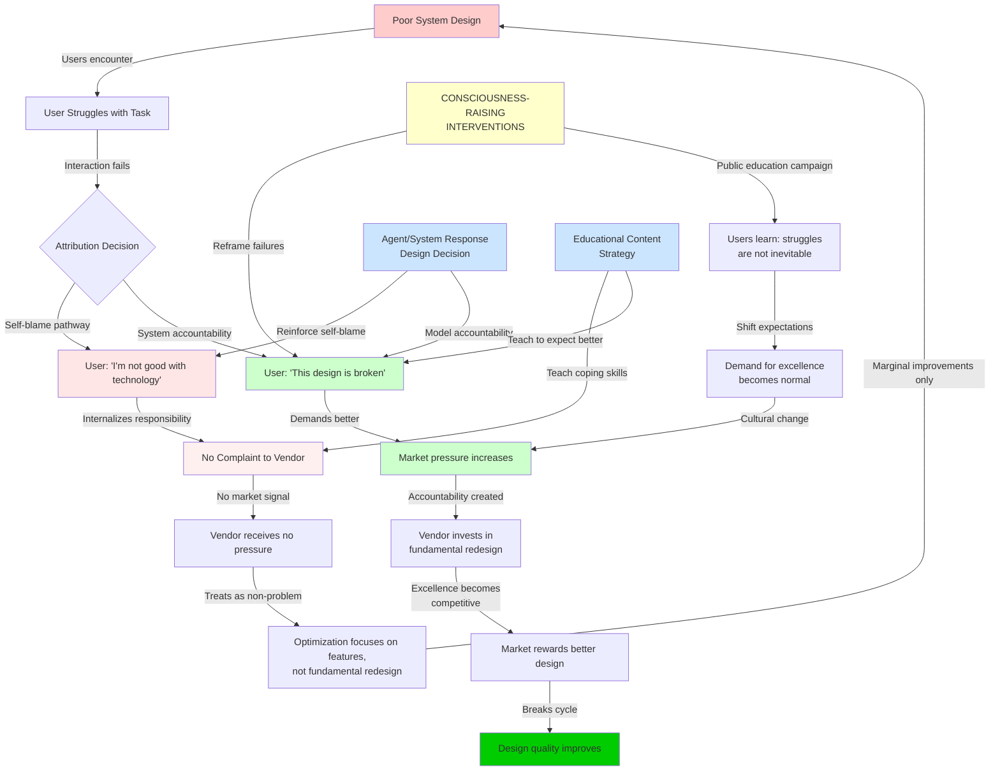

# The Internalized Blame Cycle & Intervention Points

```mermaid
flowchart TD
    A["Poor System Design"] -->|Users encounter| B["User Struggles with Task"]
    B -->|Interaction fails| C{Attribution Decision}
    C -->|Self-blame pathway| D["User: 'I'm not good with technology'"]
    C -->|System accountability| E["User: 'This design is broken'"]
    
    D -->|Internalizes responsibility| F["No Complaint to Vendor"]
    F -->|No market signal| G["Vendor receives no pressure"]
    G -->|Treats as non-problem| H["Optimization focuses on features,<br/>not fundamental redesign"]
    H -->|Marginal improvements only| A
    
    E -->|Demands better| I["Market pressure increases"]
    I -->|Accountability created| J["Vendor invests in<br/>fundamental redesign"]
    J -->|Excellence becomes<br/>competitive| K["Market rewards better design"]
    K -->|Breaks cycle| L["Design quality improves"]
    
    M["CONSCIOUSNESS-RAISING<br/>INTERVENTIONS"] -->|Reframe failures| E
    M -->|Public education campaign| N["Users learn: struggles<br/>are not inevitable"]
    N -->|Shift expectations| O["Demand for excellence<br/>becomes normal"]
    O -->|Cultural change| I
    
    P["Agent/System Response<br/>Design Decision"] -->|Reinforce self-blame| D
    P -->|Model accountability| E
    
    Q["Educational Content<br/>Strategy"] -->|Teach coping skills| F
    Q -->|Teach to expect better| E
    
    style A fill:#ffcccc
    style D fill:#ffe6e6
    style F fill:#fff0f0
    style E fill:#ccffcc
    style I fill:#ccffcc
    style L fill:#00cc00
    style M fill:#ffffcc
    style P fill:#cce5ff
    style Q fill:#cce5ff
```
