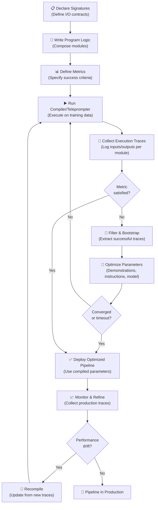

# DSPy Pipeline Compilation Flow

```mermaid
flowchart TD
    A["📋 Declare Signatures<br/>(Define I/O contracts)"] --> B["🔧 Write Program Logic<br/>(Compose modules)"]
    B --> C["📊 Define Metrics<br/>(Specify success criteria)"]
    C --> D["▶️ Run Compiler/Teleprompter<br/>(Execute on training data)"]
    D --> E["📝 Collect Execution Traces<br/>(Log inputs/outputs per module)"]
    E --> F{Metric<br/>satisfied?}
    F -->|No| G["🔄 Filter & Bootstrap<br/>(Extract successful traces)"]
    G --> H["🎯 Optimize Parameters<br/>(Demonstrations, instructions, model)"]
    H --> I{Converged<br/>or timeout?}
    I -->|No| D
    I -->|Yes| J["✅ Deploy Optimized Pipeline<br/>(Use compiled parameters)"]
    F -->|Yes| J
    J --> K["📈 Monitor & Refine<br/>(Collect production traces)"]
    K --> L{Performance<br/>drift?}
    L -->|Yes| M["🔁 Recompile<br/>(Update from new traces)"]
    M --> D
    L -->|No| N["🎉 Pipeline in Production"]
```
