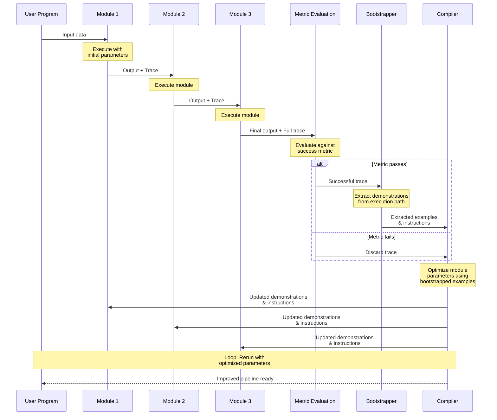

# Module Execution with Bootstrapping

```mermaid
sequenceDiagram
    participant User as User Program
    participant M1 as Module 1
    participant M2 as Module 2
    participant M3 as Module 3
    participant Metric as Metric Evaluation
    participant Boot as Bootstrapper
    participant Compiler as Compiler

    User->>M1: Input data
    Note over M1: Execute with<br/>initial parameters
    M1->>M2: Output + Trace
    Note over M2: Execute module
    M2->>M3: Output + Trace
    Note over M3: Execute module
    M3->>Metric: Final output + Full trace
    
    Note over Metric: Evaluate against<br/>success metric
    
    alt Metric passes
        Metric->>Boot: Successful trace
        Note over Boot: Extract demonstrations<br/>from execution path
        Boot->>Compiler: Extracted examples<br/>& instructions
    else Metric fails
        Metric->>Compiler: Discard trace
    end
    
    Note over Compiler: Optimize module<br/>parameters using<br/>bootstrapped examples
    Compiler->>M1: Updated demonstrations<br/>& instructions
    Compiler->>M2: Updated demonstrations<br/>& instructions
    Compiler->>M3: Updated demonstrations<br/>& instructions
    
    Note over User,Compiler: Loop: Rerun with<br/>optimized parameters
    Compiler-->>User: Improved pipeline ready
```
