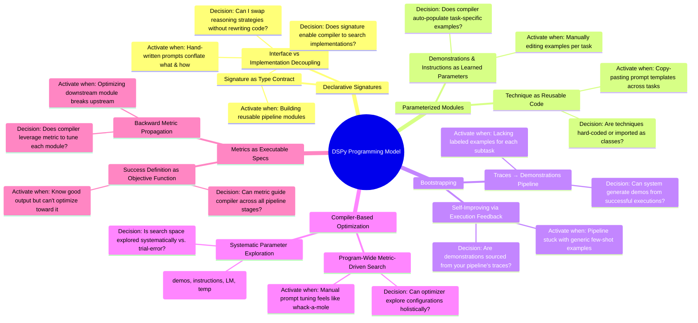

# DSPy Core Mental Models & Decision Heuristics

```mermaid
mindmap
  root((DSPy Programming Model))
    Declarative Signatures
      Interface vs Implementation Decoupling
        Activate when: Hand-written prompts conflate what & how
        Decision: Can I swap reasoning strategies without rewriting code?
      Signature as Type Contract
        Activate when: Building reusable pipeline modules
        Decision: Does signature enable compiler to search implementations?
    
    Parameterized Modules
      Technique as Reusable Code
        Activate when: Copy-pasting prompt templates across tasks
        Decision: Are techniques hard-coded or imported as classes?
      Demonstrations & Instructions as Learned Parameters
        Activate when: Manually editing examples per task
        Decision: Does compiler auto-populate task-specific examples?
    
    Bootstrapping
      Traces → Demonstrations Pipeline
        Activate when: Lacking labeled examples for each subtask
        Decision: Can system generate demos from successful executions?
      Self-Improving via Execution Feedback
        Activate when: Pipeline stuck with generic few-shot examples
        Decision: Are demonstrations sourced from your pipeline's traces?
    
    Compiler-Based Optimization
      Program-Wide Metric-Driven Search
        Activate when: Manual prompt tuning feels like whack-a-mole
        Decision: Can optimizer explore configurations holistically?
      Systematic Parameter Exploration
        Activate when: Too many variables (demos, instructions, LM, temp)
        Decision: Is search space explored systematically vs. trial-error?
    
    Metrics as Executable Specs
      Success Definition as Objective Function
        Activate when: Know good output but can't optimize toward it
        Decision: Can metric guide compiler across all pipeline stages?
      Backward Metric Propagation
        Activate when: Optimizing downstream module breaks upstream
        Decision: Does compiler leverage metric to tune each module?
```
