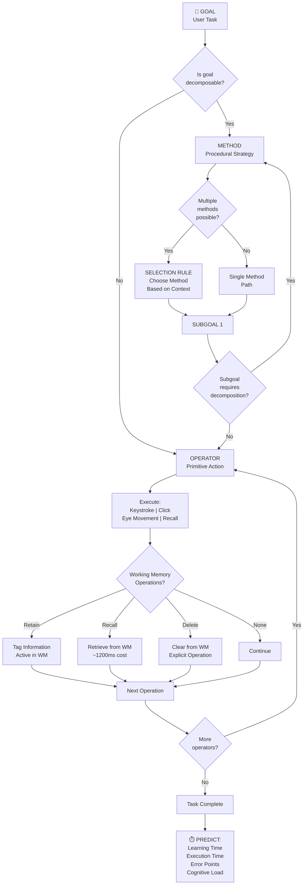

# GOMS Hierarchical Task Decomposition

```mermaid
flowchart TD
    A["🎯 GOAL<br/>User Task"] --> B{Is goal<br/>decomposable?}
    
    B -->|Yes| C["METHOD<br/>Procedural Strategy"]
    B -->|No| D["OPERATOR<br/>Primitive Action"]
    
    C --> E{Multiple<br/>methods<br/>possible?}
    
    E -->|Yes| F["SELECTION RULE<br/>Choose Method<br/>Based on Context"]
    E -->|No| G["Single Method<br/>Path"]
    
    F --> H["SUBGOAL 1"]
    G --> H
    
    H --> I{Subgoal<br/>requires<br/>decomposition?}
    
    I -->|Yes| C
    I -->|No| D
    
    D --> J["Execute:<br/>Keystroke | Click<br/>Eye Movement | Recall"]
    
    J --> K{"Working Memory<br/>Operations?"}
    
    K -->|Retain| L["Tag Information<br/>Active in WM"]
    K -->|Recall| M["Retrieve from WM<br/>~1200ms cost"]
    K -->|Delete| N["Clear from WM<br/>Explicit Operation"]
    K -->|None| O["Continue"]
    
    L --> P["Next Operation"]
    M --> P
    N --> P
    O --> P
    
    P --> Q{More<br/>operators?}
    
    Q -->|Yes| D
    Q -->|No| R["Task Complete"]
    
    R --> S["⏱️ PREDICT:<br/>Learning Time<br/>Execution Time<br/>Error Points<br/>Cognitive Load"]
```
