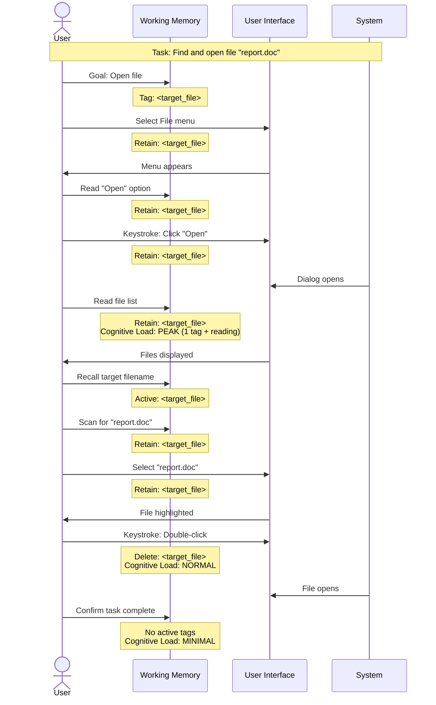

# Task Execution with Working Memory State

```mermaid
sequenceDiagram
    actor User
    participant WM as Working Memory
    participant UI as User Interface
    participant System as System

    Note over User,System: Task: Find and open file "report.doc"
    
    User->>WM: Goal: Open file
    Note over WM: Tag: <target_file>
    
    User->>UI: Select File menu
    Note over WM: Retain: <target_file>
    UI->>User: Menu appears
    
    User->>WM: Read "Open" option
    Note over WM: Retain: <target_file>
    
    User->>UI: Keystroke: Click "Open"
    Note over WM: Retain: <target_file>
    System->>UI: Dialog opens
    
    User->>WM: Read file list
    Note over WM: Retain: <target_file><br/>Cognitive Load: PEAK (1 tag + reading)
    UI->>User: Files displayed
    
    User->>WM: Recall target filename
    Note over WM: Active: <target_file>
    
    User->>WM: Scan for "report.doc"
    Note over WM: Retain: <target_file>
    
    User->>UI: Select "report.doc"
    Note over WM: Retain: <target_file>
    UI->>User: File highlighted
    
    User->>UI: Keystroke: Double-click
    Note over WM: Delete: <target_file><br/>Cognitive Load: NORMAL
    System->>UI: File opens
    
    User->>WM: Confirm task complete
    Note over WM: No active tags<br/>Cognitive Load: MINIMAL

```
