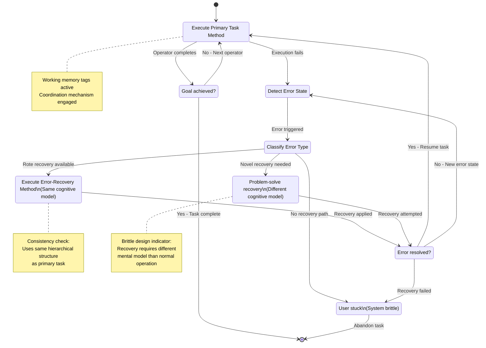

# Error Recovery State Transitions

```mermaid
stateDiagram-v2
    [*] --> NormalExecution
    
    NormalExecution: Execute Primary Task Method
    NormalExecution --> DecisionPoint: Operator completes
    
    DecisionPoint: Goal achieved?
    DecisionPoint --> [*]: Yes - Task complete
    DecisionPoint --> NormalExecution: No - Next operator
    
    NormalExecution --> ErrorDetection: Execution fails
    
    ErrorDetection: Detect Error State
    ErrorDetection --> ErrorClassify: Error triggered
    
    ErrorClassify: Classify Error Type
    ErrorClassify --> SimpleRecovery: Rote recovery available
    ErrorClassify --> ComplexRecovery: Novel recovery needed
    ErrorClassify --> DesignFailure: No recovery path
    
    SimpleRecovery: Execute Error-Recovery Method\n(Same cognitive model)
    SimpleRecovery --> VerifyRecovery: Recovery applied
    
    ComplexRecovery: Problem-solve recovery\n(Different cognitive model)
    ComplexRecovery --> VerifyRecovery: Recovery attempted
    
    DesignFailure: User stuck\n(System brittle)
    DesignFailure --> [*]: Abandon task
    
    VerifyRecovery: Error resolved?
    VerifyRecovery --> NormalExecution: Yes - Resume task
    VerifyRecovery --> ErrorDetection: No - New error state
    VerifyRecovery --> DesignFailure: Recovery failed
    
    note right of NormalExecution
        Working memory tags active
        Coordination mechanism engaged
    end note
    
    note right of SimpleRecovery
        Consistency check:
        Uses same hierarchical structure
        as primary task
    end note
    
    note right of ComplexRecovery
        Brittle design indicator:
        Recovery requires different
        mental model than normal operation
    end note
```
