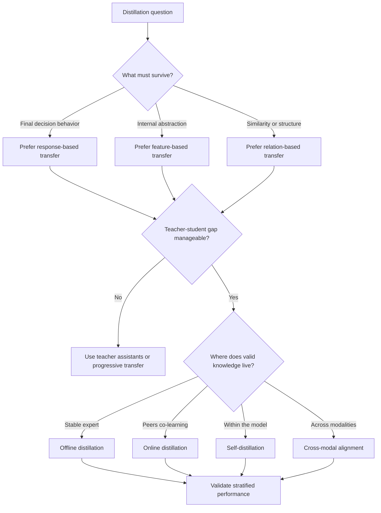

# Knowledge Distillation: A Survey

Use this skill when the hard question is not "should we distill?" but "what kind of knowledge is worth transferring, through which scheme, across what capacity gap?"

## When to Use

- You need to choose among response-based, feature-based, or relation-based transfer.
- A strong teacher exists, but the student keeps underperforming and you suspect a capacity-gap or representation mismatch.
- You are deciding between offline, online, self-distillation, or cross-modal transfer.
- The team wants to reuse knowledge across modalities, domains, or resolutions and needs to know what is essential versus incidental.
- You need a high-level distillation doctrine before designing the specific training stack.

## NOT for Boundaries

This skill is not the primary fit for:
- Generic model compression checklists that never ask what knowledge is being transferred.
- Architecture tuning problems without a teacher-student or representation-transfer question.
- Deployment economics, cascade routing, or threshold setting once the transfer strategy is already chosen.
- Prompt-only optimization or ordinary supervised fine-tuning with no distillation mechanism.

## Core Mental Models

### Knowledge Has Multiple Transferable Forms

The survey's central move is to stop treating "knowledge" as one blob. Teachers can transfer:
- **Response knowledge** through logits, soft labels, and calibrated predictions.
- **Feature knowledge** through intermediate representations and abstractions.
- **Relational knowledge** through geometry, similarity, and structure across examples or layers.

### Capacity Gap Is A Structural Constraint

Distillation fails when the student cannot represent the thing you are trying to teach. Large teacher advantage can become a liability if the transferred representation is too compressed, too entangled, or too alien for the student.

### Transfer Scheme Encodes A Coordination Philosophy

- **Offline distillation** assumes the expert is already stable.
- **Online distillation** assumes peers or ensembles should co-evolve.
- **Self-distillation** assumes the model contains useful internal views worth aligning.

These are different assumptions about where valid knowledge lives and how it changes.

### Cross-Modal Success Exposes The Essential

If the transfer survives a modality jump, the knowledge is probably abstract and portable rather than tied to surface form. Cross-modal wins are a clue about what the teacher actually knows.

### Distillation Often Transfers Learning Strategy, Not Just Answers

Good teachers encode geometry, uncertainty structure, and regularization habits. Students can inherit better ways of generalizing, not merely a compressed lookup table.

## Decision Points

See the richer visual inventory in [diagrams/INDEX.md](diagrams/INDEX.md).

### 1. Decide What Kind Of Knowledge Matters

- Use response transfer when task identity stays mostly stable and the student mainly needs better decision boundaries.
- Use feature transfer when abstraction quality matters more than exact output mimicry.
- Use relation transfer when preserving geometry, ranking, or similarity is the real objective.

### 2. Decide Whether The Gap Needs Scaffolding

- Small or medium gaps can often learn directly from the teacher.
- Large gaps usually need teacher assistants, progressive stages, or a redesigned student.
- If the student does worse than training from scratch, assume structural mismatch before blaming implementation.

### 3. Decide How Dynamic The Learning Setting Is

- Stable expert, stable task: offline is simplest.
- Evolving team, ensemble, or non-stationary task: online learning may be more faithful.
- No external teacher but useful internal hierarchy: self-distillation becomes viable.

### 4. Decide Whether Cross-Modal Transfer Is Worth The Cost

- Use it when you need robustness across representations or want to discover what is modality-independent.
- Skip it when the downstream task only cares about narrow surface-form fidelity.

## Failure Modes

- Biggest teacher wins fallacy: the teacher is so far ahead that the student copies confidence without understanding.
- Uniform-transfer mistake: every layer and output is treated as equally valuable.
- Scheme mismatch: offline transfer is chosen even though the environment or ensemble is evolving.
- False success: average accuracy looks fine while minority classes or rare cases degrade badly.
- Translation blind spot: the team copies teacher representations that the student architecture cannot express.

## Worked Examples

### Example 1: On-Device Moderation Model

- Goal: compress a large multilingual moderation model into a mobile student.
- Decision: response-based transfer for label behavior, then feature matching only on the layers that encode toxic-context abstraction.
- Risk: the smallest student cannot represent multilingual nuance.
- Adjustment: introduce a teacher assistant rather than pushing the full expert directly into the tiny model.

### Example 2: RGB To Depth Transfer For Robotics

- Goal: preserve scene understanding across modalities.
- Decision: relation-based and feature-based transfer matter more than pure logits because the representation changed.
- Success criterion: the student's geometry and ranking of scene structure remain reliable, not just class predictions.

## Quality Gates

- The chosen knowledge type matches the real downstream objective.
- Teacher-student capacity gap has been evaluated explicitly.
- Transfer scheme matches whether knowledge is stable, collaborative, or internal.
- Validation is stratified by difficulty, rarity, or domain slice rather than relying on one headline metric.
- The team can explain why this knowledge is essential enough to transfer instead of relearn.

## References And Visuals

- [references/knowledge-types-for-intelligent-decomposition.md](references/knowledge-types-for-intelligent-decomposition.md) when choosing response, feature, or relation transfer.
- [references/capacity-gap-and-progressive-learning.md](references/capacity-gap-and-progressive-learning.md) for teacher assistants and progressive scaffolding.
- [references/online-distillation-and-collaborative-learning.md](references/online-distillation-and-collaborative-learning.md) when the learning problem is genuinely collaborative.
- [references/self-distillation-and-internal-refinement.md](references/self-distillation-and-internal-refinement.md) when the model must learn from itself.
- [references/cross-modal-and-domain-knowledge-transfer.md](references/cross-modal-and-domain-knowledge-transfer.md) when the representation changes.
- [references/failure-modes-in-knowledge-transfer.md](references/failure-modes-in-knowledge-transfer.md) for debugging underperforming students.
- [diagrams/INDEX.md](diagrams/INDEX.md) for the richer flowchart, quadrant, and mindmap surfaces already bundled with this skill.

## Shibboleths

Surface understanding says "distillation is just compressing a big model into a small one."

Deeper understanding says:
- "The first question is what form of knowledge the student actually needs."
- "A larger teacher can be worse if the student cannot represent what is being taught."
- "Online, offline, and self-distillation are different assumptions about where good knowledge lives."
- "Cross-modal transfer is a test of what is essential, not just a deployment trick."
