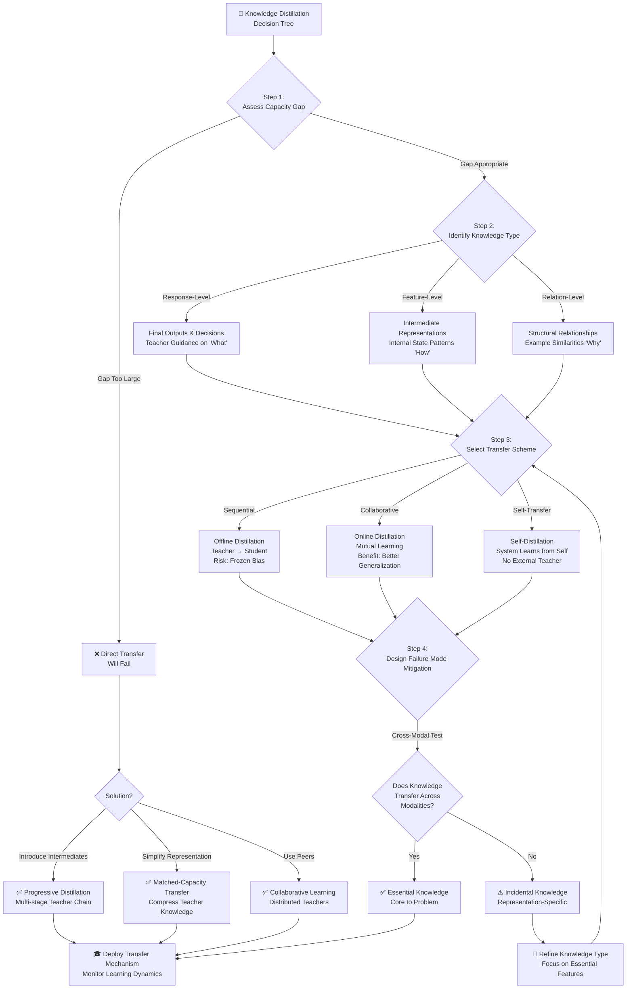

# Knowledge Distillation Decision Tree

```mermaid
flowchart TD
    A["🎯 Knowledge Distillation<br/>Decision Tree"] --> B{Step 1:<br/>Assess Capacity Gap}
    
    B -->|Gap Too Large| C["❌ Direct Transfer<br/>Will Fail"]
    C --> D{Solution?}
    D -->|Introduce Intermediates| E["✅ Progressive Distillation<br/>Multi-stage Teacher Chain"]
    D -->|Simplify Representation| F["✅ Matched-Capacity Transfer<br/>Compress Teacher Knowledge"]
    D -->|Use Peers| G["✅ Collaborative Learning<br/>Distributed Teachers"]
    
    B -->|Gap Appropriate| H{Step 2:<br/>Identify Knowledge Type}
    
    H -->|Response-Level| I["Final Outputs & Decisions<br/>Teacher Guidance on 'What'"]
    H -->|Feature-Level| J["Intermediate Representations<br/>Internal State Patterns 'How'"]
    H -->|Relation-Level| K["Structural Relationships<br/>Example Similarities 'Why'"]
    
    I --> L{Step 3:<br/>Select Transfer Scheme}
    J --> L
    K --> L
    
    L -->|Sequential| M["Offline Distillation<br/>Teacher → Student<br/>Risk: Frozen Bias"]
    L -->|Collaborative| N["Online Distillation<br/>Mutual Learning<br/>Benefit: Better Generalization"]
    L -->|Self-Transfer| O["Self-Distillation<br/>System Learns from Self<br/>No External Teacher"]
    
    M --> P{Step 4:<br/>Design Failure Mode Mitigation}
    N --> P
    O --> P
    
    P -->|Cross-Modal Test| Q{"Does Knowledge<br/>Transfer Across<br/>Modalities?"}
    Q -->|Yes| R["✅ Essential Knowledge<br/>Core to Problem"]
    Q -->|No| S["⚠️ Incidental Knowledge<br/>Representation-Specific"]
    
    R --> T["🎓 Deploy Transfer Mechanism<br/>Monitor Learning Dynamics"]
    S --> U["🔄 Refine Knowledge Type<br/>Focus on Essential Features"]
    
    E --> T
    F --> T
    G --> T
    U --> L
```
