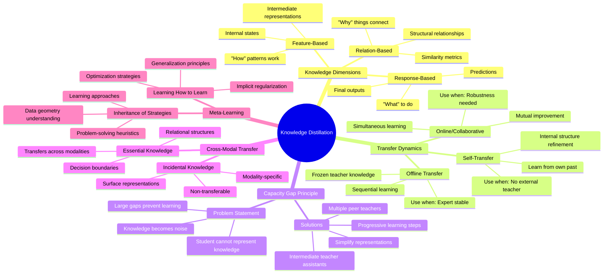

# Knowledge Dimensions & Transfer Architectures

```mermaid
mindmap
  root((Knowledge Distillation))
    Knowledge Dimensions
      Response-Based
        Final outputs
        Predictions
        "What" to do
      Feature-Based
        Intermediate representations
        Internal states
        "How" patterns work
      Relation-Based
        Structural relationships
        Similarity metrics
        "Why" things connect
    Transfer Dynamics
      Offline Transfer
        Sequential learning
        Frozen teacher knowledge
        Use when: Expert stable
      Online/Collaborative
        Simultaneous learning
        Mutual improvement
        Use when: Robustness needed
      Self-Transfer
        Learn from own past
        Internal structure refinement
        Use when: No external teacher
    Capacity Gap Principle
      Problem Statement
        Large gaps prevent learning
        Student cannot represent knowledge
        Knowledge becomes noise
      Solutions
        Progressive learning steps
        Intermediate teacher assistants
        Simplify representations
        Multiple peer teachers
    Cross-Modal Transfer
      Essential Knowledge
        Transfers across modalities
        Decision boundaries
        Relational structures
      Incidental Knowledge
        Modality-specific
        Surface representations
        Non-transferable
    Meta-Learning
      Learning How to Learn
        Implicit regularization
        Optimization strategies
        Generalization principles
      Inheritance of Strategies
        Problem-solving heuristics
        Data geometry understanding
        Learning approaches
```
