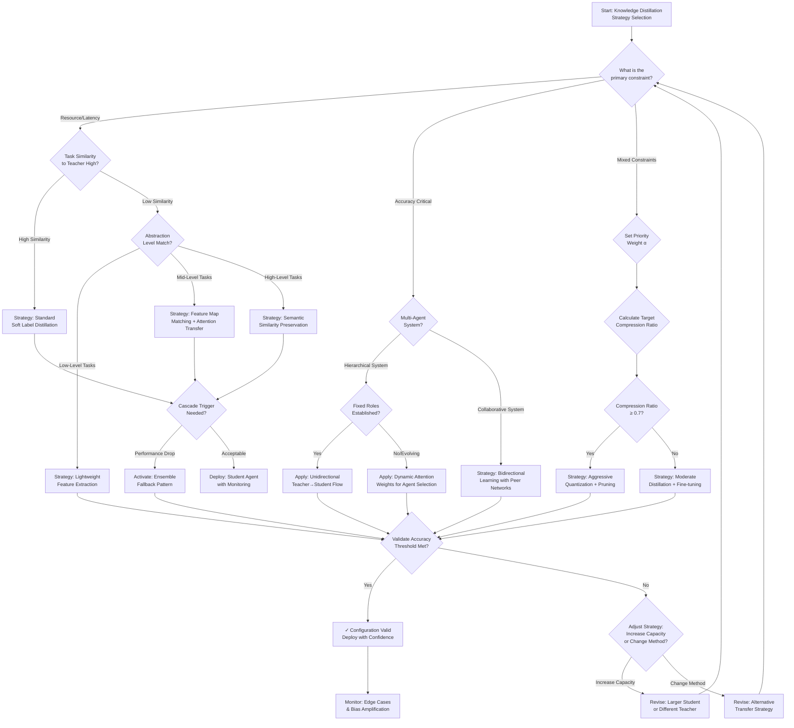

# Knowledge Distillation Strategy Decision Tree

```mermaid
graph TD
    A["Start: Knowledge Distillation<br/>Strategy Selection"] --> B{What is the<br/>primary constraint?}
    
    B -->|Resource/Latency| C{Task Similarity<br/>to Teacher High?}
    B -->|Accuracy Critical| D{Multi-Agent<br/>System?}
    B -->|Mixed Constraints| E{Set Priority<br/>Weight α}
    
    C -->|High Similarity| F["Strategy: Standard<br/>Soft Label Distillation"]
    C -->|Low Similarity| G{Abstraction<br/>Level Match?}
    
    G -->|Low-Level Tasks| H["Strategy: Lightweight<br/>Feature Extraction"]
    G -->|Mid-Level Tasks| I["Strategy: Feature Map<br/>Matching + Attention Transfer"]
    G -->|High-Level Tasks| J["Strategy: Semantic<br/>Similarity Preservation"]
    
    D -->|Hierarchical System| K{Fixed Roles<br/>Established?}
    D -->|Collaborative System| L["Strategy: Bidirectional<br/>Learning with Peer Networks"]
    
    K -->|Yes| M["Apply: Unidirectional<br/>Teacher→Student Flow"]
    K -->|No/Evolving| N["Apply: Dynamic Attention<br/>Weights for Agent Selection"]
    
    E --> O{Calculate Target<br/>Compression Ratio}
    O --> P{Compression Ratio<br/>≥ 0.7?}
    
    P -->|Yes| Q["Strategy: Aggressive<br/>Quantization + Pruning"]
    P -->|No| R["Strategy: Moderate<br/>Distillation + Fine-tuning"]
    
    F --> S{Cascade Trigger<br/>Needed?}
    I --> S
    J --> S
    
    S -->|Performance Drop| T["Activate: Ensemble<br/>Fallback Pattern"]
    S -->|Acceptable| U["Deploy: Student Agent<br/>with Monitoring"]
    
    M --> V{Validate Accuracy<br/>Threshold Met?}
    L --> V
    Q --> V
    R --> V
    H --> V
    N --> V
    T --> V
    
    V -->|Yes| W["✓ Configuration Valid<br/>Deploy with Confidence"]
    V -->|No| X{Adjust Strategy:<br/>Increase Capacity<br/>or Change Method?}
    
    X -->|Increase Capacity| Y["Revise: Larger Student<br/>or Different Teacher"]
    X -->|Change Method| Z["Revise: Alternative<br/>Transfer Strategy"]
    
    Y --> B
    Z --> B
    W --> AA["Monitor: Edge Cases<br/>& Bias Amplification"]
```
