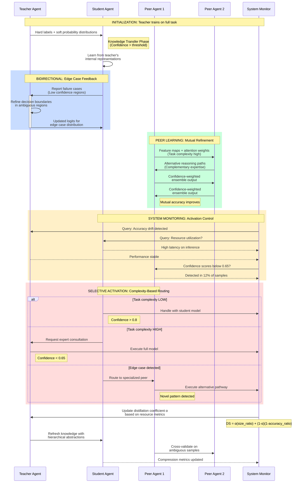

# Collaborative Multi-Agent Knowledge Flow

```mermaid
sequenceDiagram
    participant Teacher as Teacher Agent
    participant Student as Student Agent
    participant Peer1 as Peer Agent 1
    participant Peer2 as Peer Agent 2
    participant Monitor as System Monitor

    Note over Teacher,Monitor: INITIALIZATION: Teacher trains on full task

    Teacher->>Student: Hard labels + soft probability distributions
    Note right of Student: Knowledge Transfer Phase<br/>(Confidence > threshold)
    Student->>Student: Learn from teacher's<br/>internal representations

    rect rgb(200, 220, 255)
        Note over Student,Teacher: BIDIRECTIONAL: Edge Case Feedback
        Student->>Teacher: Report failure cases<br/>(Low confidence regions)
        activate Teacher
        Teacher->>Teacher: Refine decision boundaries<br/>in ambiguous regions
        Teacher->>Student: Updated logits for<br/>edge case distribution
        deactivate Teacher
    end

    rect rgb(200, 255, 220)
        Note over Peer1,Peer2: PEER LEARNING: Mutual Refinement
        Peer1->>Peer2: Feature maps + attention weights<br/>(Task complexity high)
        Peer2->>Peer1: Alternative reasoning paths<br/>(Complementary expertise)
        Peer1->>Peer2: Confidence-weighted<br/>ensemble output
        Peer2->>Peer1: Confidence-weighted<br/>ensemble output
        Note right of Peer1: Mutual accuracy improves
    end

    rect rgb(255, 240, 200)
        Note over Student,Monitor: SYSTEM MONITORING: Activation Control
        Monitor->>Teacher: Query: Accuracy drift detected
        Monitor->>Student: Query: Resource utilization?
        Student-->>Monitor: High latency on inference
        Teacher-->>Monitor: Performance stable
        Monitor->>Peer1: Confidence scores below 0.65?
        Peer1-->>Monitor: Detected in 12% of samples
    end

    rect rgb(255, 220, 220)
        Note over Student,Peer1: SELECTIVE ACTIVATION: Complexity-Based Routing
        alt Task complexity LOW
            Student->>Monitor: Handle with student model
            Note right of Student: Confidence > 0.8
        else Task complexity HIGH
            Student->>Teacher: Request expert consultation
            Teacher->>Monitor: Execute full model
            Note right of Teacher: Confidence < 0.65
        else Edge case detected
            Student->>Peer1: Route to specialized peer
            Peer1->>Monitor: Execute alternative pathway
            Note right of Peer1: Novel pattern detected
        end
    end

    Monitor->>Teacher: Update distillation coefficient α<br/>based on resource metrics
    Note over Monitor: DS = α(size_ratio) + (1-α)(1-accuracy_ratio)

    Teacher->>Student: Refresh knowledge with<br/>hierarchical abstractions
    Peer1->>Peer2: Cross-validate on<br/>ambiguous samples
    Student-->>Monitor: Compression metrics updated
```
