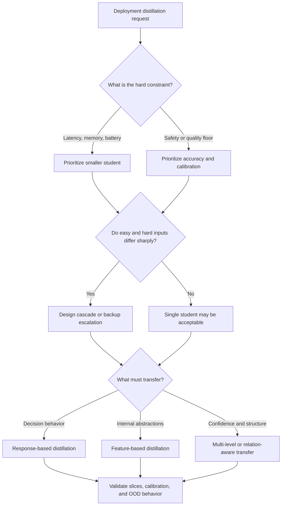

# Knowledge Distillation In Deep Learning

Use this skill when the core design question is how to compress a capable model into something smaller, cheaper, or more routable without hiding unacceptable losses in calibration, robustness, or edge-case performance.

## When to Use

- You are designing a teacher-student compression pipeline for deployment-constrained inference.
- You need to set explicit size versus accuracy priorities instead of hand-waving about "good enough."
- A small model should handle common cases first, with escalation to a larger backup model when uncertainty rises.
- You need to reason about whether compressed performance is failing because of capacity cliffs, bias amplification, or poor calibration.
- The system architecture needs different-capacity agents for different abstraction levels.

## NOT for Boundaries

This skill is not the primary fit for:
- Generic deep-learning overviews or literature surveys with no concrete distillation objective.
- Prompt optimization, retrieval tuning, or non-neural transfer problems.
- Compression discussions that stop at average accuracy and ignore calibration, minority slices, or out-of-distribution behavior.
- Architecture work where there is no teacher-student relationship, cascade, or compression tradeoff to manage.

## Core Mental Models

### Knowledge Is Multi-Representational

Distillation can transfer logits, soft labels, feature maps, or other internal structure. Deployment success depends on choosing the representation that preserves the behavior you actually care about.

### Size-Accuracy Tradeoffs Need An Explicit Policy

The paper's distillation-score framing matters because it forces the team to say what it is optimizing for. Mobile and edge deployments tolerate more loss than safety-critical paths. If the priority is hidden, the system will drift toward accidental risk.

### Abstraction Level Should Drive Capacity

Low-level feature extraction can often live in smaller students. High-level semantic or reasoning-heavy decisions usually require more capacity. Uniform compression across all layers or roles is usually the wrong move.

### Cascades Beat Wishful Compression

When the input distribution has easy and hard cases, a small-first, large-backup cascade often dominates "one tiny model for everything." Distillation should support escalation, not eliminate it.

### Compression Amplifies Existing Weaknesses

Compressed models often fail first on rare classes, borderline examples, and out-of-distribution inputs. Average accuracy can stay high while the risk profile becomes much worse.

## Decision Points

See the richer flow, quadrant, and sequence diagrams in [diagrams/INDEX.md](diagrams/INDEX.md).

### 1. Set The Tradeoff Policy Up Front

- Decide how much performance loss is acceptable for the target resource envelope.
- Make the weighting explicit so the student is not judged by contradictory goals later.

### 2. Decide Whether A Cascade Is Mandatory

- If rare hard cases matter disproportionately, keep a larger model available.
- If escalation cost is acceptable, do not force the smallest model to handle everything.

### 3. Match Capacity To Abstraction

- Compress aggressively on low-level or routine subtasks.
- Preserve more capacity on semantic, safety-critical, or uncertainty-heavy decisions.

### 4. Validate Beyond Headline Accuracy

- Check calibration, per-class performance, and out-of-distribution behavior.
- Treat disagreement, abstention, or escalation thresholds as first-class design objects.

## Failure Modes

- Average-metric blindness: compression looks successful until rare slices are inspected.
- Capacity cliff: one more size reduction causes sharp competence collapse instead of graceful decay.
- Overconfident student: the small model copies decisions without preserving uncertainty structure.
- Uniform-compression mistake: high-level reasoning layers are shrunk as aggressively as cheap perceptual layers.
- No-backup fantasy: the team removes escalation paths to make the architecture look simpler.

## Worked Examples

### Example 1: Mobile Vision Model With Safety Escalation

- Goal: run common image moderation checks on device.
- Student handles routine cases with response-based transfer.
- Hard or ambiguous cases escalate to the larger cloud model based on calibrated confidence and slice-aware thresholds.
- Quality question: not just "what is top-1 accuracy?" but "what dangerous cases slip through without escalation?"

### Example 2: Multi-Agent Review Stack

- A tiny sentinel agent screens incoming tasks.
- Mid-capacity agents handle common semantic work.
- A high-capacity adjudicator handles rare, safety-critical, or low-confidence cases.
- Distillation goal: preserve the right routing boundary, not just compress each agent independently.

## Quality Gates

- The tradeoff between size and quality has been made explicit.
- Cascade versus single-student choice is justified by input-difficulty distribution.
- Validation includes slice-level, calibration, and OOD checks.
- The student has a documented escalation or abstention story for unusual inputs.
- The team can explain which representation was distilled and why it matches the target behavior.

## References And Visuals

- [references/the-size-accuracy-tradeoff-and-distillation-metric.md](references/the-size-accuracy-tradeoff-and-distillation-metric.md) for the explicit tradeoff framing.
- [references/knowledge-transfer-as-multi-representation-learning.md](references/knowledge-transfer-as-multi-representation-learning.md) for choosing what representation to transfer.
- [references/hierarchical-abstraction-in-knowledge-transfer.md](references/hierarchical-abstraction-in-knowledge-transfer.md) when allocating capacity by abstraction layer.
- [references/failure-modes-of-compression.md](references/failure-modes-of-compression.md) for debugging fragile students.
- [references/expert-decision-making-under-uncertainty.md](references/expert-decision-making-under-uncertainty.md) when calibration and uncertainty surfaces matter.
- [references/coordination-without-central-authority.md](references/coordination-without-central-authority.md) when using distillation logic to shape collaborative or cascaded agent systems.
- [diagrams/INDEX.md](diagrams/INDEX.md) for the existing extended visual artifacts.

## Shibboleths

Surface understanding says "the student only lost 2% accuracy, so ship it."

Deeper understanding says:
- "That 2% may hide catastrophic loss on rare or high-risk slices."
- "A smaller student without calibration or escalation is often more dangerous than a larger slower model."
- "Compression policy should differ by abstraction level and role."
- "Distillation is not finished until the failure boundary and backup path are explicit."
