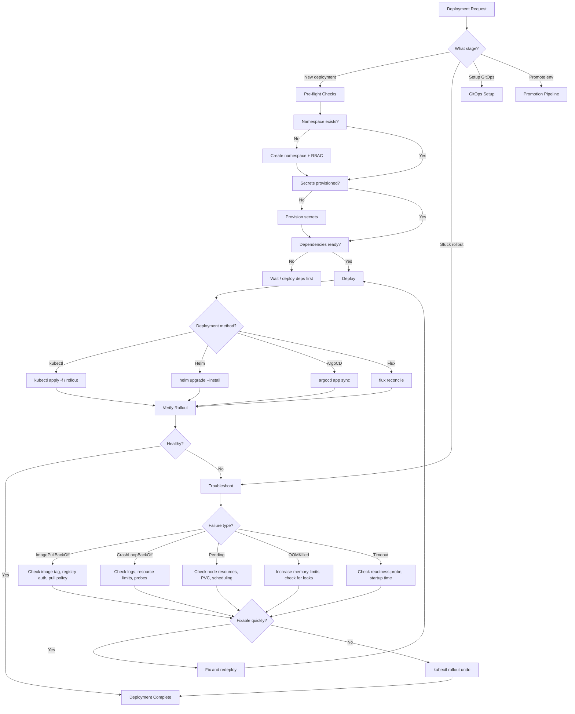
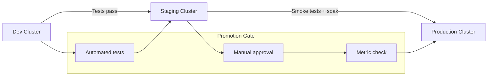

# Kubernetes Deployment Automation

Operational expertise for the deployment lifecycle — from `kubectl apply` to production-verified rollout. Owns Day 2 operations: deploying manifests, monitoring rollouts, troubleshooting failures, managing secrets/namespaces, and GitOps workflows.

## When to Use

**Use for:**
- Deploying manifests to Kubernetes clusters (kubectl, Helm, Kustomize)
- Setting up GitOps with ArgoCD or Flux
- Monitoring and verifying rollout health
- Troubleshooting stuck or failed deployments
- Multi-environment promotion (dev → staging → prod)
- Namespace, RBAC, and secret lifecycle for deployments
- Rollback decisions and execution

**NOT for:**
- Generating K8s YAML/Helm charts → `kubernetes-manifest-generator`
- Blue-green/canary traffic shifting → `blue-green-deployment-orchestrator`
- Cluster provisioning with Terraform → `terraform-module-builder`
- CI/CD pipeline YAML → `github-actions-pipeline-builder`
- Application-level debugging → language-specific skills

## Core Process



## Deployment Methods

### kubectl Direct Apply

```bash
# Dry-run first — always
kubectl apply -f manifests/ --dry-run=server

# Apply with record for rollback
kubectl apply -f manifests/

# Watch rollout
kubectl rollout status deployment/<name> -n <ns> --timeout=300s
```

**When to use**: Simple deployments, scripted pipelines, single-cluster.

### Helm

```bash
# Diff before upgrade (requires helm-diff plugin)
helm diff upgrade <release> <chart> -f values-prod.yaml -n <ns>

# Deploy with atomic (auto-rollback on failure)
helm upgrade --install <release> <chart> \
  -f values-prod.yaml \
  -n <ns> \
  --atomic \
  --timeout 5m \
  --wait
```

**When to use**: Parameterized deployments, multiple environments from one chart.

### ArgoCD GitOps

```bash
# Create application
argocd app create <name> \
  --repo <git-url> \
  --path <manifest-path> \
  --dest-server https://kubernetes.default.svc \
  --dest-namespace <ns> \
  --sync-policy automated \
  --auto-prune \
  --self-heal

# Sync with prune
argocd app sync <name> --prune

# Check health
argocd app get <name>
```

**When to use**: Multi-cluster, audit trail required, team deployments.

### Flux GitOps

```bash
# Bootstrap Flux
flux bootstrap github \
  --owner=<org> \
  --repository=<repo> \
  --path=clusters/<cluster> \
  --personal

# Create Kustomization
flux create kustomization <name> \
  --source=GitRepository/<repo> \
  --path=<manifest-path> \
  --prune=true \
  --interval=5m

# Force reconcile
flux reconcile kustomization <name>
```

**When to use**: Lightweight GitOps, multi-tenant clusters, prefer pull-based.

## Rollout Verification

Always verify after deploy. Minimum checks:

```bash
# 1. Rollout status
kubectl rollout status deployment/<name> -n <ns> --timeout=300s

# 2. Pod health
kubectl get pods -n <ns> -l app=<name> -o wide

# 3. Recent events (failures surface here)
kubectl events -n <ns> --for deployment/<name> --types=Warning

# 4. Endpoint readiness
kubectl get endpoints <service-name> -n <ns>

# 5. Logs from new pods (spot crashes early)
kubectl logs -n <ns> -l app=<name> --since=2m --tail=50
```

## Anti-Patterns

### `kubectl apply` Without Dry-Run
**Novice**: "Just apply it, YOLO"
**Expert**: Always `--dry-run=server` first. Server-side dry-run catches quota violations, admission webhook rejections, and schema errors that client-side misses.
**Timeline**: 2022: client-side dry-run was common → 2024+: server-side dry-run is standard (catches real admission issues).

### Helm Without `--atomic`
**Novice**: `helm upgrade` then manually check and rollback on failure
**Expert**: `--atomic` auto-rolls back on any failure. Without it, you get half-deployed states where some resources updated and others didn't, requiring manual cleanup.

### Ignoring Resource Requests/Limits at Deploy Time
**Novice**: "The manifest generator already set them"
**Expert**: Verify limits match the target environment. Dev limits in prod cause OOMKills. Run `kubectl describe node` to check available capacity before deploying resource-heavy workloads.

### Secrets in Git
**Novice**: Base64-encoded secrets committed to the repo
**Expert**: Base64 is encoding, not encryption. Use Sealed Secrets, SOPS, External Secrets Operator, or Vault. GitOps repos should contain `SealedSecret` or `ExternalSecret` resources, never plain `Secret`.
**Detection**: `grep -r "kind: Secret" manifests/ | grep -v SealedSecret | grep -v ExternalSecret`

## Multi-Environment Promotion



**Pattern**: Same manifests, different values per environment.

| Approach | How | Best For |
|----------|-----|----------|
| Kustomize overlays | `base/` + `overlays/{dev,staging,prod}` | Simple, native K8s |
| Helm values | `values-dev.yaml`, `values-prod.yaml` | Parameterized charts |
| ArgoCD ApplicationSets | Generator matrix across clusters | Multi-cluster GitOps |
| Flux Kustomization | Per-cluster paths in fleet repo | Pull-based multi-cluster |

## References

- `references/troubleshooting-guide.md` — Consult when diagnosing specific K8s failure states (ImagePullBackOff, CrashLoopBackOff, eviction, node pressure)
- `references/gitops-patterns.md` — Consult when setting up ArgoCD or Flux from scratch, or designing repo structure for GitOps
- `references/rollback-strategies.md` — Consult when deciding between revision rollback, Helm rollback, and GitOps revert
