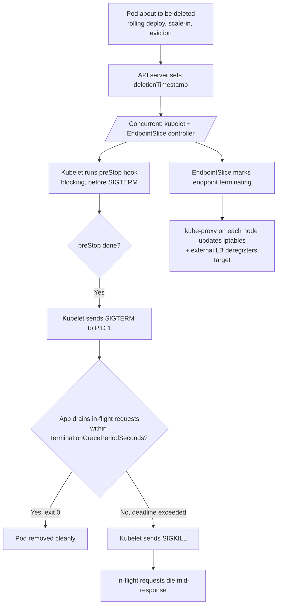

# Kubernetes Graceful Shutdown

> **TL;DR**: A pod receiving SIGTERM is *not* the same moment that traffic stops arriving. The kubelet and the Endpoints/Service controller run concurrently, so kube-proxy on every node may take seconds to remove your pod from its iptables rules. The fix is a `preStop` hook that sleeps for ~5–15 seconds *before* SIGTERM, giving the data plane time to converge, plus a signal handler in your app that drains in-flight work within `terminationGracePeriodSeconds`.

---

## Jump to your fire

| Symptom | Section |
|---|---|
| "Rolling deploy drops requests with connection refused" | [The race](#1-the-endpoint-removal-race) |
| "What does preStop actually do?" | [Pod lifecycle](#2-the-pod-termination-sequence) |
| "How long should preStop sleep be?" | [The sleep recipe](#3-the-prestop-sleep-recipe) |
| "Node.js shutdown skeleton" | [Node.js](#4-nodejs-shutdown-skeleton) |
| "Go shutdown skeleton" | [Go](#5-go-shutdown-skeleton) |
| "Pod stuck Terminating forever" | [Anti-patterns](#anti-patterns) |

---

## Decision diagram



The hazard is **steps E + G racing against D + H**. If your app stops accepting connections before G completes, kube-proxy still routes traffic to your pod's IP — connection refused.

---

## 1. The endpoint removal race

From the [Kubernetes EndpointSlices docs](https://kubernetes.io/docs/concepts/services-networking/endpoint-slices/):

> The `terminating` condition indicates that the endpoint is terminating. For endpoints backed by a Pod, this condition is set when the Pod is first deleted (that is, when it receives a deletion timestamp, **but most likely before the Pod's containers exit**).

And:

> With kube-proxy running on each Node and watching EndpointSlices, every change to an EndpointSlice becomes relatively expensive since it will be transmitted to every Node in the cluster.

**Translation**: when the API server stamps your pod with `deletionTimestamp`, the EndpointSlice controller marks the endpoint terminating *immediately* — but the actual update to iptables on every node, plus deregistration from any external load balancer (AWS NLB, GCP LB), takes time. Tens of milliseconds in a small cluster, several seconds in a large one or with a slow LB.

In that gap, traffic still arrives at your pod's IP. If your app has already started shutting down its listener, those new connections fail.

---

## 2. The pod termination sequence

From the [Container Lifecycle Hooks docs](https://kubernetes.io/docs/concepts/containers/container-lifecycle-hooks/):

> PreStop hooks are not executed asynchronously from the signal to stop the Container; **the hook must complete its execution before the TERM signal can be sent.**

> If `terminationGracePeriodSeconds` is 60, and the hook takes 55 seconds to complete, and the Container takes 10 seconds to stop normally after receiving the signal, then the Container will be killed before it can stop normally, since `terminationGracePeriodSeconds` is less than the total time (55+10).

**Ordered sequence** (verified across the lifecycle and EndpointSlice docs):

| Step | Actor | What happens | Timing |
|---|---|---|---|
| 1 | API server | Sets `deletionTimestamp` on Pod | t=0 |
| 2 | EndpointSlice controller | Marks endpoint `terminating` | t≈0 (concurrent with kubelet) |
| 3 | kube-proxy on each node | Receives EndpointSlice update, rewrites iptables | t = Δ₁ (varies per cluster size) |
| 4 | External LB | Re-syncs target groups (NLB, etc.) | t = Δ₂ (often seconds) |
| 5 | Kubelet | Runs `preStop` (blocking, synchronous) | t=0 onward |
| 6 | Kubelet | Sends SIGTERM to PID 1 | after preStop |
| 7 | App | Drains in-flight; closes server | within remainder of grace period |
| 8 | Kubelet | If app still running at deadline, SIGKILL | at `terminationGracePeriodSeconds` |

`terminationGracePeriodSeconds` defaults to **30 seconds**.

The grace-period budget is **shared** between preStop and the post-SIGTERM drain. A 60-second grace with a 30-second preStop sleep leaves only 30 seconds to drain in-flight work. Size the budget accordingly.

---

## 3. The preStop sleep recipe

The pattern: **don't start draining until traffic has stopped arriving**. Sleep gives the data plane time to converge while the app keeps serving normally.

```yaml
spec:
  containers:
  - name: api
    image: my-api:latest
    lifecycle:
      preStop:
        exec:
          command: ["/bin/sh", "-c", "sleep 15"]
  terminationGracePeriodSeconds: 60   # must be > preStop sleep + drain time
```

**Sleep duration rationale** (operational rules of thumb — kubernetes.io documents the race but not the exact tuning):

| Sleep | When |
|---|---|
| 5s | Small cluster, kube-proxy iptables convergence only |
| 10–15s | Typical: cloud LB target-group deregistration (AWS NLB, GCP LB, Azure LB) |
| 30s+ | Large clusters / long LB health-check intervals / Istio with slow xDS push |

Tune by measuring: enable access logs, do a rolling deploy, count requests that landed *after* SIGTERM. The right sleep is the smallest value that brings that count to zero.

**Kubernetes 1.29+** adds a native `sleep` action so you don't need `/bin/sh`:

```yaml
lifecycle:
  preStop:
    sleep:
      seconds: 15
```

The `exec sleep` form remains universally compatible with older clusters.

### Don't forget the readiness probe

A complementary trick: have your app fail readiness *before* it stops accepting traffic. This makes EndpointSlice mark the pod NotReady faster on its own.

```js
// Pseudocode
let ready = true
process.on('SIGTERM', () => { ready = false; /* drain... */ })
app.get('/readyz', (req, res) => res.status(ready ? 200 : 503).end())
```

But: **this does not replace the preStop sleep.** The readiness gate helps the *next* propagation cycle; the sleep covers the *current* in-flight traffic. Use both.

---

## 4. Node.js shutdown skeleton

From [the Node.js HTTP docs](https://nodejs.org/api/http.html): `server.close()` "stops the server from accepting new connections and closes all connections connected to this server which are not sending a request or waiting for a response." Since v19.0.0, it closes idle keep-alive connections automatically. `closeIdleConnections()` (v18.2.0) and `closeAllConnections()` (v18.2.0) are the explicit hammers.

```js
import http from 'node:http'

const server = http.createServer((req, res) => { /* ... */ })
server.listen(8080)

let shuttingDown = false

function shutdown() {
  if (shuttingDown) return
  shuttingDown = true

  // Optional: flip readiness so endpoint is removed faster
  // (your /readyz handler reads `shuttingDown`)

  // Stop accepting new connections; finish in-flight requests
  server.close((err) => {
    process.exit(err ? 1 : 0)
  })

  // Kick idle keep-alive sockets so close() can resolve faster
  server.closeIdleConnections()  // Node 18.2+

  // Hard deadline shorter than terminationGracePeriodSeconds
  setTimeout(() => {
    server.closeAllConnections()  // Node 18.2+: forcibly drop active requests
    process.exit(1)
  }, 25_000).unref()
}

process.on('SIGTERM', shutdown)
process.on('SIGINT', shutdown)
```

**Pitfall**: when running Node under `npm start` or a shell wrapper, PID 1 is the shell, not Node — and the shell may not forward SIGTERM. Either run Node directly (`CMD ["node", "server.js"]` in the Dockerfile, no shell) or use a process supervisor like `tini` (`--init` in `docker run`, or set `shareProcessNamespace: true` carefully).

---

## 5. Go shutdown skeleton

From [the `net/http` docs](https://pkg.go.dev/net/http): `Server.Shutdown` "gracefully shuts down the server without interrupting any active connections... by first closing all open listeners, then closing all idle connections, and then waiting indefinitely for connections to return to idle and then shut down."

```go
package main

import (
    "context"
    "errors"
    "log"
    "net/http"
    "os/signal"
    "syscall"
    "time"
)

func main() {
    srv := &http.Server{Addr: ":8080", Handler: mux()}

    // Canonical signal-to-context bridge (Go 1.16+)
    ctx, stop := signal.NotifyContext(context.Background(),
        syscall.SIGINT, syscall.SIGTERM)
    defer stop()

    go func() {
        if err := srv.ListenAndServe(); err != nil &&
            !errors.Is(err, http.ErrServerClosed) {
            log.Fatalf("listen: %v", err)
        }
    }()

    <-ctx.Done()
    log.Println("shutdown signal received")

    shutdownCtx, cancel := context.WithTimeout(context.Background(), 25*time.Second)
    defer cancel()

    if err := srv.Shutdown(shutdownCtx); err != nil {
        log.Printf("graceful shutdown failed: %v", err)
        _ = srv.Close()  // hard close — drop in-flight
    }
}
```

`signal.NotifyContext` is the idiomatic Go pattern; the returned context cancels on SIGTERM/SIGINT. `Server.Close()` is the immediate (non-graceful) variant; use it as the last-resort fallback.

---

## Anti-patterns

| Anti-pattern | Why it bites | Fix |
|---|---|---|
| No preStop hook + immediate `server.close()` on SIGTERM | New connections fail during EndpointSlice / LB convergence | Add `preStop: sleep N` with N tuned to your LB |
| `terminationGracePeriodSeconds: 30` (default) with a 25-second preStop sleep | Only 5 seconds left to drain — SIGKILL aborts in-flight work | Sum your budget: preStop + drain + safety margin |
| App ignores SIGTERM (no signal handler) | Pod hangs, gets SIGKILL'd at deadline | Always register handlers; for Node, beware shell PID 1 |
| Readiness probe stays green during shutdown | New traffic keeps arriving even after SIGTERM | Flip readiness on SIGTERM (with preStop sleep, not instead of) |
| `kill -9` style hard exit on first SIGTERM | In-flight requests get connection reset | Use `server.close()` / `srv.Shutdown(ctx)` then exit |
| `preStop sleep 60` with default 30s grace period | preStop never finishes — SIGKILL straight through | preStop must be << terminationGracePeriodSeconds |
| Calling shutdown logic but not stopping background workers (cron, queue consumers) | Workers keep popping jobs and dying mid-task | Cancel a shutdown context everywhere, not just HTTP |

---

## Novice / Expert / Timeline

| | Novice | Expert |
|---|---|---|
| **First SIGTERM handler** | `process.exit()` | `server.close()` + drain timeout + kill switch |
| **preStop hook** | None | 5-15s sleep tuned to LB convergence |
| **terminationGracePeriodSeconds** | Default 30 | Set explicitly = preStop sleep + drain budget + margin |
| **Readiness probe** | Always 200 | Flips to 503 on SIGTERM, complementing preStop |
| **Verifying shutdown** | "Looks fine, no errors in deploy" | Counts post-SIGTERM requests in access logs; should be 0 |
| **Worker pods** | Same shutdown as HTTP | Cancel shutdown context across HTTP, queue consumers, cron, DB pool |

**Timeline test**: roll a fresh deploy under sustained synthetic traffic. An expert deployment shows zero 5xx in client logs. A novice deployment shows a brief blip of connection-refused / ECONNRESET errors per pod replaced.

---

## Quality gates

A graceful-shutdown change ships when:

- [ ] **Test:** `preStop` hook exists with explicit sleep duration; `terminationGracePeriodSeconds > preStop_sleep + drain_budget`. Verified by a kubectl plugin or a CI lint of manifests.
- [ ] **Test:** Rolling deploy under synthetic traffic — measure post-SIGTERM request count from app access logs, confirm zero `connection refused` / connection reset errors at the client.
- [ ] **Test:** SIGTERM handler exists and is wired to PID 1 (no shell-wrapped CMD swallowing the signal). Verify with `docker run --rm IMAGE pgrep -P 0` or `kubectl exec`.
- [ ] **Test:** Readiness probe flips to non-ready during shutdown drain (curl `/readyz` after triggering SIGTERM, expect 503).
- [ ] **Test:** Drain has a hard ceiling — even if requests are stuck, the process exits before `terminationGracePeriodSeconds` expires (shorter setTimeout / context.WithTimeout).
- [ ] **Manual:** Background workers (queue consumers, cron) also respond to the shutdown signal — not just the HTTP server.

---

## NOT for this skill

- Database connection draining specifically (use `postgres-connection-pooling` for `idle_in_transaction_session_timeout` and pool-side concerns)
- Redis client shutdown (use `redis-patterns-expert`)
- Deployment / rollout strategies (use `kubernetes-rollout-strategies` or `argo-rollouts-canary`)
- Pod disruption budgets and node draining (use `kubernetes-pdb-and-drains`)
- Service mesh sidecar lifecycle (Istio, Linkerd) — sidecars introduce their own shutdown ordering issues; use `service-mesh-shutdown-ordering`

---

## Sources

- Kubernetes: [Pod Lifecycle](https://kubernetes.io/docs/concepts/workloads/pods/pod-lifecycle/)
- Kubernetes: [Container Lifecycle Hooks](https://kubernetes.io/docs/concepts/containers/container-lifecycle-hooks/) — preStop is synchronous-before-SIGTERM
- Kubernetes: [EndpointSlices](https://kubernetes.io/docs/concepts/services-networking/endpoint-slices/) — `terminating` condition is set "before the Pod's containers exit"
- Kubernetes: [Safely Drain a Node](https://kubernetes.io/docs/tasks/administer-cluster/safely-drain-node/) — kubectl drain, PDB interaction
- Node.js: [`http.Server.close()` and friends](https://nodejs.org/api/http.html#serverclose-callback) — `closeIdleConnections()` and `closeAllConnections()` added in v18.2.0
- Go: [`net/http.Server.Shutdown`](https://pkg.go.dev/net/http#Server.Shutdown)
- Go: [`os/signal.NotifyContext`](https://pkg.go.dev/os/signal#NotifyContext)
