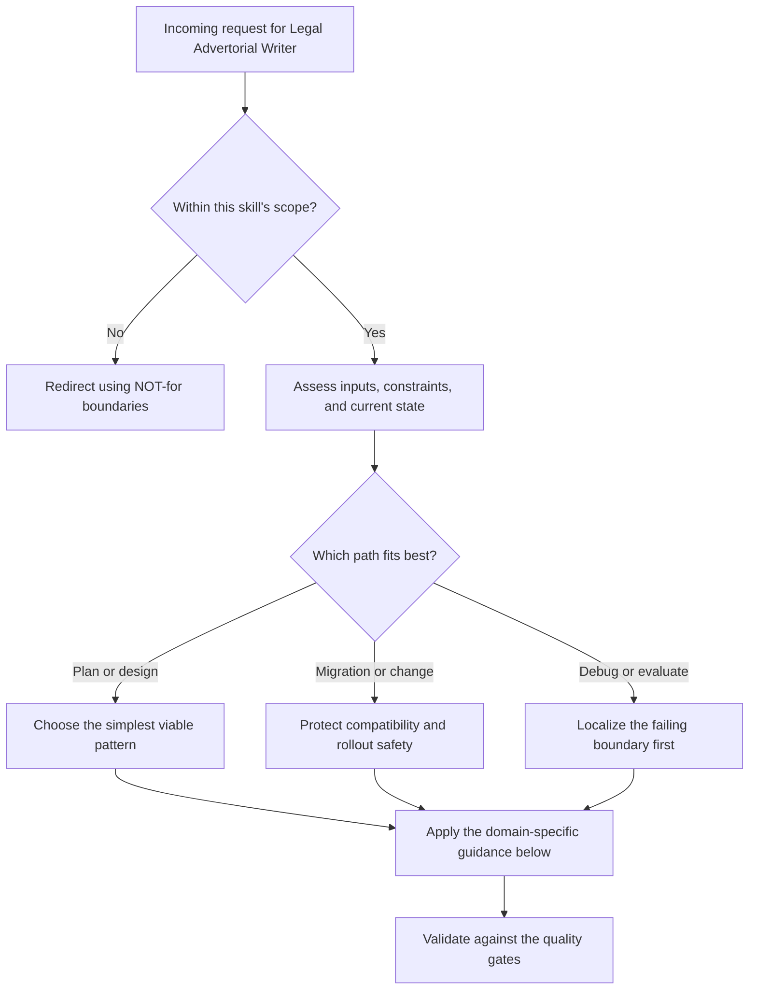

# Legal Advertorial Writer

## Core Philosophy

The central premise: **readers are not marks — they are people with a problem looking for a solution.** Legal products serve people at vulnerable moments. Overselling destroys trust and conversions. Honesty earns both.

The advertorial format works because it educates first and sells second. When the reader arrives at the CTA, they already understand why the product exists and whether it solves their specific problem. The sale is the natural conclusion of the article, not a pitch bolted onto the end.

## NOT for

- Use pressure language ("limited time," "act now," "don't miss out")
- Make promises the product cannot keep
- Oversimplify legal reality to make the product sound more powerful
- Talk down to readers who are already dealing with enough
- Giving legal advice, eligibility determinations, or jurisdiction-specific filing instructions.
- Drafting motions, pleadings, demand letters, or other legal practice documents.

## Shibboleths

- If the draft implies guaranteed relief, automatic eligibility, or "results in X days," it has left this skill's scope.
- If the CTA hides price, uses countdown pressure, or turns alternatives into strawmen, the advertorial is broken.
- If the product is framed as replacing a lawyer without nuance, the trust model has collapsed.

## Article Architecture

Every advertorial article follows this structure:

### 1. The Real Problem Hook (first 2–3 paragraphs)
Lead with the reader's actual experience, not a statistic. Name the specific frustration or confusion they're feeling. Make them feel seen before you educate them.

- Bad: "Criminal records affect 70 million Americans."
- Good: "You got your charges dropped two years ago. You've done the right things. But your background check still shows the arrest. Here's what's actually happening."

### 2. Education Block (the meat)
This is genuine, accurate information. It earns trust and does most of the selling. The reader should leave knowing something true and useful whether or not they buy.

- Explain the legal/systemic landscape plainly
- Name the specific mechanism behind the problem (e.g., data brokers vs. court records)
- Acknowledge complexity without drowning the reader in it
- Use plain English. Legal jargon should be defined when used, not avoided entirely.

### 3. The Competitive Landscape (honest positioning)
Briefly describe what options exist — including free/DIY options. Acknowledge their tradeoffs. Don't trash competitors; compare honestly.

- "You can send dispute letters yourself. The process is... [explain]. That works for some people."
- "Attorneys can help. They cost $1,500–$5,000 and are worth it for complex cases."
- "Our product fills the gap between DIY and full legal representation."

Readers who understand their options and still choose your product are your best customers.

### 4. The CTA Block (earned close)
After a well-built article, the CTA should feel like a natural conclusion, not a pivot. Keep it short. One sentence of reinforcement, one action.

- State the price clearly. Hiding it erodes trust.
- Make the outcome concrete: what does the reader get, specifically?
- Use active but non-pressuring language.
- One CTA per article. Don't hedge with multiple options.

**Template CTA block structure:**
```
[One sentence that closes the article's argument and connects it to the product]
[What you get + price, stated plainly]
[Button: action-oriented, specific, honest]
```

## Voice & Tone for Legal Products

### Use:
- Second person ("you," "your record") — direct and personal
- Short sentences at emotional beats
- Active voice
- Present tense for current situations, past tense for backstory
- Specific numbers over vague claims ("47 companies" not "dozens")
- Hedged legal claims ("may," "in most states," "depending on your record type")

### Avoid:
- "Life-changing" and other superlatives
- Passive voice on key claims ("records are cleared" → "the court clears your record")
- Legal jargon without definition
- Testimonials without attribution
- Absolute claims about legal outcomes

## Legal Compliance in Copy

Legal advertorials must thread a needle between useful information and unauthorized practice of law (UPL).

**Safe patterns:**
- "In Oregon, you may be eligible if..." (citing law, not advising)
- "Most courts require..." (general description of process)
- "The FCRA gives you the right to..." (describing existing law)
- Always include "This is not legal advice" disclaimer, worked naturally into the copy or in a sidebar

**Avoid:**
- "You qualify for expungement" (determination, not description)
- "This will remove your record" (outcome promise)
- "You don't need a lawyer for this" without nuance

## Competitive Landscape Reference

For legal tech products, readers typically compare against:

| Option | Cost | Effort | When it's right |
|--------|------|--------|-----------------|
| DIY | Free–$50 | High | Simple cases, patient users |
| Legal aid nonprofits | Free | Waitlist 2–6 months | Best for complex/serious cases |
| Private attorney | $1,500–$5,000 | Low | Complex cases, high stakes |
| Legal tech products | $19–$199 | Low–medium | Middle: too complex for DIY, not complex enough for attorney |

Honest positioning: legal tech lives in the middle. Acknowledge this. Never claim to replace an attorney.

## Article Length & Pacing

- Target: 900–1,400 words for advertorial blogs
- Paragraphs: 2–4 sentences max
- Headers: every 250–350 words
- One CTA block at end; optional in-article mention at ~60% mark
- Reading level: 8th grade (Hemingway App score 8 or below)

## Failure Modes

- Treating an out-of-scope request as if this skill owns it.
- Choosing a pattern before checking the actual constraints and current state.
- Returning an answer without validating it against the acceptance criteria for this skill.


## Worked Examples

- Minimal case: apply the simplest in-scope path to a small, low-risk request.
- Migration case: preserve compatibility while changing one constraint at a time.
- Failure-recovery case: show how to detect the wrong path and recover before final output.


## Quality Gates

- The recommendation stays inside the skill's stated boundaries.
- The chosen path matches the user's actual constraints and current state.
- The output is specific enough to act on, not just descriptive.
- Any major trade-offs or failure conditions are called out explicitly.


## References

- `references/advertorial-patterns.md` — Annotated examples of effective and ineffective legal advertorial copy with commentary
- `references/cta-templates.md` — CTA block templates for different product types and emotional contexts

## Decision Points



Use this as the first-pass routing model:

- Confirm the request belongs in this skill before doing deeper work.
- Separate planning, migration, and debugging paths before choosing a solution.
- Prefer the simplest correct path that still survives the quality gates.
