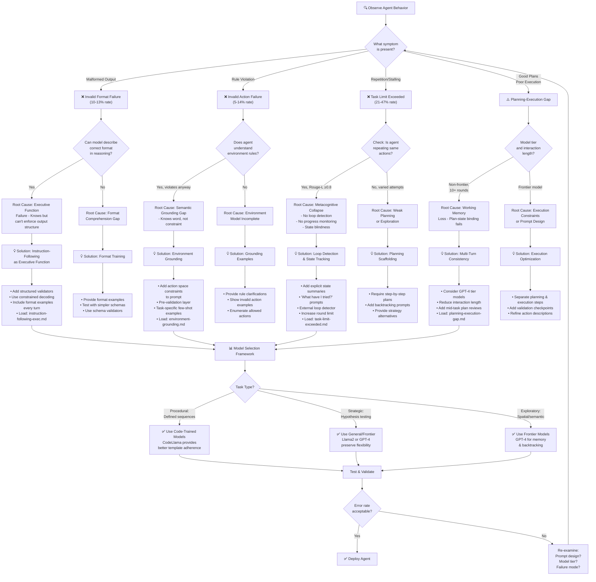

# Agent Failure Diagnosis & Remediation Protocol

```mermaid
flowchart TD
    A["🔍 Observe Agent Behavior"] --> B{What symptom<br/>is present?}
    
    B -->|Malformed Output| C["❌ Invalid Format Failure<br/>(10-13% rate)"]
    B -->|Rule Violation| D["❌ Invalid Action Failure<br/>(5-14% rate)"]
    B -->|Repetition/Stalling| E["❌ Task Limit Exceeded<br/>(21-47% rate)"]
    B -->|Good Plans<br/>Poor Execution| F["⚠️ Planning-Execution Gap"]
    
    C --> C1{"Can model describe<br/>correct format<br/>in reasoning?"}
    C1 -->|Yes| C2["Root Cause: Executive Function<br/>Failure - Knows but<br/>can't enforce output structure"]
    C1 -->|No| C3["Root Cause: Format<br/>Comprehension Gap"]
    
    C2 --> C4["💡 Solution: Instruction-Following<br/>as Executive Function"]
    C4 --> C5["• Add structured validators<br/>• Use constrained decoding<br/>• Include format examples<br/>every turn<br/>• Load: instruction-following-exec.md"]
    
    C3 --> C6["💡 Solution: Format Training"]
    C6 --> C7["• Provide format examples<br/>• Test with simpler schemas<br/>• Use schema validators"]
    
    D --> D1{"Does agent<br/>understand<br/>environment rules?"}
    D1 -->|Yes, violates anyway| D2["Root Cause: Semantic Grounding Gap<br/>- Knows word, not constraint"]
    D1 -->|No| D3["Root Cause: Environment<br/>Model Incomplete"]
    
    D2 --> D4["💡 Solution: Environment Grounding"]
    D4 --> D5["• Add action space constraints<br/>to prompt<br/>• Pre-validation layer<br/>• Task-specific few-shot examples<br/>• Load: environment-grounding.md"]
    
    D3 --> D6["💡 Solution: Grounding Examples"]
    D6 --> D7["• Provide rule clarifications<br/>• Show invalid action examples<br/>• Enumerate allowed actions"]
    
    E --> E1{"Check: Is agent<br/>repeating same<br/>actions?"}
    E1 -->|Yes, Rouge-L ≥0.8| E2["Root Cause: Metacognitive Collapse<br/>- No loop detection<br/>- No progress monitoring<br/>- State blindness"]
    E1 -->|No, varied attempts| E3["Root Cause: Weak Planning<br/>or Exploration"]
    
    E2 --> E4["💡 Solution: Loop Detection<br/>& State Tracking"]
    E4 --> E5["• Add explicit state summaries<br/>• 'What have I tried?' prompts<br/>• External loop detector<br/>• Increase round limit<br/>• Load: task-limit-exceeded.md"]
    
    E3 --> E6["💡 Solution: Planning Scaffolding"]
    E6 --> E7["• Require step-by-step plans<br/>• Add backtracking prompts<br/>• Provide strategy alternatives"]
    
    F --> F1{"Model tier<br/>and interaction<br/>length?"}
    F1 -->|Non-frontier,<br/>10+ rounds| F2["Root Cause: Working Memory<br/>Loss - Plan-state binding fails"]
    F1 -->|Frontier model| F3["Root Cause: Execution<br/>Constraints<br/>or Prompt Design"]
    
    F2 --> F4["💡 Solution: Multi-Turn Consistency"]
    F4 --> F5["• Consider GPT-4 tier models<br/>• Reduce interaction length<br/>• Add mid-task plan reviews<br/>• Load: planning-execution-gap.md"]
    
    F3 --> F6["💡 Solution: Execution Optimization"]
    F6 --> F7["• Separate planning & execution steps<br/>• Add validation checkpoints<br/>• Refine action descriptions"]
    
    C5 --> G["📊 Model Selection Framework"]
    D5 --> G
    E5 --> G
    F5 --> G
    
    G --> H{Task Type?}
    H -->|Procedural:<br/>Defined sequences| I["✅ Use Code-Trained Models<br/>CodeLlama provides<br/>better template adherence"]
    H -->|Strategic:<br/>Hypothesis testing| J["✅ Use General/Frontier<br/>Llama2 or GPT-4<br/>preserve flexibility"]
    H -->|Exploratory:<br/>Spatial/semantic| K["✅ Use Frontier Models<br/>GPT-4 for memory<br/>& backtracking"]
    
    I --> L["Test & Validate"]
    J --> L
    K --> L
    
    L --> M{Error rate<br/>acceptable?}
    M -->|Yes| N["✅ Deploy Agent"]
    M -->|No| O["Re-examine:<br/>Prompt design?<br/>Model tier?<br/>Failure mode?"]
    O --> B
```
