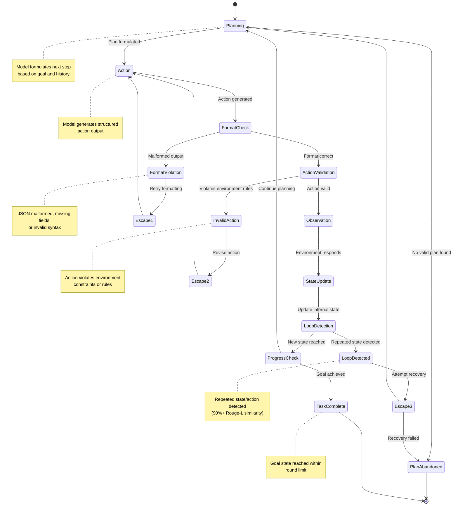

# Agent State Machine: Planning-Execution Loop Detection

```mermaid
stateDiagram-v2
    [*] --> Planning
    
    Planning --> Action: Plan formulated
    Planning --> PlanAbandoned: No valid plan found
    
    Action --> FormatCheck: Action generated
    FormatCheck --> FormatViolation: Malformed output
    FormatCheck --> ActionValidation: Format correct
    
    ActionValidation --> InvalidAction: Violates environment rules
    ActionValidation --> Observation: Action valid
    
    Observation --> StateUpdate: Environment responds
    StateUpdate --> LoopDetection: Update internal state
    
    LoopDetection --> LoopDetected: Repeated state detected
    LoopDetection --> ProgressCheck: New state reached
    
    ProgressCheck --> Planning: Continue planning
    ProgressCheck --> TaskComplete: Goal achieved
    
    FormatViolation --> Escape1: Retry formatting
    Escape1 --> Action
    
    InvalidAction --> Escape2: Revise action
    Escape2 --> Action
    
    LoopDetected --> Escape3: Attempt recovery
    Escape3 --> Planning
    Escape3 --> PlanAbandoned: Recovery failed
    
    PlanAbandoned --> [*]
    TaskComplete --> [*]
    
    note right of Planning
        Model formulates next step
        based on goal and history
    end note
    
    note right of Action
        Model generates structured
        action output
    end note
    
    note right of FormatViolation
        JSON malformed, missing fields,
        or invalid syntax
    end note
    
    note right of InvalidAction
        Action violates environment
        constraints or rules
    end note
    
    note right of LoopDetected
        Repeated state/action detected
        (90%+ Rouge-L similarity)
    end note
    
    note right of TaskComplete
        Goal state reached within
        round limit
    end note
```
