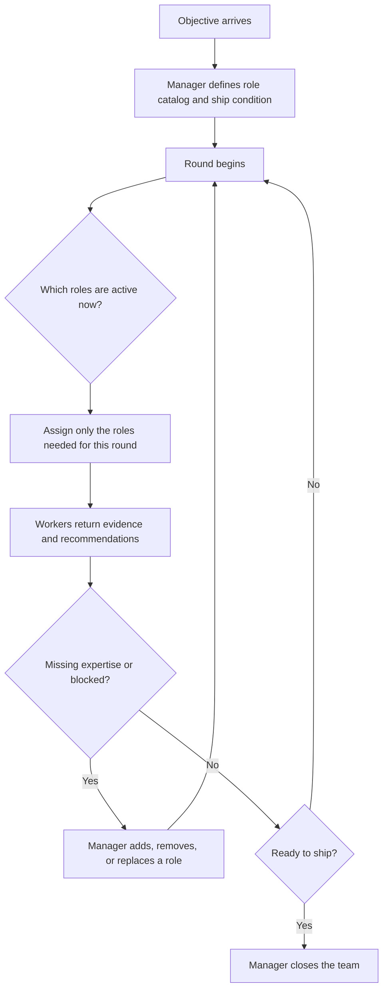

# Manager-Driven Team Orchestrator

Use this skill when a lead should continuously decide which roles are active, what each role does next, when a new role is needed, and whether another round is justified.

## When to Use

- The objective is shared, but the best next assignment changes as evidence arrives.
- Some roles should sit out certain rounds instead of running every time.
- The manager needs authority to add or replace roles midstream.
- "Ready to ship" is a judgment call, not a fixed edge in a workflow graph.

## NOT for

- Static writer-reviewer-revise loops. Model those as workflows instead.
- Free-form swarms where peers self-assign without a manager contract.
- Blackboard or diagnosis-board patterns where shared state is the primary coordination surface.
- One-shot task decomposition with no round-based reassessment.

## Decision Points

Use this routing:

- Make the manager own round boundaries and assignment changes.
- Keep workers scoped to evidence gathering, proposal generation, or critique; they do not redesign the topology on their own.
- Treat "add a role" as a first-class outcome, not an ad hoc exception.

## Fork Guidance

- Default the manager to in-process so it retains the full round history.
- Use `context: fork` for workers when they need isolated reasoning, different skill preload, or a long artifact review that should not pollute the manager context.
- Do not fork multiple speculative managers; one manager owns the team state.

## Failure Modes

- Fake team. Symptom: the same roles always run in the same order. Recovery: reclassify as a workflow.
- Permanent role over-activation. Symptom: every role runs every round regardless of need. Recovery: force the manager to mark roles active, idle, or retired each round.
- Missing authority boundary. Symptom: workers assign work to each other with no manager decision. Recovery: restore manager ownership or change topology explicitly.
- No new-role path. Symptom: the manager identifies a gap but cannot introduce expertise. Recovery: include `newRole` in the manager decision contract.
- Ship-by-fatigue. Symptom: the team stops because people are tired, not because the objective is met. Recovery: make the ship condition explicit before round one.

## Worked Example

Goal: prepare a launch memo with product, legal, and risk inputs.

1. Start with `product-strategist`, `legal-reviewer`, and `skeptical-editor`.
2. Round one shows a missing pricing model analysis.
3. The manager adds `pricing-analyst` for round two and leaves `skeptical-editor` idle.
4. Round two resolves pricing risk but reveals open compliance language.
5. The manager reactivates `legal-reviewer`, gathers the last evidence, and closes the team once the ship condition is satisfied.

The expert move is selective activation. The best team round is not the one with the most roles; it is the one with the fewest roles that can still reduce the key uncertainty.

## Quality Gates

- [ ] The manager sees full round history and final artifacts.
- [ ] Each role is defined by a capability, not only by a single task.
- [ ] The plan names a ship condition before the first round begins.
- [ ] The manager can explicitly leave roles idle or retire them.
- [ ] The manager contract includes what to do when expertise is missing.
- [ ] Every round produces evidence that changes or confirms the next assignment decision.
