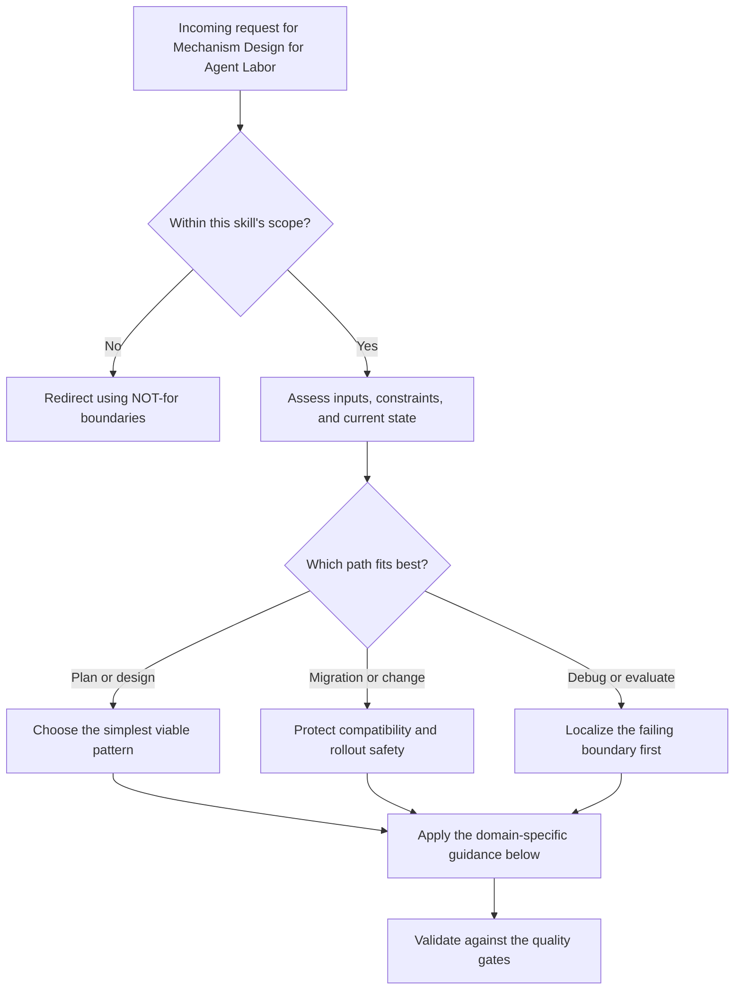

# Mechanism Design for Agent Labor

Price the bond. Settle the outcome. Make defection expensive without pricing out legitimate agents. Design the marketplace so that truthful behavior is optimal, adverse selection is mitigated, and the cold start problem has a concrete bootstrap plan.

## Decision Points



Use this as the first-pass routing model:

- Confirm the request belongs in this skill before doing deeper work.
- Separate planning, migration, and debugging paths before choosing a solution.
- Prefer the simplest correct path that still survives the quality gates.

## When to Use

- Designing a pricing function for collateralized agent work contracts
- Analyzing whether a bonding scheme satisfies incentive compatibility
- Building settlement logic that evaluates outcome against manifest
- Determining escrow amounts for agent delegations of varying risk
- Designing marketplace dynamics: listing, matching, bidding, settlement
- Solving the cold start problem for an agent labor marketplace
- Building trust infrastructure for multi-party agent coordination
- Implementing the Bonded Commons protocol from Port Daddy
- Collaborating with economists on market design for agent labor

## NOT for Boundaries

- General auction theory without agent-labor or escrow context
- Cryptocurrency tokenomics, DeFi protocol design, or validator economics
- Payment gateway integration without marketplace incentives or settlement rules
- General game-theory education detached from mechanism implementation

---

## Core Mental Models

### 1. Mechanism Design Is Inverse Game Theory

**Standard game theory:** Given the rules, predict behavior.
**Mechanism design:** Given desired behavior, design the rules.

The foundational insight (Hurwicz 1960, Nobel 2007 with Maskin and Myerson): you can design the "rules of the game" such that self-interested agents, acting purely in their own interest, produce socially optimal outcomes.

**For agent labor markets, this means:** Design the bond pricing, escrow, and settlement rules such that:
- Honest agents find it profitable to participate
- Dishonest agents find defection more expensive than cooperation
- The marketplace operator captures enough value to sustain the platform
- No participant can improve their outcome by lying about their capabilities, costs, or intent

**The revelation principle:** Any mechanism that achieves a desired outcome through complex strategic interaction can be replaced by a **direct mechanism** where agents simply report their private information truthfully, and truthful reporting is incentive-compatible. This simplifies marketplace design enormously: instead of designing elaborate strategic protocols, design a direct mechanism and verify incentive compatibility.

### 2. The Four Bond Pricing Functions

#### 2a. Fixed Bonds
```
bond(task) = CONSTANT
```

**Properties:**
- Simple to implement and understand
- Severely inefficient: overprices trivial tasks, underprices critical ones
- Creates adverse selection: only agents working on high-value tasks find the bond worthwhile to post
- Use ONLY as a bootstrap mechanism for a new marketplace with no data

#### 2b. Task-Complexity-Proportional Bonds
```
bond(task) = base_rate * complexity_score(task)

complexity_score factors:
  - Estimated compute time (CPU-hours or token count)
  - Number of files touched
  - Criticality of files (auth, config, DB migrations = high)
  - Scope: read-only vs. write vs. delete
  - Duration of access required
```

**Decision tree for complexity scoring:**
```
START: Agent requests work on task
|
+-- What is the SCOPE?
|   +-- Read-only access -> Base bond: LOW (1x)
|   +-- Write to non-critical files -> Base bond: MEDIUM (3x)
|   +-- Write to critical files (auth, config, DB) -> Base bond: HIGH (10x)
|   +-- Full system access -> Base bond: MAXIMUM (25x)
|
+-- What is the DURATION?
|   +-- < 10 minutes -> Duration multiplier: 1.0
|   +-- 10-30 minutes -> Duration multiplier: 1.5
|   +-- 30-60 minutes -> Duration multiplier: 2.0
|   +-- > 60 minutes -> Duration multiplier: 3.0
|
+-- BOND = Base * Duration
```

**Properties:**
- Scales with task risk
- Does not account for agent quality (a proven agent pays the same as a new one)
- Good as a second-generation mechanism after fixed bonds

#### 2c. Reputation-Adjusted Bonds
```
bond(task, agent) = complexity_bond(task) * reputation_discount(agent)

reputation_discount:
  0 completions -> 2.0x (surcharge: unknown agent)
  1-5 completions, 0 failures -> 1.5x
  5-20 completions, <10% failure rate -> 1.0x (par)
  20-50 completions, <5% failure rate -> 0.7x (discount)
  50+ completions, <3% failure rate -> 0.5x (deep discount)
  ANY agent with >20% failure rate -> 3.0x (penalty)
```

**Properties:**
- Rewards proven agents with lower capital requirements
- Creates a flywheel: good agents earn discounts, do more work, earn deeper discounts
- Vulnerable to Sybil attacks (creating many identities to farm clean histories)
- Requires linking agent identity to reputation (the identity problem)

#### 2d. Dynamic (Market-Driven) Bonds
```
bond(task, agent, market_state) = base_bond(task, agent) * market_multiplier(supply, demand)

market_multiplier:
  supply >> demand (many agents, few tasks) -> 0.5x (bonds decrease to attract tasks)
  supply ~= demand -> 1.0x
  supply << demand (few agents, many tasks) -> 2.0x (bonds increase; agents are scarce)

  Additional: surge pricing during high-risk periods (after a sabotage event)
```

**Properties:**
- Self-regulating: bond prices reflect actual market conditions
- Requires sufficient volume for price discovery (fails in thin markets)
- Most sophisticated; use only after the marketplace has established baseline activity
- The convergence to equilibrium pricing is itself a mechanism design problem (see Myerson 1981)

### 3. Escrow Mechanics: The Flow of Funds

**The escrow lifecycle:**

```
Phase 1: BOND POSTING
  Agent posts bond B to escrow contract
  Bond is locked; agent cannot withdraw during task execution
  Escrow contract records: agent_id, task_id, bond_amount, deadline, acceptance_criteria

Phase 2: TASK EXECUTION
  Agent performs work
  Evidence trail accumulates (commits, test results, session notes)
  Clock ticks toward deadline

Phase 3: SETTLEMENT (one of four outcomes)

  3a. SUCCESS
    Verification oracle confirms all acceptance criteria met
    Flow: escrow --> agent (100% of bond returned)
    Flow: task_poster --> agent (payment for completed work)
    Reputation: agent.completions++, agent.reputation_score increases

  3b. PARTIAL COMPLETION
    Agent crashed or timed out; evidence shows partial work
    completion_fraction = completed_criteria / total_criteria
    IF completion_fraction > 0.5:
      Flow: escrow --> agent (completion_fraction * bond)
      Flow: remainder --> salvage_fund (funds successor agent's bond)
    ELSE:
      Flow: escrow --> held (await salvage agent completion)
      Reputation: agent.salvages++, agent.reputation_score decreases

  3c. FAILURE / SABOTAGE
    Verification oracle detects destructive behavior or zero progress
    Flow: escrow --> reconstruction_fund (100% of bond liquidated)
    Flow: task_poster receives priority matching for replacement agent
    Reputation: agent.failures++, agent banned if failure_rate > threshold

  3d. DISPUTE
    Either party contests the verification oracle's decision
    Flow: escrow --> arbitration_hold (locked during dispute resolution)
    Arbitration: multi-oracle settlement (see section below)
    Reputation: no change until dispute resolved
```

### 4. Verification as the Critical Path

**The verification oracle determines settlement.** If the oracle is gameable, the entire mechanism collapses.

**FORMALJUDGE-style atomic verification:**
1. Task manifest specifies acceptance criteria as CHECKABLE assertions
2. Each assertion is either pass or fail (no partial credit at the assertion level)
3. Verification runs automatically: test suites, type checks, linting, coverage thresholds
4. Human review is the appellate court, not the first instance

**Multi-oracle settlement protocol:**
```
Oracle 1: Automated (test suite pass/fail)           -- cheap, fast, gameable
Oracle 2: Evidence-based (Merkle trail review)        -- medium cost, hard to game
Oracle 3: Human audit (random 10% sample)             -- expensive, authoritative

Settlement rule: 2-of-3 agreement required
  If all 3 agree: settle immediately
  If 2 agree, 1 dissents: settle with the majority, flag for review
  If all 3 disagree: escalate to full human arbitration
```

**Designing acceptance criteria:**
- Criteria must be MACHINE-CHECKABLE wherever possible
- Subjective criteria ("code is clean") must be operationalized ("passes ESLint with zero warnings, all functions have JSDoc comments")
- Every criterion has a weight; weighted sum determines completion_fraction
- The manifest is IMMUTABLE after bond posting (prevents moving goalposts)

### 5. Incentive Compatibility

**Definition (Myerson 1981):** A mechanism is incentive-compatible if every participant maximizes their expected payoff by reporting their private information truthfully.

**For agent labor markets, the private information is:**
- Agent's true capability (can they actually do the task?)
- Agent's true cost (how much effort/compute will it take?)
- Agent's true intent (do they plan to do the work or defect?)

**Incentive compatibility conditions:**

1. **Truthful capability reporting:** An agent who claims to be capable but isn't will fail, lose their bond, and damage their reputation. The bond must be large enough that the expected loss from failing exceeds the expected gain from attempting a task beyond one's capability.

   ```
   IC condition: bond > P(failure | incapable) * opportunity_cost_of_trying
   ```

2. **Truthful cost reporting:** In a second-price auction (Vickrey), agents report their true cost because the payment is determined by the SECOND-lowest bid, not their own bid. Lying about cost cannot improve their outcome.

3. **No profitable defection:** The bond must be large enough that sabotage is never profitable.

   ```
   IC condition: bond > max_possible_gain_from_sabotage
   ```

### 6. The Principal-Agent Problem

**Definition:** The principal (task poster) cannot observe the agent's effort directly. The agent may shirk (cut corners) while appearing to work.

**How bonds mitigate this:**
- The bond makes the agent's outcome depend on QUALITY, not just completion
- Multi-oracle verification catches corner-cutting that a single test suite might miss
- Reputation effects create long-term incentives even when short-term shirking is tempting

**The moral hazard gradient:**
```
Low moral hazard:  Task has clear, machine-checkable acceptance criteria
                   Agent's output is fully observable
                   Bond + reputation + automated verification sufficient

Medium moral hazard: Task has some subjective criteria
                     Agent's effort is partially observable
                     Add human audit sampling (10-20%)

High moral hazard:  Task is open-ended ("improve the codebase")
                    Agent's effort is largely unobservable
                    Require milestone-based escrow release
                    Each milestone has its own acceptance criteria
                    Bond released incrementally, not all-at-once
```

### 7. Adverse Selection: The Market for Lemons

**Akerlof's problem (1970):** If buyers can't distinguish good agents from bad agents, they'll only pay the average price. Good agents (whose costs are higher because they do quality work) exit the market. Only "lemons" remain.

**Mitigations for agent labor markets:**

1. **Reputation systems with skin in the game:** Reputation is built by posting bonds and succeeding. You can't buy reputation; you earn it by risking capital. This separates agents with real capability from those bluffing.

2. **Graduated task access:** New agents can only bid on low-risk, low-value tasks. As their reputation grows, they unlock higher-value tasks. This is a screening mechanism: only agents who can consistently deliver on small tasks get access to large ones.

3. **Functor-equivalent solution indexing (from ologs):** If the marketplace indexes solutions by their olog structure, an agent who solved problem A (olog C_A) automatically demonstrates capability for problem B (olog C_B) if there exists a functor F: C_A --> C_B. This creates a supply-side advantage: agents accumulate demonstrated capability across domains, not just within one narrow task type.

4. **Portfolio proof:** Agents maintain a Merkle-trail portfolio of completed work. Each entry is cryptographically linked to the task manifest, the verification result, and the settlement outcome. This is unforgeable and transferable across marketplaces.

### 8. Collusion Resistance

**The threat:** Agent rings collude to game the reputation system. Agent A posts a task, Agent B "completes" it, both receive reputation credit. Cost: only the bond (which B gets back on "success").

**Mitigations:**

1. **Economic:** Make the cost of fake tasks high enough that collusion is unprofitable. Task posting requires a listing fee (burned, not escrowed). If the listing fee exceeds the value of the reputation gained, collusion is a losing proposition.

2. **Structural:** Separate task-posting reputation from task-completing reputation. Posting easy tasks that your colluder completes doesn't help the completer's reputation for hard tasks, because task difficulty is scored independently.

3. **Detection:** Statistical analysis of agent-pair completion rates. If agent A's tasks are disproportionately completed by agent B (and vice versa), flag for review. Use graph-based anomaly detection on the task-completion bipartite graph.

4. **Stake-weighted verification:** Randomly selected verifiers from the agent pool, weighted by their own reputation. Colluders can't control who verifies their work unless they control a majority of high-reputation agents (prohibitively expensive).

### 9. The Cold Start Problem

**The bootstrap challenge:** A new marketplace has no agents, no tasks, no reputation data, and no price discovery. How do you get the flywheel spinning?

**Phase 1: Subsidized seeding (weeks 1-4)**
- Marketplace operator posts real tasks at above-market rates
- Invite 5-10 known-capable agents (from existing networks) to complete them
- Use fixed bonds (simple, predictable) during this phase
- Goal: establish baseline reputation data for the first cohort

**Phase 2: Organic growth with guardrails (months 2-6)**
- Switch to complexity-proportional bonds
- Open to new agents with the graduated task access model
- Task posters receive matching credits for posting tasks
- Reputation bootstrapping: new agents can import verifiable work history from external sources (GitHub, etc.) for a partial reputation credit

**Phase 3: Market dynamics (month 6+)**
- Switch to reputation-adjusted bonds
- Introduce dynamic pricing if volume is sufficient (>100 tasks/day)
- Reduce subsidies; the marketplace should be self-sustaining
- Introduce the listing fee for collusion resistance

**The key metric at each phase:**
```
Phase 1: task_completion_rate (must be > 80%)
Phase 2: new_agent_retention_at_30_days (must be > 50%)
Phase 3: repeat_poster_rate (must be > 60%)
```

### 10. Revenue Models for the Marketplace Operator

| Model | Description | Pros | Cons |
|---|---|---|---|
| Transaction fee | X% of each settlement | Scales with volume | Raises effective cost for both sides |
| Listing fee | Fixed fee to post a task | Deters spam, aids collusion resistance | Barrier for low-value tasks |
| Subscription | Monthly fee for agents/posters | Predictable revenue | May exclude casual participants |
| Bond spread | Marketplace keeps X% of forfeited bonds | Aligns incentives (marketplace benefits from catching bad actors) | Perverse incentive to over-penalize |
| Freemium | Free for basic, paid for priority matching/analytics | Low barrier to entry | Requires value-add features |

**Recommended:** Transaction fee (2-5%) + listing fee (prevents spam) + bond spread (1-2% of forfeited bonds). This combination aligns incentives: the marketplace earns most from successful transactions, has a small collusion deterrent from listing fees, and a small upside from catching bad actors (but not enough to create perverse incentives).

---

## Decision Framework: Bond Size Relative to Task Value

**The question:** Should bonds be 10% of task value? 50%? 100%?

**The answer depends on the threat model:**

```
Threat: Careless work (agent tries but does sloppy job)
  Bond: 10-25% of task value
  Rationale: Agent loses some but not all; enough to incentivize care

Threat: Abandonment (agent takes the task and ghosts)
  Bond: 25-50% of task value
  Rationale: Must cover the cost of finding and onboarding a replacement agent

Threat: Sabotage (agent intentionally damages the system)
  Bond: 100-200% of task value
  Rationale: Must cover full reconstruction cost
  Note: Bonds > 100% of task value are capital-inefficient; use only for critical systems

Threat: Data exfiltration (agent steals proprietary information)
  Bond: Insufficient deterrent. Use access controls, not bonds.
  Rationale: The value of stolen data may vastly exceed any feasible bond
```

**Rule of thumb:** Start at 25% of estimated task value. Adjust based on observed failure modes. If too many agents are failing and losing bonds, bonds may be too low (not deterring the careless). If agent participation is dropping, bonds may be too high (pricing out the good).

---

## Worked Examples

- Load [examples/pricing-auth-write-access.md](examples/pricing-auth-write-access.md) for a concrete bond-sizing walkthrough on a critical-file task.
- Load [references/implementation-paths.md](references/implementation-paths.md) when you need to compare Stripe, crypto escrow, and hybrid settlement rails, and [references/foundations.md](references/foundations.md) when you need the academic anchors behind the mechanism choices.

## Failure Modes

### Undercollateralization Spiral
**Symptom:** Bonds are set too low; sabotage costs less than the damage it causes. Bad actors treat bonds as a fee, not a deterrent.
**Diagnosis:** Compare bond amounts to reconstruction costs. If bond < (avg reconstruction time * hourly rate), the bond is too low.
**Fix:** Introduce a minimum bond floor tied to file criticality scores. Critical files get 10x minimum regardless of agent history.

### Over-Pricing Death Spiral
**Symptom:** Legitimate agents stop posting Float Plans because bonds are too expensive. Activity drops. Only well-funded agents participate.
**Diagnosis:** Track Float Plan submission rate over time. If rate drops >30% after a pricing change, bonds are too high.
**Fix:** Introduce history discounts earlier and more aggressively. A principal with 10 clean completions should see 30-50% bond reduction.

### Oracle Manipulation
**Symptom:** Acceptance criteria are met on paper but the work is garbage. Tests pass but code is unmaintainable.
**Diagnosis:** Compare automated oracle decisions with human spot-checks. If divergence > 20%, the oracle is gameable.
**Fix:** Use multi-oracle settlement: automated + evidence-based + random human audit. Require 2-of-3 agreement.

### Sybil Bond Farming
**Symptom:** An agent creates many identities to accumulate clean histories, then uses them for discounted bonds on sabotage.
**Diagnosis:** Track identity creation rate. Flag agents creating > 5 identities in 24 hours.
**Fix:** Tie bond history to the PRINCIPAL's identity (via delegation chain), not the agent's identity. New agents inherit their principal's reputation.

### Clock Manipulation
**Symptom:** Agent extends its session by manipulating system clock, keeping resources locked beyond the bonded duration.
**Diagnosis:** Compare session duration against wallclock from multiple sources (daemon monotonic clock, heartbeat timestamps, NTP).
**Fix:** Use monotonic counters for duration tracking, not wall-clock timestamps. The daemon's internal clock is authoritative.

### The Race to the Bottom
**Symptom:** In competitive bidding, agents underbid each other to win tasks, then cut corners because the payment doesn't cover quality work.
**Diagnosis:** Track correlation between winning bid price and task failure rate. If lower bids correlate with higher failure, the market is in a race to the bottom.
**Fix:** Use second-price (Vickrey) auctions: agents bid their true cost, winner pays the second-lowest bid. This removes the incentive to underbid. Alternatively, set a price floor based on task complexity scoring.

---

## Anti-Patterns

### The Flat Fee
**Novice:** Sets the same bond for all Float Plans regardless of scope or history. "10 units for everything."
**Expert:** Flat fees underprice high-risk work and overprice low-risk work. Only saboteurs find the price attractive for critical files, and legitimate agents are priced out of simple reads. Always use at minimum scope * duration pricing.
**Timeline:** Default mistake in v1 of any marketplace. Corrected after the first sabotage incident.

### The Reputation-Only Model
**Novice:** Uses only reputation for pricing, no collateral. "Good agents don't need bonds."
**Expert:** Reputation fails against one-shot defectors, Sybil identities, and misaligned principals. Collateral provides deterrence independent of reputation. Use reputation as a DISCOUNT on collateral, not a replacement.
**Timeline:** Philosophical argument that recurs every time someone proposes "trust-based" systems. The counter-argument is always Akerlof (1970).

### The God Oracle
**Novice:** Trusts a single automated oracle (test suite) for all settlement decisions.
**Expert:** Any single oracle is gameable. Tests can pass while code is unmaintainable. Use multi-oracle settlement with diverse verification methods.
**Timeline:** Discovered when the first agent writes code that passes tests but is incomprehensible.

### The Infinite Bond
**Novice:** "Make the bond so high that no one would ever defect." Sets bond at 10x task value.
**Expert:** Excessively high bonds create a barrier to entry that excludes all but the wealthiest agents. The marketplace becomes a plutocracy. Bonds should deter, not exclude. Target the sweet spot: high enough that defection is unprofitable, low enough that qualified agents can afford to participate.
**Timeline:** Over-reaction to the first sabotage event. The cure is data: track agent participation rates as a function of bond levels.

---

## Shibboleths

**"Just use reputation"** -- This person hasn't thought about one-shot defectors or Sybil attacks. Reputation without collateral is cheap talk. The correct response: reputation discounts bonds, it doesn't replace them.

**"The market will find the right price"** -- Only with sufficient volume. In thin markets (< 50 transactions/day), dynamic pricing oscillates chaotically. Use administered pricing (complexity-proportional) until volume supports price discovery.

**"Vickrey auctions are strategy-proof"** -- True for single-item auctions. For combinatorial allocation (multiple tasks, multiple agents), Vickrey-Clarke-Groves (VCG) is strategy-proof but computationally expensive (NP-hard in general). Practical systems use approximate mechanisms.

**"Why not just use escrow without bonds?"** -- Escrow protects the task poster's payment. Bonds protect the SYSTEM from agent misbehavior. They solve different problems. Escrow without bonds means agents risk nothing by attempting tasks they can't complete.

**"The bond should equal the task value"** -- This is the degenerate case where the agent is essentially paying upfront for the right to work. It works for high-trust, high-value work but excludes agents who are capable but capital-constrained. Better: bond = f(risk, reputation, market_conditions) where f is one of the four pricing functions above.

---

## Quality Gates

You have a well-designed agent labor mechanism when:

- [ ] Bond pricing function takes scope, duration, and agent reputation as inputs
- [ ] Deterrence: bond exceeds expected reconstruction cost for every scope tier
- [ ] Accessibility: an agent with > 10 clean completions can afford bonds for routine work
- [ ] Incentive compatibility: truthful capability/cost reporting is weakly dominant
- [ ] Settlement logic handles all four terminal states (success, partial, sabotage, dispute)
- [ ] Multi-oracle verification with 2-of-3 agreement for dispute resolution
- [ ] Adverse selection mitigated via graduated task access or portfolio proof
- [ ] Collusion resistance via listing fees and statistical detection
- [ ] Cold start plan with concrete metrics for each bootstrap phase
- [ ] Revenue model identified and sustainable at target volume
- [ ] An economist has reviewed the mechanism for arbitrage opportunities
- [ ] Practical implementation path chosen (Stripe, crypto, or hybrid) with trade-offs documented
