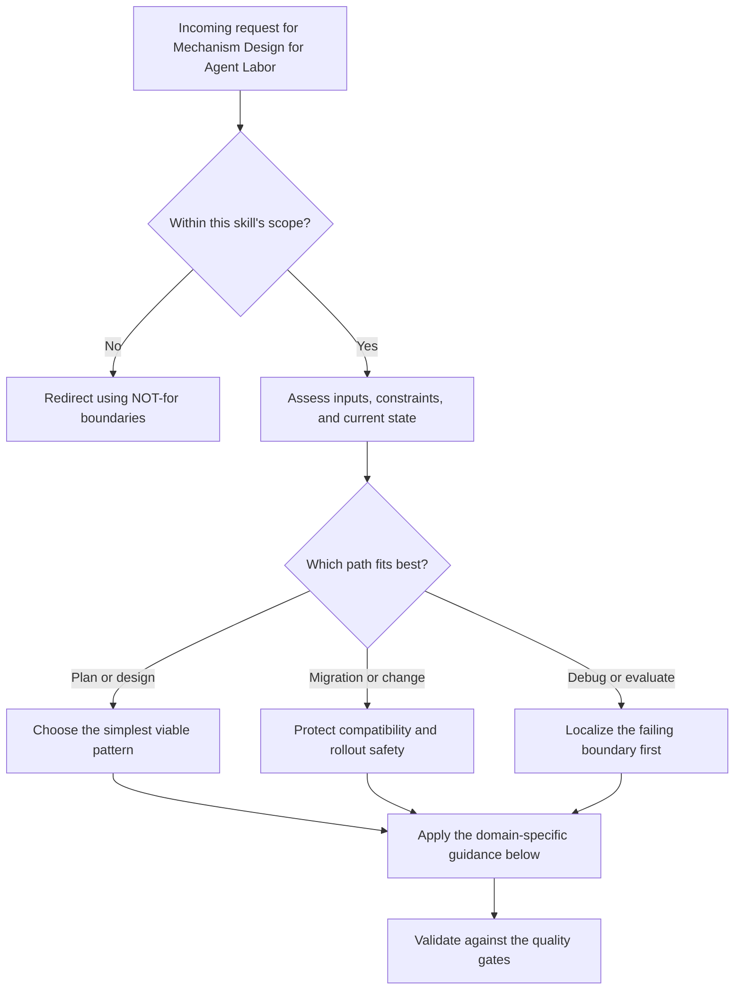

# Diagram 1: flowchart

```mermaid
flowchart TD
  A[Incoming request for Mechanism Design for Agent Labor] --> B{Within this skill's scope?}
  B -->|No| C[Redirect using NOT-for boundaries]
  B -->|Yes| D[Assess inputs, constraints, and current state]
  D --> E{Which path fits best?}
  E -->|Plan or design| F[Choose the simplest viable pattern]
  E -->|Migration or change| G[Protect compatibility and rollout safety]
  E -->|Debug or evaluate| H[Localize the failing boundary first]
  F --> I[Apply the domain-specific guidance below]
  G --> I
  H --> I
  I --> J[Validate against the quality gates]
```
