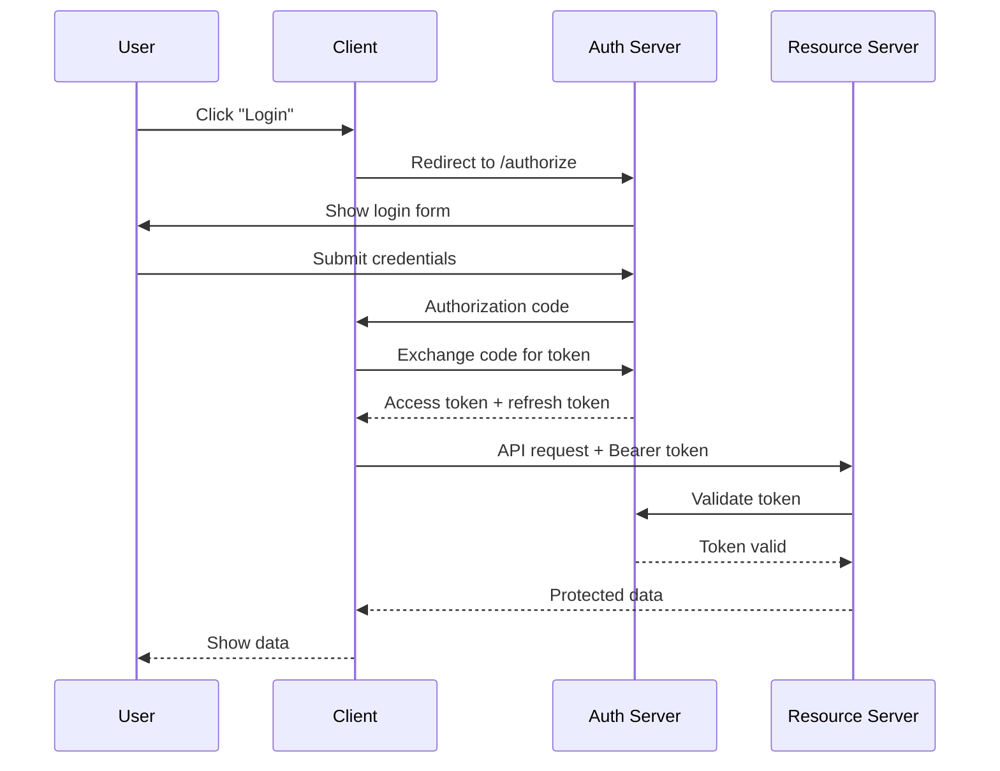
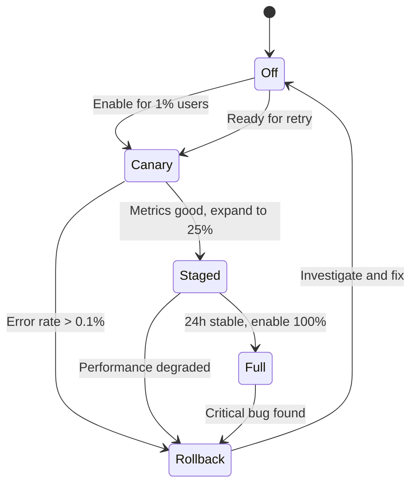
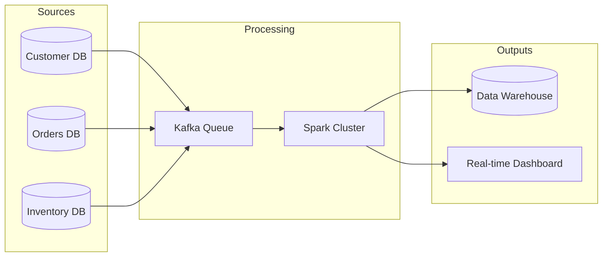

# Mermaid Graph Writer

Writes precise, well-structured Mermaid diagrams by selecting the optimal diagram type, applying correct syntax, and producing diagrams that are readable by both humans and agents.

## Decision Points

### Primary Diagram Type Selection
```
Content Type → Decision Logic:
├── Sequential interactions with timing?
│   ├── If protocol/API calls → sequenceDiagram
│   └── If user journey with emotions → journey
├── States with transitions?
│   ├── If lifecycle/status changes → stateDiagram-v2
│   └── If git branching → gitGraph  
├── Branching logic or process flow?
│   ├── If <15 nodes → flowchart TD/LR
│   └── If >15 nodes → break into subgraphs or multiple diagrams
├── Data relationships?
│   ├── If tables/entities → erDiagram
│   └── If class hierarchy → classDiagram
├── Temporal progression?
│   ├── If events over time → timeline
│   └── If project tasks → gantt
├── Hierarchical concepts?
│   ├── If brainstorm/taxonomy → mindmap
│   └── If proportional hierarchy → treemap
├── System architecture?
│   ├── If cloud/infrastructure → architecture-beta
│   ├── If containers/contexts → C4Context/C4Container
│   └── If component blocks → block-beta
└── Data visualization?
    ├── If categories/proportions → pie
    ├── If 2-axis comparison → quadrantChart  
    ├── If flow quantities → sankey-beta
    └── If numerical trends → xychart-beta
```

### Flowchart Direction Choice
```
Content Flow → Direction:
├── Decision tree with branching conditions?
│   └── Use TD (top-down) - questions flow down to answers
├── Sequential process steps?
│   └── Use LR (left-right) - time flows left to right
├── Dependency relationships?
│   └── Use BT (bottom-up) - dependencies point upward
└── Reverse chronology?
    └── Use RL (right-left) - latest first
```

### Node Shape Selection for Flowcharts
```
Node Purpose → Shape:
├── Decision/condition? → {Diamond}
├── Start/end point? → ([Stadium])
├── Process step? → [Rectangle]
├── Data store? → [(Cylinder)]
├── External system? → [[Subroutine]]
├── Event/trigger? → ((Circle))
└── Input/output? → [/Parallelogram/]
```

### Edge Cases - C4 vs Architecture
```
System Scope → Choice:
├── Single application context?
│   └── C4Context (shows external systems)
├── Internal containers of one system?
│   └── C4Container (shows APIs, DBs, web apps)
├── Component details within container?
│   └── C4Component (shows classes, modules)
└── Multiple cloud services/infrastructure?
    └── architecture-beta (shows regions, clusters)
```

### Complexity Thresholds - Sankey vs Flowchart
```
Flow Visualization → Decision:
├── Quantities flowing between categories?
│   ├── If proportional amounts matter → sankey-beta
│   └── If just showing connections → flowchart LR
├── >5 parallel flows?
│   └── sankey-beta (handles parallel flows better)
└── <5 flows with decision points?
    └── flowchart (shows branching logic clearly)
```

## Failure Modes

### Schema Bloat
**Symptoms**: Diagrams with >20 nodes, crossing edges everywhere, unreadable when rendered
**Detection**: Count nodes - if >15 in flowchart or >10 entities in ER, you're likely here
**Fix**: Split into overview + detail diagrams, use subgraphs for logical grouping, or change diagram type

### Mismatched Type Selection  
**Symptoms**: Using flowchart for everything - protocols shown as flowcharts, state machines as flowcharts
**Detection**: If you're forcing temporal sequences or state transitions into flowchart boxes, wrong type
**Fix**: Sequence diagrams for protocols, state diagrams for lifecycles, timeline for chronological events

### Unlabeled Decision Branches
**Symptoms**: Diamond nodes with unlabeled outgoing edges - reader can't tell which condition leads where
**Detection**: Any `{decision} --> node` without edge labels like `-->|Yes|` or `-->|condition|`
**Fix**: Label every edge from decision diamonds with the condition that triggers that path

### Direction Chaos
**Symptoms**: Mixing TD and LR within same flowchart, or using wrong direction for content type
**Detection**: Arrows going multiple directions, or decision tree flowing left-to-right
**Fix**: Pick one direction per diagram based on content flow (TD for decisions, LR for processes)

### Invisible Syntax Errors
**Symptoms**: Mermaid code that looks correct but fails to render, missing spaces, wrong brackets
**Detection**: Code that produces parser errors or renders as text instead of diagram
**Fix**: Validate syntax - spaces around arrows, matching brackets, correct diagram declaration

## Worked Examples

### Example 1: API Authentication Flow
**Input**: "Show how a user authenticates with OAuth2 and gets a token, then uses it to access protected resources"

**Expert Analysis**: 
- This is request/response over time → sequenceDiagram
- Multiple actors (User, Client, Auth Server, Resource Server)
- Async responses and token validation steps

**Decision Process**:
1. Content type: Sequential interactions with timing → sequenceDiagram
2. Actors: User, Client, AuthServer, ResourceServer
3. Key insight: This isn't a decision tree (flowchart) - it's a protocol with back-and-forth messages

**Output**:


**What novice would miss**: Using flowchart instead of sequence diagram, missing the timing aspect and participant interactions

### Example 2: Feature Flag Rollout Strategy
**Input**: "We need to visualize how feature flags roll out from development through production with different user percentages and rollback scenarios"

**Expert Analysis**:
- This has state transitions (off/canary/staged/full/rollback) → stateDiagram-v2
- But also has decision points about percentages → could be flowchart
- Key insight: States and transitions are primary, percentages are transition conditions

**Decision Process**:
1. Content type: States with transitions → stateDiagram-v2
2. States: Off, Canary, Staged, Full, Rollback
3. Transitions labeled with conditions (user%, metrics)
4. Alternative considered: flowchart, but state diagram better shows the status lifecycle

**Output**:


**What novice would miss**: Using flowchart and losing the state machine nature, not showing that you can rollback from any forward state

### Example 3: Data Pipeline Architecture
**Input**: "Show our ETL pipeline that reads from 3 databases, processes through Kafka and Spark, then outputs to data warehouse and real-time dashboard"

**Expert Analysis**:
- This is system architecture with data flows → multiple options
- Could be architecture-beta (infrastructure focus)
- Could be block-beta (component focus)  
- Could be sankey-beta (data flow quantities)
- Could be flowchart LR (process focus)

**Decision Process**:
1. Content focus: Data flow between systems → sankey-beta for quantities OR flowchart LR for process
2. Key insight: "3 databases" and "outputs to 2 destinations" suggests flow quantities matter
3. But no actual quantity data provided, so process flow is primary
4. Choose flowchart LR - shows the pipeline stages clearly

**Output**:


**Trade-off Analysis**: 
- Sankey would show data volumes but we don't have volume data
- Architecture-beta would show cloud regions but this is logical flow
- Block-beta would work but flowchart LR is simpler for linear pipeline

## Quality Gates

- [ ] Diagram type matches content structure (sequence for protocols, state for lifecycles, flowchart for processes)
- [ ] Node count ≤15 for flowcharts, ≤10 entities for ER diagrams, or uses subgraphs for larger structures  
- [ ] All decision diamond nodes have labeled outgoing edges (`-->|condition|`)
- [ ] Consistent direction throughout diagram (don't mix TD and LR)
- [ ] Node shapes match their semantic purpose (diamonds for decisions, rectangles for processes)
- [ ] Subgraphs used when diagram has natural groupings (frontend/backend, phases, teams)
- [ ] Edge styles are semantically meaningful (solid for main flow, dotted for optional/async)
- [ ] All participants/entities are clearly labeled with descriptive names (not codes)
- [ ] Syntax validates without parser errors (matching brackets, spaces around arrows)
- [ ] Diagram renders readable at standard size (text doesn't overlap, layout isn't cramped)

## NOT-FOR Boundaries

**Do NOT use this skill for**:
- Rendering Mermaid to images/PDFs → Use `mermaid-graph-renderer` instead
- ASCII art or Unicode box-drawing → Use `diagramming-expert` instead  
- Interactive diagram editing → Use GUI tools (draw.io, Figma) instead
- Presenting already-created diagrams → Use presentation tools instead
- Complex mathematical graphs → Use specialized math tools (matplotlib, D3) instead
- Real-time updating diagrams → Use dynamic charting libraries instead
- Diagrams requiring custom styling beyond Mermaid themes → Use vector graphics tools instead

**Delegate to other skills when**:
- Need to convert between diagram formats → Use `format-converter`
- Need to extract diagram content from images → Use `image-analyzer`
- Need to embed diagrams in specific documentation systems → Use relevant `*-writer` skill
- Need to validate business logic shown in diagrams → Use domain-specific analysis skills