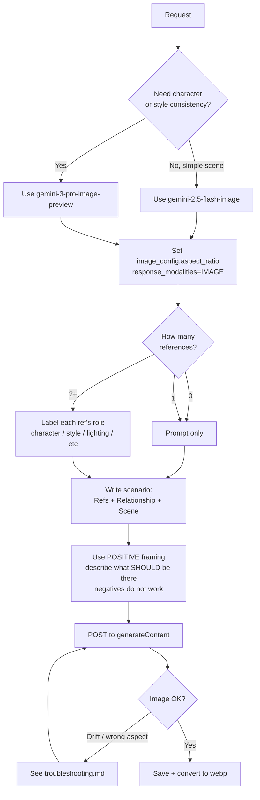

# Nano Banana Image Gen

Generate editorial illustrations, marketing assets, and product mockups with Google's Gemini image-generation models, using character sheets and style templates as references.

## When to Use

✅ **Use for**:
- Generating with `gemini-2.5-flash-image`, `gemini-3.1-flash-image-preview`, `gemini-3-pro-image-preview`
- Character-consistent illustrations across multiple scenes (same person, new setting)
- Style transfer using a reference image as the visual template
- Multi-image composition ("character from img 1 wearing outfit from img 2 in environment from img 3")
- Iterative image editing with conversation-style refinement
- Anything mentioning "Nano Banana", "Nano Banana 2", or "Nano Banana Pro"

❌ **NOT for**:
- Ideogram V3 generation — use existing `next-app/scripts/gen-*.py` scripts and the `IDEOGRAM_API_KEY` pattern
- Qwen image generation on M4 Max — see `~/.claude/QWEN_IMAGE_GUIDE.md` (use v0.6.0)
- Generic prompt engineering tutorials
- Non-image Gemini API usage (text completion, embeddings, video)
- Image *classification* / object detection (use `computer-vision-pipeline`)

---

## Core Process



### Step 1: Pick the right model

| Model ID | Marketing name | Status | Use when |
|---|---|---|---|
| `gemini-3-pro-image-preview` | **Nano Banana Pro** | Preview | **Default for character/style work**. Studio-quality, reliable text suppression, complex layouts. |
| `gemini-3.1-flash-image-preview` | Nano Banana 2 | Preview | High volume + extreme aspect ratios (1:4, 4:1, 1:8, 8:1). Up to 14 reference objects, 4 characters. |
| `gemini-2.5-flash-image` | Nano Banana | GA | Cheap/fast scratch generations. Simple non-character scenes. **Avoid for editorial illustration with strict style adherence — it drifts.** |

Full comparison: `references/model-selection.md`.

### Step 2: Build the request correctly

The aspect ratio MUST be set in the generation config. Putting "16:9" in the prompt does not work.

```python
config = {
    "responseModalities": ["IMAGE"],
    "imageConfig": {"aspectRatio": "16:9"},  # ← non-negotiable
}
```

Supported ratios: `1:1, 2:3, 3:2, 3:4, 4:3, 4:5, 5:4, 9:16, 16:9, 21:9`. Nano Banana 2 adds `1:4, 4:1, 1:8, 8:1`.

Endpoint: `POST https://generativelanguage.googleapis.com/v1beta/models/{MODEL}:generateContent` with header `x-goog-api-key: $GEMINI_API_KEY`.

Reference images attach as inline-data parts in `contents[0].parts`:

```python
parts = [
    {"inlineData": {"mimeType": "image/png", "data": base64_of_char_sheet}},
    {"inlineData": {"mimeType": "image/png", "data": base64_of_style_ref}},
    {"text": prompt_with_role_labels},
]
```

A complete runnable example: `scripts/generate.py`.

### Step 3: Use the official prompt formula

```
[Reference images] + [Relationship instruction] + [New scenario]
```

The **relationship instruction** is the load-bearing piece — explicitly label what role each reference plays. Without role labels, the model partly absorbs and partly ignores the reference.

Worked example for an editorial hero illustration:

```
Reference image 1 is the CHARACTER SHEET — preserve the man's face,
build, hair, and teal hoodie exactly.
Reference image 2 is the STYLE TEMPLATE — match its graphic-novel rendering,
warm leather-and-amber palette, atmospheric lighting, and cinematic composition.

Generate a new scene where: [scene description].

Wide cinematic 16:9 framing, character occupies the left third.
Laptop screens display abstract glowing UI shapes with no readable typography,
indistinct soft-blurred interface.
```

Deep dive on the formula and more variants: `references/prompt-formula.md`.

### Step 4: Layer character consistency

Three techniques, in order of impact:

1. **Words + reference together** — describe identifying details in text *and* attach the reference. "Young Latino man, teal hoodie, dark curly hair" + image. Image alone drifts.
2. **Iterative re-feeding** — for multi-scene consistency, attach the previous generation in the next request alongside the original sheet. Identity tightens with each pass.
3. **Annotated references** — Nano Banana reads labels and captions inside reference images. A labeled character sheet outperforms a clean illustration.

Details + edge cases: `references/character-consistency.md`.

### Step 5: Style references are separate from character refs

For matching an existing visual style, attach **two** images with explicit roles:

- Ref 1: the character (face/build/clothing to preserve)
- Ref 2: a successful piece in the target style (rendering, palette, lighting, composition to match)

Single-reference style transfer drifts. Dual-reference with role labels is the documented pattern. See `references/style-references.md` for the full pattern and when to use 3+ refs.

### Step 6: Suppress unwanted text/labels with positive framing only

There is no negative prompt. Two things that work:

- **Positive framing**: describe what *should* occupy the space. Not "no text on the laptop screens" → "the laptop screens display abstract glowing UI shapes, indistinct soft-blurred interface, no readable typography."
- **Use Nano Banana Pro**: its text-rendering architecture is also good at *not* rendering text when told to. The 2.5-flash model is unreliable here.

---

## Anti-Patterns

### Anti-Pattern: Aspect ratio in the prompt

**Novice**: "I asked for a 16:9 wide editorial illustration in the prompt — Gemini gave me a square."
**Expert**: Aspect ratio belongs in `generationConfig.imageConfig.aspectRatio`, never in prompt text. The model ignores prompt-level dimensions. The default is square.
**Timeline**: This config field landed with the 2.5-flash-image GA release in late 2025. Earlier docs and tutorials often omit it; verify against the current docs.

### Anti-Pattern: Single reference, expecting both character AND style fidelity

**Novice**: "I attached the character sheet and asked for the same style — Gemini gave me 16-bit pixel art."
**Expert**: A single illustrated reference is ambiguous about role. The model treats it as a loose mood board and may hallucinate aesthetic interpretations that aren't in the source. Attach *two* references with explicit role labels (`Reference 1 is the CHARACTER`, `Reference 2 is the STYLE TEMPLATE`). Character fidelity and style fidelity are different jobs.
**Timeline**: This became necessary with the move from Imagen-style "one ref + style flag" pipelines (Ideogram V3) to Gemini's reference-as-context model. Pre-2026 patterns don't transfer.

### Anti-Pattern: Negative prompts ("no text", "no watermark")

**Novice**: "I added 'no text, no labels, no watermarks' but Gemini still wrote 'CONCERT TICKETS' across the screen."
**Expert**: Gemini does not honor negative prompts the way Ideogram or Stable Diffusion do. Describe what *should* be there instead — abstract shapes, blurred interface, plain surface. Or upgrade to Nano Banana Pro, whose text architecture is precise enough to reliably *not* generate text on command.
**Timeline**: This is a structural property of Gemini's image head, not a temporary limitation. It applies to all current models in the family.

### Anti-Pattern: Using `gemini-2.5-flash-image` for character work

**Novice**: "I'll save money by using 2.5-flash for the editorial hero illustration."
**Expert**: 2.5-flash is the weakest character-consistency model in the family and unreliable for strict style adherence. Pro is the right tool for character/style work; 2.5-flash is for cheap simple scenes. The cost difference is rarely worth the regeneration loop.
**Timeline**: Pro became available (preview) in early 2026. Before that, the choice was between 2.5-flash and external tools like Ideogram.

---

## References

Consult these for deep dives — they are NOT loaded by default:

| File | Consult When |
|------|-------------|
| `references/model-selection.md` | Choosing between 2.5-flash, 3.1-flash, and 3-pro for a given task |
| `references/prompt-formula.md` | Writing reference-grounded prompts, role-labeling patterns, edge cases |
| `references/character-consistency.md` | Multi-scene generation with the same character; iterative re-feeding |
| `references/style-references.md` | Style transfer pattern, dual-ref vs triple-ref, matching existing illustrated work |
| `references/troubleshooting.md` | Output is square, contains text, drifted style, ignored references |
| `references/comparison-ideogram-qwen.md` | When to use Nano Banana vs Ideogram V3 vs Qwen on M4 Max |
| `scripts/generate.py` | Runnable Python example with two refs + aspect ratio + role-labeled prompt |

---

## Quick Reference: Repo Conventions (jbuds4life)

When this skill is invoked inside the `jbuds4life` repo:

- Character sheets live in `experiments/blog-image-styles/character-sheets/` (alex, jordan, marcus, mei, sofia — all `*-v3-sheet.png`)
- Existing successful heroes (use as STYLE TEMPLATE refs) live in `next-app/public/images/blog/*.webp`
- API key in `next-app/.env.local` as `GEMINI_API_KEY`
- Output convention: save timestamped PNG first, then convert to webp via `cwebp -q 85`, then place at `next-app/public/images/blog/{slug}-hero.webp`
- The blog frontmatter `og_image_url: /images/blog/{slug}-hero.webp` is what's served as the OG image

---

## Sources

- [Gemini API: image generation](https://ai.google.dev/gemini-api/docs/image-generation)
- [Gemini models reference](https://ai.google.dev/gemini-api/docs/models)
- [Google Cloud — Ultimate prompting guide for Nano Banana](https://cloud.google.com/blog/products/ai-machine-learning/ultimate-prompting-guide-for-nano-banana)
- [Google Cloud — Gemini 2.5 Flash Image on Vertex AI](https://cloud.google.com/blog/products/ai-machine-learning/gemini-2-5-flash-image-on-vertex-ai)
- [Google Developers — Introducing Gemini 2.5 Flash Image](https://developers.googleblog.com/en/introducing-gemini-2-5-flash-image/)
