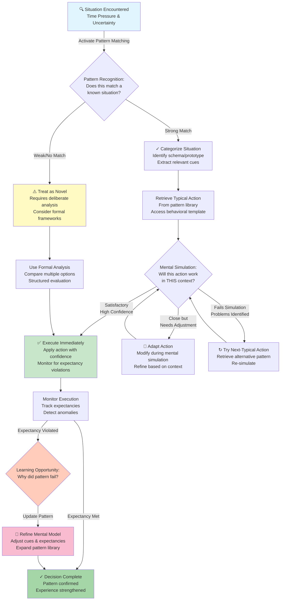

# Recognition-Primed Decision (RPD) Model Flow

```mermaid
flowchart TD
    A["🔍 Situation Encountered<br/>Time Pressure & Uncertainty"] -->|Activate Pattern Matching| B{Pattern Recognition:<br/>Does this match a<br/>known situation?}
    
    B -->|Strong Match| C["✓ Categorize Situation<br/>Identify schema/prototype<br/>Extract relevant cues"]
    B -->|Weak/No Match| D["⚠️ Treat as Novel<br/>Requires deliberate analysis<br/>Consider formal frameworks"]
    
    C --> E["Retrieve Typical Action<br/>From pattern library<br/>Access behavioral template"]
    
    E --> F{Mental Simulation:<br/>Will this action work<br/>in THIS context?}
    
    F -->|Satisfactory<br/>High Confidence| G["✅ Execute Immediately<br/>Apply action with confidence<br/>Monitor for expectancy violations"]
    
    F -->|Close but<br/>Needs Adjustment| H["🔄 Adapt Action<br/>Modify during mental simulation<br/>Refine based on context"]
    
    F -->|Fails Simulation<br/>Problems Identified| I["↻ Try Next-Typical Action<br/>Retrieve alternative pattern<br/>Re-simulate"]
    
    H --> F
    I --> F
    
    D --> J["Use Formal Analysis<br/>Compare multiple options<br/>Structured evaluation"]
    
    J --> G
    
    G --> K["Monitor Execution<br/>Track expectancies<br/>Detect anomalies"]
    
    K -->|Expectancy Met| L["✓ Decision Complete<br/>Pattern confirmed<br/>Experience strengthened"]
    
    K -->|Expectancy Violated| M{"Learning Opportunity:<br/>Why did pattern fail?"}
    
    M -->|Update Pattern| N["🧠 Refine Mental Model<br/>Adjust cues & expectancies<br/>Expand pattern library"]
    
    N --> L
    
    style A fill:#e1f5ff
    style G fill:#c8e6c9
    style L fill:#a5d6a7
    style D fill:#fff9c4
    style M fill:#ffccbc
    style N fill:#f8bbd0
```
