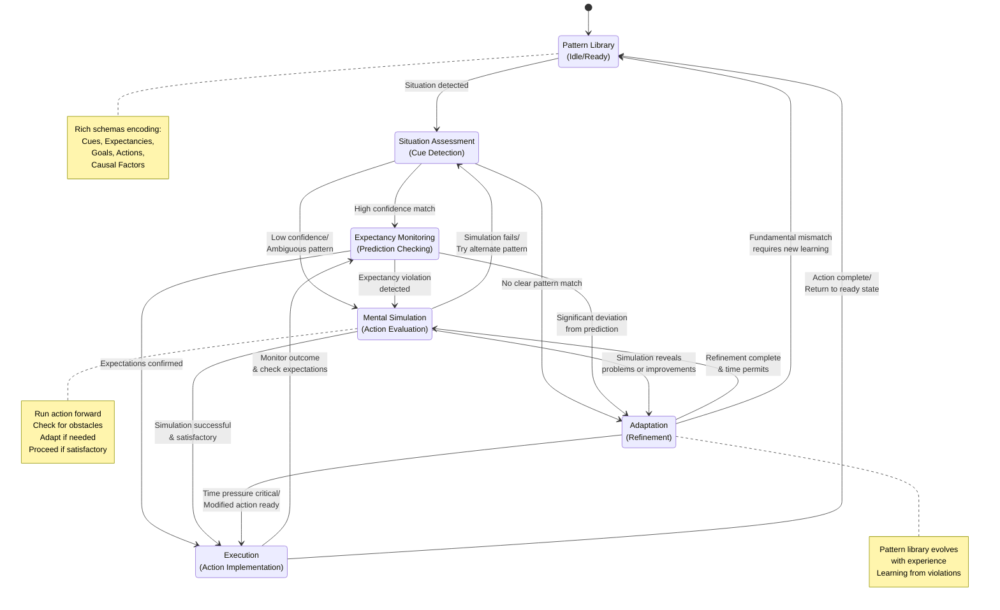

# Pattern Schema States and Transitions

```mermaid
stateDiagram-v2
    [*] --> PatternLibrary
    
    PatternLibrary: Pattern Library<br/>(Idle/Ready)
    SituationAssessment: Situation Assessment<br/>(Cue Detection)
    ExpectancyMonitoring: Expectancy Monitoring<br/>(Prediction Checking)
    MentalSimulation: Mental Simulation<br/>(Action Evaluation)
    Adaptation: Adaptation<br/>(Refinement)
    Execution: Execution<br/>(Action Implementation)
    
    PatternLibrary --> SituationAssessment: Situation detected
    
    SituationAssessment --> ExpectancyMonitoring: High confidence match
    SituationAssessment --> MentalSimulation: Low confidence/<br/>Ambiguous pattern
    SituationAssessment --> Adaptation: No clear pattern match
    
    ExpectancyMonitoring --> Execution: Expectations confirmed
    ExpectancyMonitoring --> MentalSimulation: Expectancy violation<br/>detected
    ExpectancyMonitoring --> Adaptation: Significant deviation<br/>from prediction
    
    MentalSimulation --> Execution: Simulation successful<br/>& satisfactory
    MentalSimulation --> Adaptation: Simulation reveals<br/>problems or improvements
    MentalSimulation --> SituationAssessment: Simulation fails/<br/>Try alternate pattern
    
    Adaptation --> MentalSimulation: Refinement complete<br/>& time permits
    Adaptation --> Execution: Time pressure critical/<br/>Modified action ready
    Adaptation --> PatternLibrary: Fundamental mismatch<br/>requires new learning
    
    Execution --> ExpectancyMonitoring: Monitor outcome<br/>& check expectations
    Execution --> PatternLibrary: Action complete/<br/>Return to ready state
    
    note right of PatternLibrary
        Rich schemas encoding:
        Cues, Expectancies,
        Goals, Actions,
        Causal Factors
    end note
    
    note right of MentalSimulation
        Run action forward
        Check for obstacles
        Adapt if needed
        Proceed if satisfactory
    end note
    
    note right of Adaptation
        Pattern library evolves
        with experience
        Learning from violations
    end note
```
