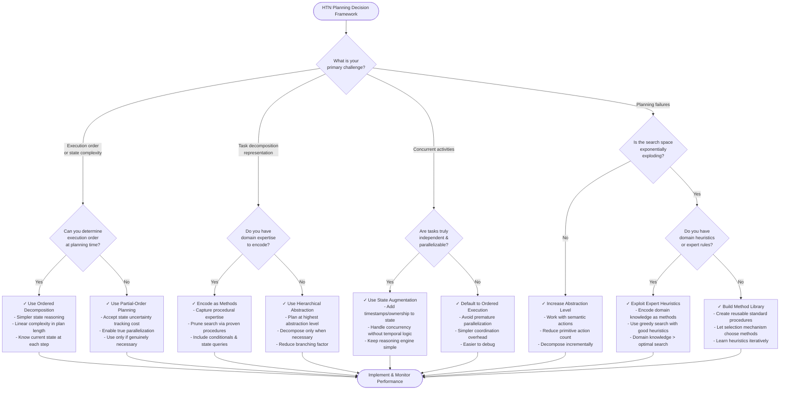

# HTN Planning Decision Framework

```mermaid
flowchart TD
    Start([HTN Planning Decision Framework]) --> Q1{What is your<br/>primary challenge?}
    
    Q1 -->|Execution order<br/>or state complexity| Q2{Can you determine<br/>execution order<br/>at planning time?}
    Q1 -->|Task decomposition<br/>representation| Q3{Do you have<br/>domain expertise<br/>to encode?}
    Q1 -->|Concurrent activities| Q4{Are tasks truly<br/>independent &<br/>parallelizable?}
    Q1 -->|Planning failures| Q5{Is the search space<br/>exponentially<br/>exploding?}
    
    Q2 -->|Yes| R1["✓ Use Ordered Decomposition<br/>- Simpler state reasoning<br/>- Linear complexity in plan length<br/>- Know current state at each step"]
    Q2 -->|No| R2["✓ Use Partial-Order Planning<br/>- Accept state uncertainty tracking cost<br/>- Enable true parallelization<br/>- Use only if genuinely necessary"]
    
    Q3 -->|Yes| R3["✓ Encode as Methods<br/>- Capture procedural expertise<br/>- Prune search via proven procedures<br/>- Include conditionals & state queries"]
    Q3 -->|No| R4["✓ Use Hierarchical Abstraction<br/>- Plan at highest abstraction level<br/>- Decompose only when necessary<br/>- Reduce branching factor"]
    
    Q4 -->|Yes| R5["✓ Use State Augmentation<br/>- Add timestamps/ownership to state<br/>- Handle concurrency without temporal logic<br/>- Keep reasoning engine simple"]
    Q4 -->|No| R6["✓ Default to Ordered Execution<br/>- Avoid premature parallelization<br/>- Simpler coordination overhead<br/>- Easier to debug"]
    
    Q5 -->|Yes| Q6{Do you have<br/>domain heuristics<br/>or expert rules?}
    Q5 -->|No| R7["✓ Increase Abstraction Level<br/>- Work with semantic actions<br/>- Reduce primitive action count<br/>- Decompose incrementally"]
    
    Q6 -->|Yes| R8["✓ Exploit Expert Heuristics<br/>- Encode domain knowledge as methods<br/>- Use greedy search with good heuristics<br/>- Domain knowledge > optimal search"]
    Q6 -->|No| R9["✓ Build Method Library<br/>- Create reusable standard procedures<br/>- Let selection mechanism choose methods<br/>- Learn heuristics iteratively"]
    
    R1 --> End([Implement & Monitor Performance])
    R2 --> End
    R3 --> End
    R4 --> End
    R5 --> End
    R6 --> End
    R7 --> End
    R8 --> End
    R9 --> End
```
