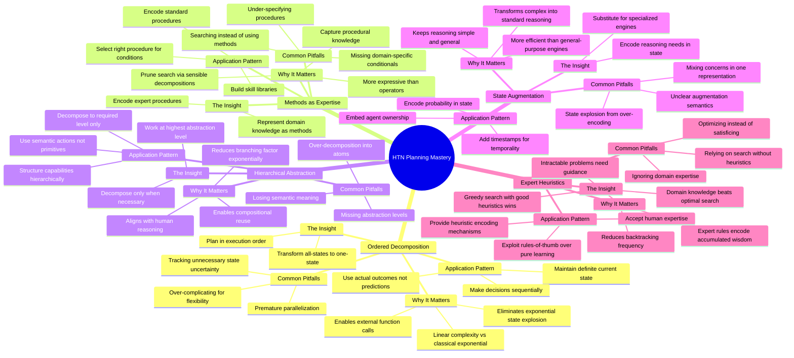

# HTN Planning Core Mental Models & Application Patterns

```mermaid
mindmap
  root((HTN Planning Mastery))
    Ordered Decomposition
      The Insight
        Plan in execution order
        Transform all-states to one-state
      Why It Matters
        Eliminates exponential state explosion
        Enables external function calls
        Linear complexity vs classical exponential
      Application Pattern
        Maintain definite current state
        Make decisions sequentially
        Use actual outcomes not predictions
      Common Pitfalls
        Premature parallelization
        Tracking unnecessary state uncertainty
        Over-complicating for flexibility
    Methods as Expertise
      The Insight
        Encode expert procedures
        Represent domain knowledge as methods
      Why It Matters
        Capture procedural knowledge
        More expressive than operators
        Prune search via sensible decompositions
      Application Pattern
        Build skill libraries
        Encode standard procedures
        Select right procedure for conditions
      Common Pitfalls
        Searching instead of using methods
        Under-specifying procedures
        Missing domain-specific conditionals
    Hierarchical Abstraction
      The Insight
        Work at highest abstraction level
        Decompose only when necessary
      Why It Matters
        Reduces branching factor exponentially
        Enables compositional reuse
        Aligns with human reasoning
      Application Pattern
        Structure capabilities hierarchically
        Use semantic actions not primitives
        Decompose to required level only
      Common Pitfalls
        Over-decomposition into atoms
        Losing semantic meaning
        Missing abstraction levels
    State Augmentation
      The Insight
        Encode reasoning needs in state
        Substitute for specialized engines
      Why It Matters
        Keeps reasoning simple and general
        Transforms complex into standard reasoning
        More efficient than general-purpose engines
      Application Pattern
        Add timestamps for temporality
        Embed agent ownership
        Encode probability in state
      Common Pitfalls
        State explosion from over-encoding
        Unclear augmentation semantics
        Mixing concerns in one representation
    Expert Heuristics
      The Insight
        Domain knowledge beats optimal search
        Greedy search with good heuristics wins
      Why It Matters
        Intractable problems need guidance
        Expert rules encode accumulated wisdom
        Reduces backtracking frequency
      Application Pattern
        Accept human expertise
        Provide heuristic encoding mechanisms
        Exploit rules-of-thumb over pure learning
      Common Pitfalls
        Relying on search without heuristics
        Ignoring domain expertise
        Optimizing instead of satisficing
```
