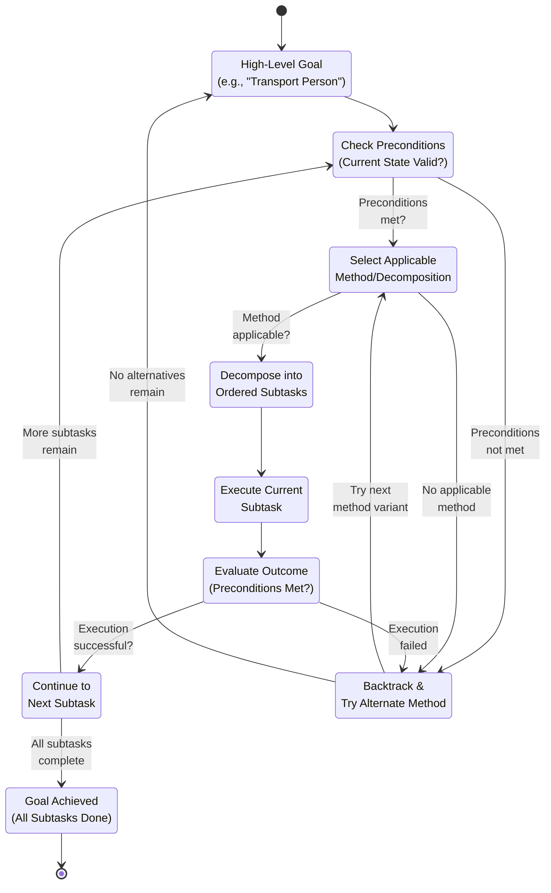

# Agent Task Decomposition State Machine

```mermaid
stateDiagram-v2
    [*] --> HighLevelGoal
    
    HighLevelGoal: High-Level Goal<br/>(e.g., "Transport Person")
    CheckPreconditions: Check Preconditions<br/>(Current State Valid?)
    SelectMethod: Select Applicable<br/>Method/Decomposition
    DecomposeSubtasks: Decompose into<br/>Ordered Subtasks
    ExecuteSubtask: Execute Current<br/>Subtask
    EvaluateOutcome: Evaluate Outcome<br/>(Preconditions Met?)
    ContinuePath: Continue to<br/>Next Subtask
    BacktrackPath: Backtrack &<br/>Try Alternate Method
    GoalAchieved: Goal Achieved<br/>(All Subtasks Done)
    
    HighLevelGoal --> CheckPreconditions
    
    CheckPreconditions --> SelectMethod: Preconditions<br/>met?
    CheckPreconditions --> BacktrackPath: Preconditions<br/>not met
    
    SelectMethod --> DecomposeSubtasks: Method<br/>applicable?
    SelectMethod --> BacktrackPath: No applicable<br/>method
    
    DecomposeSubtasks --> ExecuteSubtask
    
    ExecuteSubtask --> EvaluateOutcome
    
    EvaluateOutcome --> ContinuePath: Execution<br/>successful?
    EvaluateOutcome --> BacktrackPath: Execution<br/>failed
    
    ContinuePath --> CheckPreconditions: More subtasks<br/>remain
    ContinuePath --> GoalAchieved: All subtasks<br/>complete
    
    BacktrackPath --> SelectMethod: Try next<br/>method variant
    BacktrackPath --> HighLevelGoal: No alternatives<br/>remain
    
    GoalAchieved --> [*]
```
