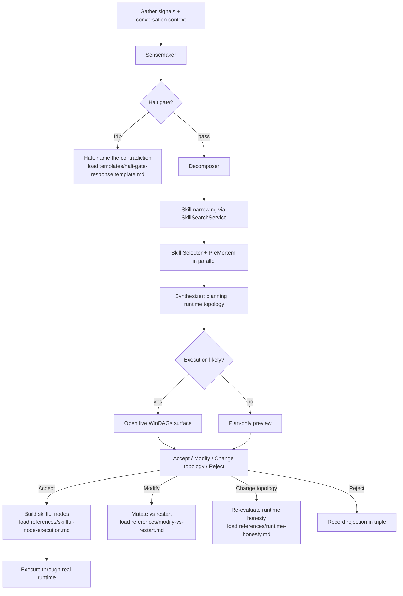

# /next-move

Predict the best next move, present it clearly, and — on approval — hand it to the real WinDAGs execution path.

**Two operating rules are mandatory:**

1. **Separate planning topology from runtime topology.** Server execution is real for `dag` and `workflow`. `team-loop`, `swarm`, `blackboard`, `team-builder`, and `recurring` fall back to generic DAG execution. See `references/runtime-honesty.md`.

2. **Prefer live WinDAGs visualization** over ASCII when execution is going to happen. ASCII is fallback only. See `references/live-execution-visualization.md`.

**Arguments:** `$ARGUMENTS`

If the user passed `--fresh`, ignore conversation history and predict from project signals only.

## Skill Layout

This skill is structured for on-demand loading. Don't bulk-load — pull only what the current stage needs.

| Need | Load |
|---|---|
| Decision tree, file map, top-level guidance | `INDEX.md` |
| Per-agent prompts (Sensemaker, Decomposer, etc.) | `prompts/<agent>.md` |
| Operational rules and judgment-call guidance | `references/<topic>.md` (see `references/INDEX.md`) |
| Worked end-to-end walkthroughs | `examples/<NN>-<scenario>.md` (only when shape recognition is needed) |
| Output schemas for validation | `schemas/<output>.schema.json` |
| Empty starting structures | `templates/<output>.template.<ext>` |
| Replay / validate / inspect-attribution utilities | `scripts/<utility>.{sh,ts}` |
| Direct invocation of a single meta-DAG stage | `agents/<stage>.md` (subagent for `Task` tool) |

## Project Signals

These are preprocessed at skill-load time via `!`...` ` shell calls. Treat them as ground truth.

### Git State
```
!`git status --short 2>/dev/null || echo "Not a git repo"`
```
**Branch:** !`git branch --show-current 2>/dev/null || echo "unknown"`

### Recent Commits
```
!`git log --oneline -8 2>/dev/null || echo "No commits"`
```

### What Changed
```
!`git diff --stat 2>/dev/null || echo "No unstaged changes"`
```

### Staged Changes
```
!`git diff --cached --stat 2>/dev/null || echo "Nothing staged"`
```

### Recently Modified Files
```
!`git diff --name-only HEAD~3 2>/dev/null || echo "No recent file changes"`
```

### CLAUDE.md
```
!`head -60 CLAUDE.md 2>/dev/null || echo "No CLAUDE.md found"`
```

### Package / Project Info
```
!`cat package.json 2>/dev/null | head -40 || echo "No package.json"`
```

### Port Daddy
```
!`command -v pd >/dev/null 2>&1 && pd find 2>/dev/null || echo "Port Daddy not installed. portdaddy.dev"`
```
```
!`command -v pd >/dev/null 2>&1 && pd notes 2>/dev/null || echo ""`
```
```
!`command -v pd >/dev/null 2>&1 && pd salvage 2>/dev/null || echo ""`
```
```
!`command -v pd >/dev/null 2>&1 && pd whoami 2>/dev/null || echo ""`
```

### Prior WinDAGs Predictions
```
!`ls -1t .windags/triples/ 2>/dev/null | head -5 || echo "No prior predictions"`
```

## Decision Flow



For depth on any decision point, load the matching reference. Don't try to derive judgment-call rules from the diagram alone.

## Core Workflow (Compact)

The full workflow is in the references; this is the lookup version.

1. **Sensemaker** → Load `prompts/sensemaker.md`. Validate output against `schemas/sensemaker-output.schema.json`.
2. **Halt gate** → Apply `references/halt-gate-discipline.md`. If trips: render `templates/halt-gate-response.template.md`, store no triple, stop.
3. **Decomposer** → Load `prompts/decomposer.md`. 3-7 subtasks. Validate against `schemas/decomposer-output.schema.json`.
4. **Skill narrowing** → Use `mcp__windags__windags_skill_search` (routes through `SkillSearchService`). See `references/skill-narrowing-cascade.md` for internals.
5. **Skill Selector + PreMortem** → Load `prompts/skill-selector.md` and `prompts/premortem.md`. Run in parallel.
6. **Synthesize** → Apply `references/topology-selection.md` and `references/runtime-honesty.md`. Validate against `schemas/predicted-dag.schema.json`.
7. **Present** → Live WinDAGs UI preferred. See `references/live-execution-visualization.md`.
8. **Execute on accept** → Build skillful nodes. See `references/skillful-node-execution.md` and `prompts/execution-node.md`.
9. **Modify / restart** → See `references/modify-vs-restart.md`.
10. **Store triple** → Write to `.windags/triples/`. See `references/triple-feedback-loop.md`.

## When to Refuse

`/next-move` halts on ambiguity. Halts are first-class output, not failure. See `references/halt-gate-discipline.md`. Worked example: `examples/03-halt-gate-tripped.md`.

## When Things Look Wrong

Catalog of failure modes with detection signals and fixes: `references/failure-modes.md`.

## Worked Examples

Load only when you need shape recognition end-to-end:

- `examples/01-feature-delivery-happy-path.md` — clean signals, native DAG
- `examples/02-debugging-blackboard-shape.md` — runtime honesty in practice
- `examples/03-halt-gate-tripped.md` — pipeline correctly refuses

## Quality Gates

Before sending the prediction:
- [ ] Sensemaker, Decomposer, Skill Selector, PreMortem all returned valid structured output
- [ ] Halt gate enforced when ambiguity remained
- [ ] Planning topology and runtime topology both present and honest
- [ ] Every node has a primary skill, input contract, output contract, and `commitment_level`
- [ ] Approval steps modeled as real gates (`human-gate-designer`), not prose
- [ ] Live visualization attempted before falling back to ASCII
- [ ] Triple stored only on completion or user feedback (never on halt)

## NOT-FOR Boundaries

- **Creating skills** → use `skill-creator` or `skill-architect`
- **One-off bug debugging** → use `fullstack-debugger`
- **Promising native execution of unsupported topologies** → see `references/runtime-honesty.md`
- **ASCII theater when live UI is available** → open the real surface
- **Ad hoc subagent prompts** → use `prompts/execution-node.md` and `references/skillful-node-execution.md`
