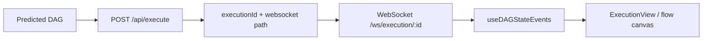

# Live Execution Visualization for `next-move`

When `next-move` moves from planning into execution, default to the real WinDAGs execution surface.

ASCII is the fallback preview, not the canonical runtime.

## Preferred Surfaces

### 1. Tauri desktop app

Best when the user is local and wants the full execution canvas.

Relevant code:

- `apps/tauri-desktop/src/components/flow/FlowWindow.tsx`
- `apps/tauri-desktop/src/components/flow/ExecutionView.tsx`
- `apps/tauri-desktop/src/hooks/useDAGExecution.ts`
- `apps/tauri-desktop/src/hooks/useDAGStateEvents.ts`

This path is the closest thing to "1:1 execution and visualization" in the repo today.

### 2. CLI server + browser UI

If the desktop app is not already running, start or reuse the CLI server:

```bash
node packages/cli/dist/index.js start --port 3334
```

If `dist` is missing, build first:

```bash
pnpm --filter workgroup-ai build
```

The server auto-opens a browser when possible.

Relevant code:

- `packages/cli/src/index.ts`
- `packages/cli/src/server.ts`
- `packages/cli/src/ws-server.ts`

## Real Runtime Path



The live event source is:

- `POST /api/execute`
- `ws://localhost:<port>/ws/execution/:id`

The server integration test proving the bridge exists is:

- `packages/cli/src/server.integration.test.ts`

## Rules for `next-move`

### Before asking for final approval

If execution is likely and the environment supports it:

- open or reuse the live WinDAGs surface
- tell the user whether the view will be exact or an approximation

### On accept

- keep the live surface open
- execute through `/api/execute`
- treat the WebSocket channel as the source of truth for status

### If live surface is unavailable

Use ASCII fallback, but say so plainly:

- "Live WinDAGs surface unavailable, showing ASCII fallback"

### If topology is not natively dispatchable

Say so before execution:

- "Planning topology is blackboard; runtime will execute the projected DAG because specialized dispatch is not yet wired through `/api/execute`."

## Health Checks

Useful checks before claiming the live surface is available:

```bash
curl http://localhost:3334/health
curl http://localhost:3334/api/execute/<id>
```

The WebSocket path itself is:

```text
ws://localhost:3334/ws/execution/:id
```

## Failure Modes

### Demo component mistaken for runtime

Bad sign:
- using `apps/marketing/src/components/blog/NextMoveDAGViz.tsx` as if it were the execution surface

Fix:
- use the Tauri/sidecar execution stack for real execution

### Browser opened but not wired to execution

Bad sign:
- pretty DAG, no `executionId`, no WebSocket subscription

Fix:
- route through `/api/execute` and `/ws/execution/:id`

### Silent approximation

Bad sign:
- non-DAG topology executes as DAG fallback without telling the user

Fix:
- disclose the approximation before running
