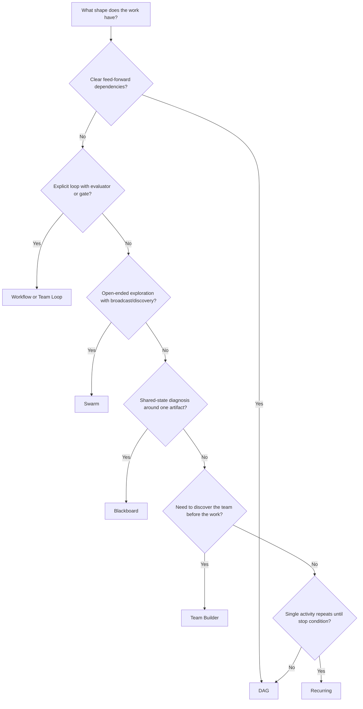

# Topology Selection for `next-move`

Choose topology based on the coordination pattern of the work, not on what looks interesting in a diagram.

The important distinction is:

- **Planning topology**: the real shape of the work
- **Runtime topology**: what the current execution surface can actually run honestly today

## Decision Tree

## Practical Selection Rules

### Use `dag` when

- work is mostly feed-forward
- dependencies are stable
- nodes can be grouped into waves
- the user wants immediate execution through the current server

This is the safest default for real execution today.

### Use `workflow` when

- the plan has an explicit entry node
- the loop or back-edge is concrete, not aspirational
- there is a clear evaluator, reviewer, or exit condition

This is the best runtime option when the work is genuinely iterative but still can be formalized.

### Use `team-loop` when

- the work naturally alternates between produce -> review -> revise
- quality convergence matters more than single-pass speed
- you can describe what "good enough" means

If executing through the current server, prefer translating this into a `workflow` runtime when possible.

### Use `swarm` when

- the problem space is open-ended
- multiple researchers or thinkers can discover work independently
- convergence is emergent rather than centrally scheduled

Today this is primarily a planning topology unless you intentionally project it into a DAG/workflow runtime.

### Use `blackboard` when

- specialists inspect and update a shared diagnostic artifact
- debugging or forensics is the main task
- hypotheses compete around one evolving state model

Today this is primarily a planning topology unless you intentionally project it into a DAG/workflow runtime.

### Use `team-builder` when

- the user does not yet know which team or roles they need
- the first move is to design the working group itself

This is almost always planning-first. Do not claim the current server will natively execute team discovery unless you built that runtime path.

### Use `recurring` when

- one action repeats until a measurable stop condition is hit
- the work is more like polling, retrying, or periodic checking than decomposition

Prefer a workflow or explicit loop runtime if the server needs to execute it today.

## Runtime Honesty Matrix

| Planning topology | Runtime support in `/api/execute` today | Recommended `next-move` behavior |
|-------------------|------------------------------------------|----------------------------------|
| `dag` | Real | Execute directly |
| `workflow` | Real | Execute directly |
| `team-loop` | Partial via DAG fallback | Convert to workflow if possible, otherwise disclose approximation |
| `swarm` | DAG fallback only | Present as planning topology; ask before approximating |
| `blackboard` | DAG fallback only | Present as planning topology; ask before approximating |
| `team-builder` | DAG fallback only | Keep as plan-first unless concretized |
| `recurring` | DAG fallback only | Convert to workflow if possible, otherwise disclose approximation |

Source of truth:

- `packages/cli/src/server.ts`
- `docs/OPERATORS-GUIDE.md`
- `docs/V4-UNIFIED-ROADMAP.md`

## Failure Modes

### "Swarm" because it sounds powerful

Bad sign:
- the work is actually a small feed-forward build plan

Fix:
- choose `dag`

### `team-loop` with no exit condition

Bad sign:
- "keep improving until good" with no reviewer, metric, or stop rule

Fix:
- either define a reviewer node and turn it into `workflow`, or stay in planning mode

### `blackboard` for ordinary feature work

Bad sign:
- no shared diagnostic artifact exists

Fix:
- choose `dag`

### Hiding runtime limitations

Bad sign:
- you present `swarm` or `blackboard` as if the current server will run it natively

Fix:
- distinguish planning topology from runtime topology explicitly
