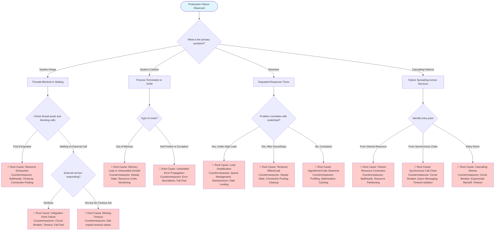

# Failure Propagation Decision Tree

```mermaid
flowchart TD
    Start([Production Failure Observed]) --> SymptomCheck{What is the primary symptom?}
    
    SymptomCheck -->|System Hangs| Hangs[Threads Blocked or Waiting]
    SymptomCheck -->|System Crashes| Crashes[Process Terminated or OOM]
    SymptomCheck -->|Slowness| Slow[Degraded Response Times]
    SymptomCheck -->|Cascading Failures| Cascade[Failure Spreading Across Services]
    
    Hangs --> HangDiag{Check thread pools and blocking calls}
    HangDiag -->|Pool Exhausted| ResourceExhaust["🔴 Root Cause: Resource Exhaustion<br/>Countermeasures: Bulkheads, Timeouts, Connection Pooling"]
    HangDiag -->|Waiting on External Call| TimeoutCheck{External service responding?}
    TimeoutCheck -->|No/Slow| IntegrationFail["🔴 Root Cause: Integration Point Failure<br/>Countermeasures: Circuit Breaker, Timeout, Fail Fast"]
    TimeoutCheck -->|Yes but No Timeout Set| TimeoutMiss["🔴 Root Cause: Missing Timeout<br/>Countermeasures: Add explicit timeout values"]
    
    Crashes --> CrashType{Type of crash?}
    CrashType -->|Out of Memory| MemLeak["🔴 Root Cause: Memory Leak or Unbounded Growth<br/>Countermeasures: Steady State, Resource Limits, Monitoring"]
    CrashType -->|Null Pointer or Exception| ErrorProp["🔴 Root Cause: Unhandled Error Propagation<br/>Countermeasures: Error Boundaries, Fail Fast"]
    
    Slow --> ScaleCheck{Problem correlates with scale/load?}
    ScaleCheck -->|Yes, Under High Load| LoadAmp["🔴 Root Cause: Load Amplification<br/>Countermeasures: Queue Management, Backpressure, Rate Limiting"]
    ScaleCheck -->|Yes, After Hours/Days| TimeEffect["🔴 Root Cause: Temporal Effect/Leak<br/>Countermeasures: Steady State, Connection Pooling Cleanup"]
    ScaleCheck -->|No, Consistent| SlowCode["🔴 Root Cause: Algorithmic/Code Slowness<br/>Countermeasures: Profiling, Optimization, Caching"]
    
    Cascade --> CascadeSource{Identify entry point}
    CascadeSource -->|From Shared Resource| SharedRes["🔴 Root Cause: Shared Resource Contention<br/>Countermeasures: Bulkheads, Resource Partitioning"]
    CascadeSource -->|From Synchronous Chain| SyncChain["🔴 Root Cause: Synchronous Call Chain<br/>Countermeasures: Circuit Breaker, Async Messaging, Timeout Isolation"]
    CascadeSource -->|Retry Storm| Retry["🔴 Root Cause: Cascading Retries<br/>Countermeasures: Circuit Breaker, Exponential Backoff, Timeout"]
    
    style Start fill:#e1f5ff
    style ResourceExhaust fill:#ffcccc
    style IntegrationFail fill:#ffcccc
    style TimeoutMiss fill:#ffcccc
    style MemLeak fill:#ffcccc
    style ErrorProp fill:#ffcccc
    style LoadAmp fill:#ffcccc
    style TimeEffect fill:#ffcccc
    style SlowCode fill:#ffcccc
    style SharedRes fill:#ffcccc
    style SyncChain fill:#ffcccc
    style Retry fill:#ffcccc
```
