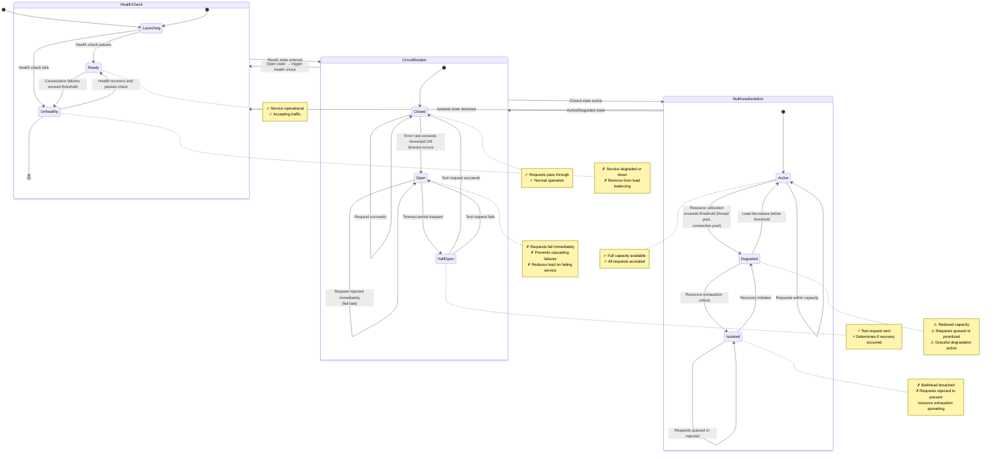

# Circuit Breaker State Machine & Stability Pattern Lifecycle

```mermaid
stateDiagram-v2
    [*] --> Launching
    
    %% Health Check Lifecycle
    state HealthCheck {
        [*] --> Launching
        Launching --> Ready: Health check passes
        Launching --> Unhealthy: Health check fails
        Ready --> Unhealthy: Consecutive failures exceed threshold
        Unhealthy --> Ready: Health recovers and passes check
        Unhealthy --> [*]
    }
    
    %% Circuit Breaker State Machine
    state CircuitBreaker {
        [*] --> Closed
        
        Closed --> Open: Error rate exceeds threshold OR<br/>timeout occurs
        Closed --> Closed: Request succeeds
        
        Open --> HalfOpen: Timeout period elapsed
        Open --> Open: Request rejected immediately<br/>(fail fast)
        
        HalfOpen --> Closed: Test request succeeds
        HalfOpen --> Open: Test request fails
    }
    
    %% Bulkhead Isolation States
    state BulkheadIsolation {
        [*] --> Active
        
        Active --> Degraded: Resource utilization<br/>exceeds threshold (thread pool,<br/>connection pool)
        Active --> Active: Requests within capacity
        
        Degraded --> Isolated: Resource exhaustion critical
        Degraded --> Active: Load decreases below threshold
        
        Isolated --> Degraded: Recovery initiated
        Isolated --> Isolated: Requests queued or rejected
    }
    
    %% Cross-state transitions
    HealthCheck --> CircuitBreaker: Ready state entered
    CircuitBreaker --> BulkheadIsolation: Closed state active
    BulkheadIsolation --> CircuitBreaker: Active/Degraded state
    CircuitBreaker --> HealthCheck: Open state → trigger health check
    BulkheadIsolation --> HealthCheck: Isolated state detected
    
    note right of Closed
        ✓ Requests pass through
        ✓ Normal operation
    end note
    
    note right of Open
        ✗ Requests fail immediately
        ✗ Prevents cascading failures
        ✗ Reduces load on failing service
    end note
    
    note right of HalfOpen
        ⚡ Test request sent
        ⚡ Determines if recovery occurred
    end note
    
    note right of Active
        ✓ Full capacity available
        ✓ All requests accepted
    end note
    
    note right of Degraded
        ⚠ Reduced capacity
        ⚠ Requests queued or prioritized
        ⚠ Graceful degradation active
    end note
    
    note right of Isolated
        ✗ Bulkhead breached
        ✗ Requests rejected to prevent
           resource exhaustion spreading
    end note
    
    note right of Ready
        ✓ Service operational
        ✓ Accepting traffic
    end note
    
    note right of Unhealthy
        ✗ Service degraded or down
        ✗ Remove from load balancing
    end note
```
