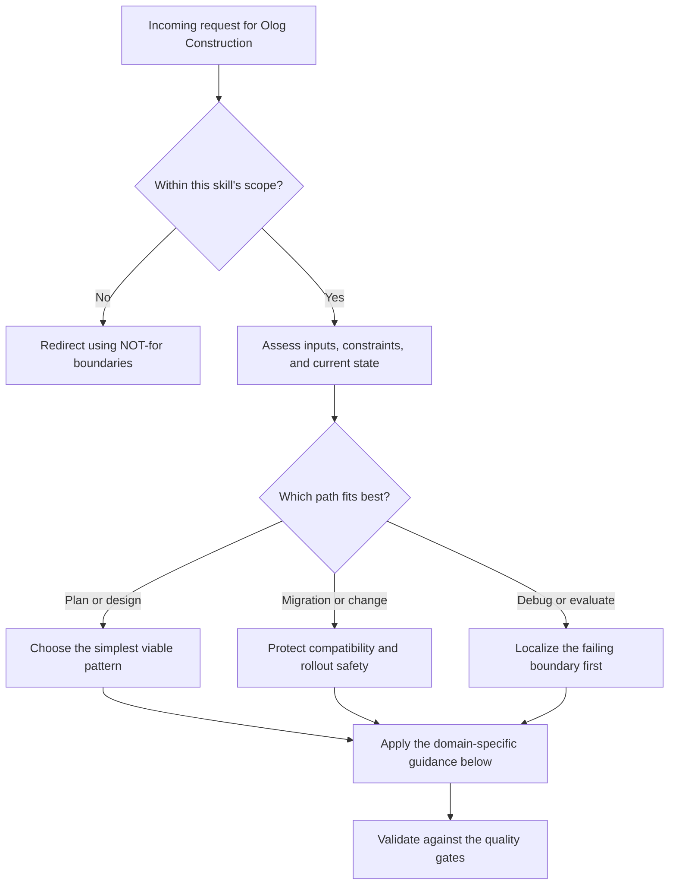

# Olog Construction

An olog is a category presented as a labeled graph. Objects are types (labeled with singular indefinite noun phrases). Arrows are functional relationships (labeled with verb phrases that form readable sentences). Path equivalences encode business rules. An olog IS a database schema; its instances are functors to Set.

## Decision Points



Use this as the first-pass routing model:

- Confirm the request belongs in this skill before doing deeper work.
- Separate planning, migration, and debugging paths before choosing a solution.
- Prefer the simplest correct path that still survives the quality gates.


## When to Use

- Designing a problem taxonomy or domain model with formal semantics
- Classifying tasks for routing in multi-agent systems
- Building knowledge libraries where analogies between domains matter
- Establishing formal equivalences between problem domains via functor search
- Translating a natural language specification into a database schema
- Validating that a domain model is compositionally consistent
- Using LLMs to PROPOSE olog structures that humans then verify

## NOT for

- General ontology engineering with OWL, RDF, or RDFS
- Knowledge graphs that do not enforce functional arrows or path equivalences
- Database administration, indexing, or query optimization work
- Pure graph-database modeling where many-to-many edges are left unconstrained

---

## Core Mental Models

### 1. An Olog Is a Category

**Formal definition:** An olog is a finite category C where:
- Objects are **types**, each labeled with a singular indefinite noun phrase that describes every element of the set it represents. Example: "a person", "a US state", "a programming language".
- Morphisms (arrows) are **aspects**, each labeled with a verb phrase such that for every object x in the domain, the sentence "[domain label] [arrow label] [codomain label]" is a true, readable English sentence. Example: "a person" --has as birthplace--> "a US state".
- Every arrow is **functional**: each element of the domain maps to exactly one element of the codomain. This is the critical constraint that distinguishes ologs from arbitrary knowledge graphs.
- **Path equivalences** (commutative diagrams) encode business rules: if two paths of arrows from A to B always produce the same result, they are declared equivalent.
- Every object has an **identity arrow** (reflexive: "a person" --is--> "a person").
- Composition is associative.

**Key insight from Spivak (2012):** The functional arrow constraint is what makes ologs rigorous. In a knowledge graph, "a person --speaks--> a language" would be a valid edge. In an olog, it is NOT valid because a person may speak multiple languages (the relationship is not functional). You must restructure this as a span (see below).

### 2. The Functional Arrow Constraint and Spans

**The rule:** Every arrow f: A --> B must satisfy: for each element a in A, there exists exactly one element b in B such that f(a) = b.

**Many-to-many relationships require spans.** A span is a pair of arrows from an intermediate "relationship object":

```
        a language spoken by a person
          /                      \
   is spoken by               is a language
        |                         |
        v                         v
    a person                 a language
```

The intermediate object "a language spoken by a person" has two functional arrows:
- "is spoken by" --> "a person" (each language-spoken-by-person pair maps to exactly one person)
- "is a language" --> "a language" (each pair maps to exactly one language)

This is equivalent to a junction/bridge table in relational databases. The categorical perspective makes explicit that many-to-many relationships are not primitive -- they decompose into two functional relationships through an intermediary type.

**One-to-many relationships** (a person has many addresses) also need restructuring:
```
    an address of a person --belongs to--> a person       (functional: each address belongs to one person)
    an address of a person --is located at--> an address   (functional: each record maps to one address)
```

### 3. Path Equivalences as Business Rules

Path equivalences are commutative diagrams that encode domain invariants. If paths p and q from object A to object Z always produce the same result, write p ~ q.

**Example:**
```
  a paper --has as first author--> a researcher --works at--> an institution
  a paper --was submitted to--> a journal --is published by--> an institution

  These paths are NOT equivalent (the first author's institution != the journal's publisher in general).
  Declaring them equivalent would be asserting a business rule that papers can only be submitted
  to journals published by the first author's institution.
```

**When to declare equivalence:**
- When two computational paths provably produce identical results for all instances
- When you want to ENFORCE that they produce identical results (as a constraint)
- When database normalization requires eliminating redundant derivations

**Validation:** For every declared equivalence p ~ q, instantiate with 3-5 concrete examples. If any example produces different results via the two paths, the equivalence is false.

### 4. Ologs as Database Schemas

**The Grothendieck construction** (Spivak 2014, Chapter 7): An olog C defines a database schema. An instance of the olog is a functor I: C --> Set, which assigns:
- To each object (type), a finite set of elements (rows)
- To each arrow (aspect), a function between those sets (foreign key relationships)
- Path equivalences become integrity constraints

This means:
- Objects = tables
- Arrows = foreign key columns (each row in the source table maps to exactly one row in the target table)
- Path equivalences = CHECK constraints or triggers ensuring consistency
- Fiber products (pullbacks) = JOIN operations

**Practical consequence:** If you can draw a valid olog, you can mechanically derive a normalized relational schema. The categorical structure guarantees referential integrity by construction.

### 5. Fiber Products (Pullbacks) for Conjunction

A fiber product (pullback) models "things that share a common attribute." Given:
```
    A --f--> C <--g-- B
```
The fiber product A x_C B is the set of all pairs (a, b) where f(a) = g(b).

**Example:**
```
    a person who lives in state S --lives in--> a US state <--is located in-- a university in state S

    Pullback: "a person-university pair in the same state"
    = {(person, university) | person.state = university.state}
```

This is exactly a SQL JOIN: `SELECT * FROM persons p JOIN universities u ON p.state_id = u.state_id`

**When to use pullbacks in olog design:**
- When you need to model "X and Y that share property Z"
- When computing intersections of two subtypes
- When defining constrained relationships (a marriage = a pullback of two persons over the same marriage event)

### 6. Functor Search for Problem Equivalence

**The key application for multi-agent systems:** Given two ologs C and D representing different problem domains, a functor F: C --> D establishes a structural mapping between them. If F exists and preserves path equivalences, the domains are formally analogous.

**What functor search gives you:**
- **Reuse:** If you have solved a problem in domain C, and there exists a functor F: C --> D, then the solution structure transfers to domain D
- **Classification:** Problems with isomorphic ologs are in the same equivalence class
- **Supply-side advantage:** A marketplace that indexes solutions by olog structure can match solvers across domains

**Computational complexity:**
- For ologs with <= 20 objects and <= 30 arrows: exhaustive enumeration is tractable (seconds)
- For ologs with 20-50 objects: use CSP (constraint satisfaction) solvers. Encode functor conditions as constraints, use backtracking with arc consistency
- For ologs with 50+ objects: approximate. Use graph homomorphism heuristics, or decompose into subgraphs and search piecewise
- NP-hard in general (subgraph isomorphism reduces to it), but practical instances have structure that makes them tractable

**Tools:**
- CQL (Categorical Query Language, categoricaldata.net) -- directly supports olog definition, instance creation, and limited functor search
- Catlab.jl (Julia) -- algebraic Julia package for applied category theory. Supports C-Sets (copresheaf categories) and has homomorphism search
- CatColab (Topos Institute) -- browser-based collaborative tool for building categorical models

---

## Decision Framework: Constructing an Olog from Natural Language

### Step 1: Extract Types (Objects)

Read the problem description. Identify every noun phrase that refers to a CLASS of things (not a specific instance).

**Test:** Can you write "a [noun phrase]" and have it refer to an arbitrary member of the class? If yes, it is a type.

```
Good types:      "a customer", "a product", "a shipping address", "a date"
Bad types:       "Amazon" (specific instance), "shipping" (verb/process, not a type),
                 "the database" (specific instance, not a class)
```

**Common mistake: Too many types.** Beginners create types for every noun they see. Instead, ask: "Does this type participate in at least one functional relationship with another type?" If not, it is likely an attribute (a functional arrow to a primitive type like "a string" or "a date"), not a standalone type.

### Step 2: Identify Aspects (Arrows)

For every pair of types, ask: "Does every [source type] have exactly one [target type] via some relationship?"

**Test:** For the candidate arrow f: A --> B, can you find ANY element of A that maps to zero elements of B, or to more than one element of B? If yes, f is NOT functional.

```
Functional:       "a person" --has as SSN--> "a SSN"  (each person has exactly one)
Not functional:   "a person" --has as phone number--> "a phone number"  (a person may have 0 or many)
```

For non-functional relationships, introduce a span (Step 2b).

### Step 3: Declare Path Equivalences

For every pair of paths from object A to object Z, ask: "Do these paths ALWAYS produce the same result?"

Use concrete examples. If the paths produce different results for any example, they are NOT equivalent.

### Step 4: Validate the Olog

Run these checks:

1. **Readability:** Every arrow, read as "[source label] [arrow label] [target label]", produces a grammatically correct, true English sentence.
2. **Functionality:** Every arrow is many-to-one or one-to-one. No one-to-many or many-to-many arrows exist without spans.
3. **Compositionality:** For every composable pair f: A-->B, g: B-->C, the composite g . f: A-->C is also functional and has a readable label.
4. **Path equivalences are true:** Test each declared equivalence with 3+ concrete instances.
5. **Completeness:** Every relationship mentioned in the problem description is captured (either as a direct arrow or via a span).
6. **No orphan types:** Every type participates in at least one arrow.

### Step 5: Using LLMs to Propose Ologs

LLMs are good at Step 1 (extracting types) and Step 2 (proposing arrows). They are BAD at Step 3 (declaring valid path equivalences) and Step 4 (rigorous validation).

**Recommended workflow:**
1. Give the LLM the problem description and ask it to propose types and aspects
2. Have the LLM label each arrow and check readability
3. **Human reviews** the functional arrow constraint for every proposed arrow
4. **Human declares** path equivalences (LLMs tend to hallucinate false equivalences)
5. LLM generates the corresponding CQL or SQL schema from the validated olog
6. Human validates the schema against test data

**Prompt template for LLM olog proposal:**
```
Given the following domain description, construct an olog:

[description]

For each type, provide:
- A singular indefinite noun phrase label (e.g., "a customer")

For each aspect (arrow), provide:
- Source type
- Target type
- A verb phrase label such that "[source] [label] [target]" is a true sentence
- Confirmation that the relationship is functional (each source element maps to EXACTLY ONE target element)

If a relationship is many-to-many, decompose it into a span with an intermediate type.

List any path equivalences and provide 3 concrete examples demonstrating each equivalence holds.
```

---

## Worked Example: Task Routing Olog

**Problem:** An agent coordination system receives tasks. Each task has a domain (e.g., "frontend", "backend"). Each task is assigned to exactly one agent. Each agent has a set of skills. We want to route tasks to agents whose skills match the task's domain.

**Olog:**
```
Types:
  T = "a task"
  D = "a domain"
  A = "an agent"
  S = "a skill of an agent"

Arrows:
  T --belongs to--> D        (functional: each task belongs to exactly one domain)
  T --is assigned to--> A    (functional: each task is assigned to exactly one agent)
  S --is possessed by--> A   (functional: each skill record belongs to exactly one agent)
  S --qualifies for--> D     (functional: each skill qualifies for exactly one domain)

Path equivalence (DESIRED, not inherent):
  T --is assigned to--> A    should satisfy:
  there EXISTS some S such that S --is possessed by--> A and S --qualifies for--> T.domain

  This is a CONSTRAINT, not a path equivalence. It says: "only assign tasks to agents
  who have a qualifying skill." Encode this as a pullback condition.

Pullback:
  ValidAssignment = Agent x_Domain Task
  = {(agent, task) | agent has a skill qualifying for task.domain}
```

**Derived SQL:**
```sql
CREATE TABLE domains (id TEXT PRIMARY KEY, name TEXT NOT NULL);
CREATE TABLE agents (id TEXT PRIMARY KEY, name TEXT NOT NULL);
CREATE TABLE tasks (
  id TEXT PRIMARY KEY,
  domain_id TEXT NOT NULL REFERENCES domains(id),
  agent_id TEXT NOT NULL REFERENCES agents(id)
);
CREATE TABLE skills (
  id TEXT PRIMARY KEY,
  agent_id TEXT NOT NULL REFERENCES agents(id),
  domain_id TEXT NOT NULL REFERENCES domains(id)
);
-- Constraint: task assignment requires matching skill
-- Enforced via trigger or application logic (pullback condition)
```

---

## Failure Modes

Use the anti-pattern catalog below as the operational failure-mode checklist for this skill. During execution, explicitly look for these failure patterns before you ship a recommendation or implementation.


## Anti-Patterns

### The Kitchen Sink Olog
**Novice:** Creates a type for every noun in the problem description, including attributes that should be arrows to primitive types. Produces an olog with 50+ types where 30 of them are leaf nodes with no outgoing arrows.
**Expert:** Aggressive pruning. If a type has only one incoming arrow and no outgoing arrows, it is probably an attribute (arrow to a primitive type like "a string" or "a number"), not a standalone type. Aim for 8-15 types in a first-pass olog. Expand only when validation reveals missing structure.
**Timeline:** This happens on every first attempt. The cure is the "does this type participate in at least two relationships?" test.

### The Non-Functional Arrow
**Novice:** Labels an arrow "a person --has--> a phone number" without checking functionality. The olog is invalid because a person can have zero or many phone numbers.
**Expert:** Every arrow must pass the functionality test before inclusion. Many-to-many and one-to-many relationships MUST be decomposed into spans. This is not optional -- it is the defining constraint of ologs vs. arbitrary labeled graphs.
**Timeline:** Caught immediately if you run the validation checklist. Missed entirely if you skip validation.

### The False Path Equivalence
**Novice:** Declares two paths equivalent because they "seem like they should be" without testing with concrete instances. Example: "a paper's first author's institution = the journal's publisher" -- false in general.
**Expert:** Never declare an equivalence without testing it against at least 3 concrete instances where the answer is known. Path equivalences are the hardest part of olog construction because they encode INVARIANTS, not just relationships.
**Timeline:** This is the most common source of incorrect ologs. LLMs are particularly bad at this -- they hallucinate plausible-sounding equivalences that fail on concrete examples.

### The Monolithic Olog
**Novice:** Tries to capture an entire enterprise in a single olog with 100+ types.
**Expert:** Decompose into sub-ologs connected by functors. Each sub-olog should capture one bounded context (in DDD terms). Inter-context relationships are functor mappings, not direct arrows. This mirrors microservice architecture: each service has its own olog, and integration is via typed interfaces.
**Timeline:** Encountered when scaling past toy examples. The fix is always decomposition.

---

## Shibboleths

**"The arrow is many-to-many"** -- There are no many-to-many arrows in an olog. If someone says this, they haven't internalized the functional arrow constraint. The correct response: "Decompose it into a span."

**"An olog is just an ER diagram"** -- Close but wrong. An ER diagram allows non-functional relationships (many-to-many directly). An olog enforces that EVERY arrow is functional. The olog is more constrained and therefore more compositional. An ER diagram can violate compositionality; an olog cannot.

**"Path equivalences are just foreign key constraints"** -- Path equivalences are RICHER than foreign key constraints. A foreign key says "this column references that table." A path equivalence says "these two COMPOSITIONS OF foreign keys produce the same result." FK constraints are a special case (paths of length 1).

**"Can I compute the functor automatically?"** -- For small ologs (< 20 types), yes, exhaustively. For medium ologs (20-50), use CSP. For large ologs, it's NP-hard in general. But practical domain ologs rarely exceed 30 types per bounded context, so this is usually tractable.

---

## Reference Files

When deeper detail is needed on any of these topics, the following primary sources should be consulted:

- **Spivak, D.I. (2012).** "Ologs: A Categorical Framework for Knowledge Representation." PLoS ONE 7(1): e24274. -- The foundational paper. Contains the formal definition, worked examples, and the olog-to-database correspondence.
- **Spivak, D.I. (2014).** *Category Theory for the Sciences.* MIT Press. -- Chapters 4-7 cover ologs, instances as functors, fiber products, and the Grothendieck construction in detail.
- **CQL documentation.** categoricaldata.net -- The tool that directly implements ologs as database schemas with categorical semantics.
- **Patterson, E. et al. (2022).** "Categorical Data Structures for Technical Computing." Compositionality 4(5). -- Catlab.jl's theoretical foundation. Relevant for computational functor search.
- **CatColab.** toposinstitute.org -- Browser-based collaborative categorical modeling. Good for team-based olog construction.

---

## Worked Examples

- Minimal case: apply the simplest in-scope path to a small, low-risk request.
- Migration case: preserve compatibility while changing one constraint at a time.
- Failure-recovery case: show how to detect the wrong path and recover before final output.


## Quality Gates

You have a valid olog when:

- [ ] Every type is labeled with a singular indefinite noun phrase
- [ ] Every arrow is labeled with a verb phrase that forms a readable sentence
- [ ] Every arrow is functional (many-to-one or one-to-one)
- [ ] All many-to-many relationships are decomposed into spans
- [ ] All declared path equivalences are verified with 3+ concrete instances
- [ ] No orphan types (every type has at least one arrow)
- [ ] The olog has 8-15 types (or is decomposed into sub-ologs of this size)
- [ ] A corresponding database schema can be mechanically derived
- [ ] A domain expert has reviewed the olog for completeness and correctness
