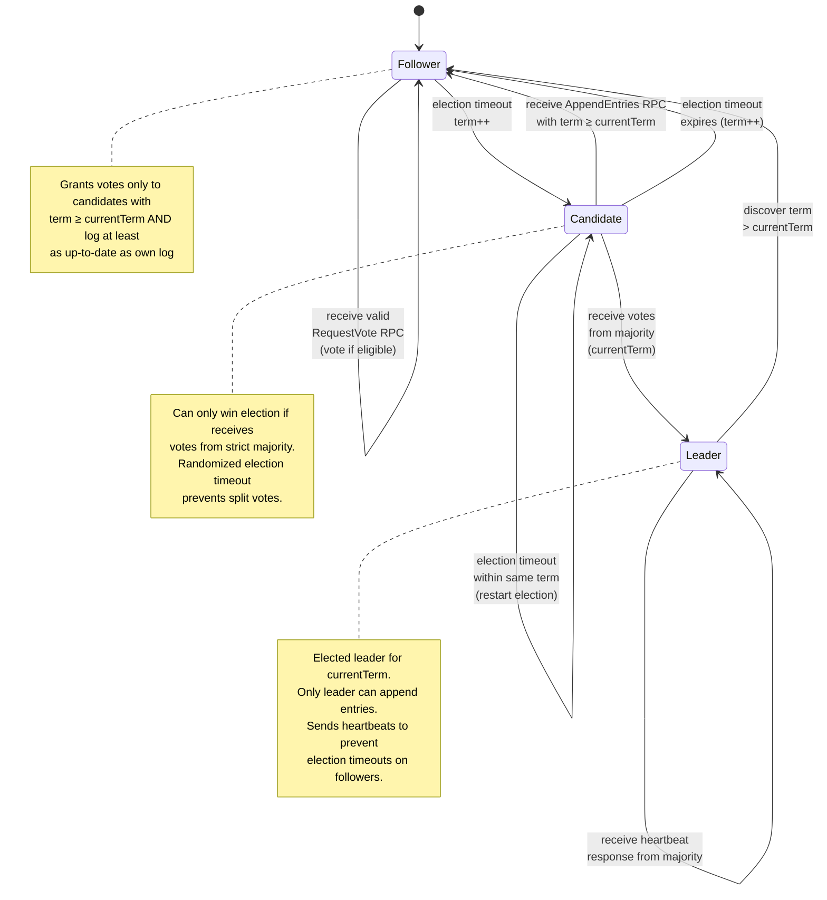

# Raft Server State Transitions & Role Changes

```mermaid
stateDiagram-v2
    [*] --> Follower
    
    Follower --> Candidate: election timeout<br/>term++
    Follower --> Follower: receive valid<br/>AppendEntries RPC<br/>from leader
    Follower --> Follower: receive valid<br/>RequestVote RPC<br/>(vote if eligible)
    
    Candidate --> Leader: receive votes<br/>from majority<br/>(currentTerm)
    Candidate --> Follower: receive AppendEntries RPC<br/>with term ≥ currentTerm
    Candidate --> Follower: election timeout<br/>expires (term++)
    Candidate --> Candidate: election timeout<br/>within same term<br/>(restart election)
    
    Leader --> Follower: discover term<br/>> currentTerm
    Leader --> Leader: append entries to log<br/>replicate to followers<br/>(normal operation)
    Leader --> Leader: receive heartbeat<br/>response from majority
    
    note right of Follower
        Grants votes only to candidates with
        term ≥ currentTerm AND log at least
        as up-to-date as own log
    end note
    
    note right of Candidate
        Can only win election if receives
        votes from strict majority.
        Randomized election timeout
        prevents split votes.
    end note
    
    note right of Leader
        Elected leader for currentTerm.
        Only leader can append entries.
        Sends heartbeats to prevent
        election timeouts on followers.
    end note
```
