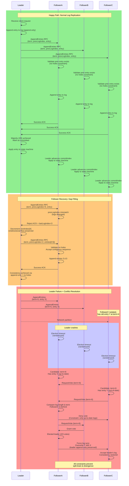

# Log Replication Protocol: Happy Path vs. Edge Cases

```mermaid
sequenceDiagram
    participant Leader
    participant FollowerA
    participant FollowerB
    participant FollowerC

    rect rgb(144, 238, 144)
    Note over Leader,FollowerC: Happy Path: Normal Log Replication
    Leader->>Leader: Receive client request
    Leader->>Leader: Append entry to log (append-only)
    Leader->>FollowerA: AppendEntries RPC<br/>(term, prevLogIndex, entry)
    Leader->>FollowerB: AppendEntries RPC<br/>(term, prevLogIndex, entry)
    Leader->>FollowerC: AppendEntries RPC<br/>(term, prevLogIndex, entry)
    FollowerA->>FollowerA: Validate prev entry exists<br/>(no holes constraint)
    FollowerB->>FollowerB: Validate prev entry exists<br/>(no holes constraint)
    FollowerC->>FollowerC: Validate prev entry exists<br/>(no holes constraint)
    FollowerA->>FollowerA: Append entry to log
    FollowerB->>FollowerB: Append entry to log
    FollowerC->>FollowerC: Append entry to log
    FollowerA->>Leader: Success ACK
    FollowerB->>Leader: Success ACK
    FollowerC->>Leader: Success ACK
    Leader->>Leader: Majority (3/5) achieved<br/>Mark as committed
    Leader->>Leader: Apply entry to state machine
    FollowerA->>FollowerA: Leader advances commitIndex<br/>Apply to state machine
    FollowerB->>FollowerB: Leader advances commitIndex<br/>Apply to state machine
    FollowerC->>FollowerC: Leader advances commitIndex<br/>Apply to state machine
    end

    rect rgb(255, 200, 124)
    Note over Leader,FollowerC: Follower Recovery: Gap Filling
    Leader->>FollowerA: AppendEntries RPC<br/>(term, prevLogIndex=5, entry)
    FollowerA->>FollowerA: prevLogIndex mismatch<br/>(logs diverged)
    FollowerA->>Leader: Reject ACK + lastLogIndex=3
    Leader->>Leader: Decrement nextIndex[A]<br/>Unidirectional flow preserved
    Leader->>FollowerA: AppendEntries RPC<br/>(term, prevLogIndex=2, entries[3:5])
    FollowerA->>FollowerA: Validate no holes<br/>Accept contiguous sequence
    FollowerA->>FollowerA: Append entries 3,4,5
    FollowerA->>Leader: Success ACK
    Leader->>Leader: Consistency achieved via<br/>append-only + no-holes
    end

    rect rgb(255, 150, 150)
    Note over Leader,FollowerC: Leader Failure + Conflict Resolution
    Leader->>FollowerA: AppendEntries<br/>(term=5, entry X)
    Leader->>FollowerB: AppendEntries<br/>(term=5, entry X)
    Note over FollowerC: FollowerC isolated,<br/>has old entry Y at term=4
    Leader--xFollowerC: Network partition
    rect rgb(200, 200, 255)
    Note over FollowerA,FollowerB: Leader crashes
    FollowerA->>FollowerA: Election timeout<br/>(randomized)
    FollowerB->>FollowerB: Election timeout<br/>(randomized)
    FollowerC->>FollowerC: Election timeout<br/>(randomized)
    end
    FollowerA->>FollowerA: Candidate: term=6<br/>Has entry X (up-to-date)
    FollowerB->>FollowerA: RequestVote (term=6)
    FollowerC->>FollowerC: Candidate: term=6<br/>Has entry Y (out-of-date)
    FollowerC->>FollowerA: RequestVote (term=6)
    FollowerA->>FollowerA: Compare log length & term<br/>FollowerC is behind
    FollowerA->>FollowerC: Deny vote<br/>(Constraint: only up-to-date logs)
    FollowerA->>FollowerB: RequestVote (term=6)
    FollowerB->>FollowerA: Grant vote
    FollowerA->>FollowerA: Elected leader (2/3 votes)
    FollowerA->>FollowerC: Force log sync<br/>Overwrite Y with X<br/>(leader append-only preserved)
    FollowerC->>FollowerC: Accept leader's log<br/>Consistency restored
    Note over FollowerA,FollowerC: All constraints prevent<br/>split-brain & divergence
    end
```
