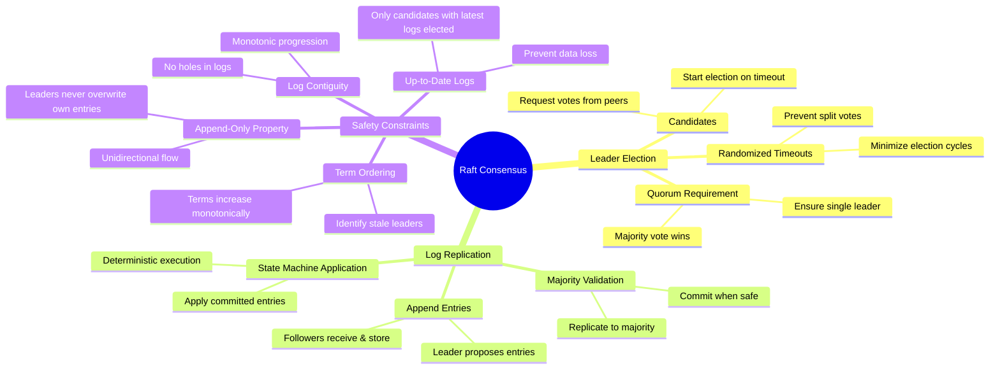

# Decomposition Hierarchy: Raft's Independent Subproblems

```mermaid
mindmap
  root((Raft Consensus))
    Leader Election
      Candidates
        Start election on timeout
        Request votes from peers
      Randomized Timeouts
        Prevent split votes
        Minimize election cycles
      Quorum Requirement
        Majority vote wins
        Ensure single leader
    Log Replication
      Append Entries
        Leader proposes entries
        Followers receive & store
      Majority Validation
        Replicate to majority
        Commit when safe
      State Machine Application
        Apply committed entries
        Deterministic execution
    Safety Constraints
      Log Contiguity
        No holes in logs
        Monotonic progression
      Append-Only Property
        Leaders never overwrite own entries
        Unidirectional flow
      Up-to-Date Logs
        Only candidates with latest logs elected
        Prevent data loss
      Term Ordering
        Terms increase monotonically
        Identify stale leaders
```
