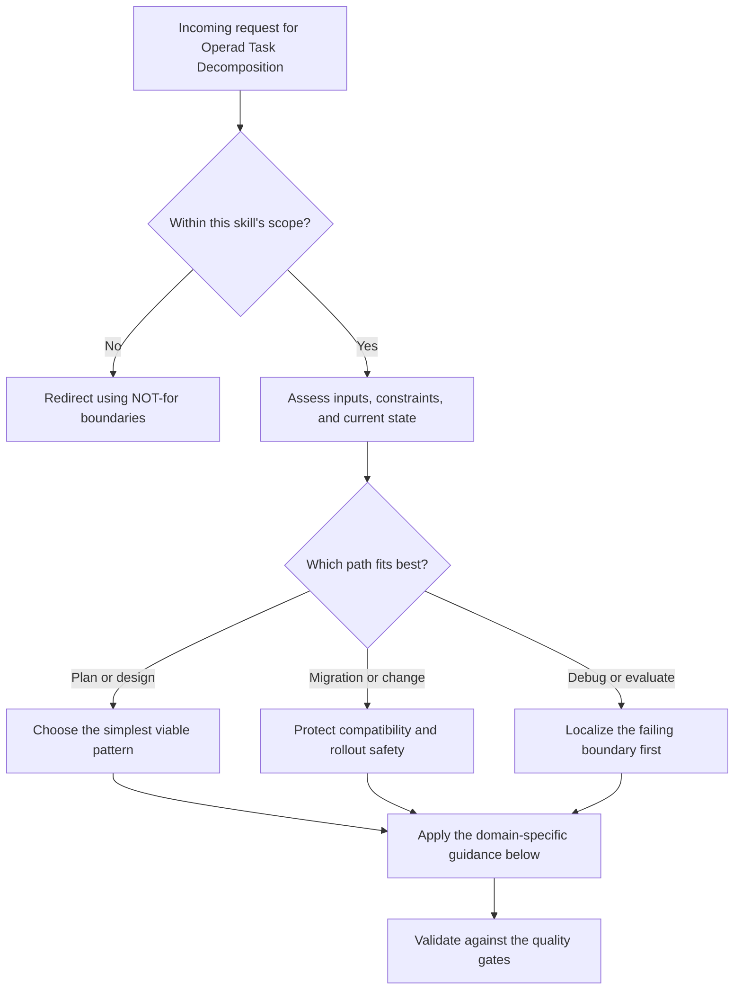

# Operad Task Decomposition

An operad formalizes "a complex thing decomposes into simpler things, and the decomposition itself composes." Each operation has typed inputs and a typed output. Composition is hierarchical: you can plug the output of one operation into the input of another, provided the types match. The composition laws (associativity and identity) guarantee that decomposition is well-defined regardless of the order you assemble the pieces.

This is the mathematical structure underlying DAG-of-agents architectures, WinDAGs, and any system where tasks decompose into subtasks with explicit interface contracts.

## Decision Points



Use this as the first-pass routing model:

- Confirm the request belongs in this skill before doing deeper work.
- Separate planning, migration, and debugging paths before choosing a solution.
- Prefer the simplest correct path that still survives the quality gates.


## When to Use

- Decomposing a complex task into subtasks for multi-agent execution
- Designing DAG topologies where nodes have typed inputs and outputs
- Validating that a task decomposition is well-typed (no interface mismatches)
- Building compositional agent workflows where subworkflows can be reused
- Reasoning about parallel vs. sequential execution (monoidal product vs. composition)
- Connecting task structure to olog-defined domain types
- Understanding why certain decompositions fail at integration boundaries

## NOT for

- General category theory education divorced from a real decomposition problem
- Creating individual agent skills or prompts rather than typed workflow structure
- Runtime DAG execution, queueing, or scheduling policy
- Output-quality grading that should happen after composition is already designed

---

## Core Mental Models

### 1. What Is an Operad?

An operad O consists of:
- A set of **types** (also called colors, or sorts)
- For each tuple of input types (t_1, ..., t_n) and output type t, a set of **operations** O(t_1, ..., t_n; t)
- A **composition rule**: if you have an operation f: (t_1, ..., t_n) --> t and operations g_i: (...) --> t_i for each input, you can compose them to get a single operation that takes all the g_i inputs and produces output t
- An **identity operation** id_t: (t) --> t for each type
- **Associativity**: composing in stages gives the same result regardless of grouping
- **Equivariance** (for symmetric operads): you can permute inputs

**In plain English:** An operad is a collection of "ways to combine things" where:
- Each combiner has typed input slots and a typed output
- You can nest combiners (plug one combiner's output into another's input slot)
- The order of nesting doesn't matter (associativity)
- There's a trivial combiner that does nothing (identity)

### 2. Task Decomposition as Operad Application

**The key insight:** A task decomposition IS an element of an operad.

Consider a task T that decomposes into subtasks S_1, S_2, S_3. This decomposition is an operation:

```
    decompose_T : (S_1_output, S_2_output, S_3_output) --> T_output
```

The operation says: "Given the results of subtasks S_1, S_2, and S_3, here is how to combine them into the result of task T."

Each subtask S_i may itself decompose further:

```
    decompose_S1 : (S_1a_output, S_1b_output) --> S_1_output
```

**Composition in the operad** gives you the full decomposition:

```
    decompose_T . (decompose_S1, id_S2, id_S3) :
        (S_1a_output, S_1b_output, S_2_output, S_3_output) --> T_output
```

**Associativity guarantees:** It doesn't matter whether you first decompose T into (S_1, S_2, S_3) and then decompose S_1 into (S_1a, S_1b), or whether you directly decompose T into (S_1a, S_1b, S_2, S_3). The result is the same.

**Why this matters for multi-agent systems:** Associativity means subtask delegation is safe. An agent can delegate a subtask to another agent, who further delegates, and the overall composition is correct as long as types match at every boundary.

### 3. Colored Operads for Typed Task Decomposition

A **colored operad** (also called a **multicategory**) is an operad where the types (colors) carry semantic meaning. In task decomposition:

- Types represent the kinds of artifacts that flow between agents
- An operation with input types (CodeReview, TestResults) and output type MergeDecision means: "given a code review and test results, produce a merge decision"
- Type mismatches are caught at design time, not runtime

**Type examples for an agent workflow:**

```
Types:
  ProblemDescription     -- natural language task specification
  DomainAnalysis         -- structured analysis of the problem domain
  DAGTopology            -- a validated directed acyclic graph of subtasks
  AgentOutput            -- raw output from a single agent execution
  QualityReport          -- evaluation of an agent's output
  SynthesizedResult      -- combined output from multiple agents
  FinalDeliverable       -- the completed, reviewed work product
```

**Typed operations:**

```
analyze : (ProblemDescription) --> DomainAnalysis
decompose : (DomainAnalysis) --> DAGTopology
execute_node : (ProblemDescription, DAGTopology) --> AgentOutput
evaluate : (AgentOutput, ProblemDescription) --> QualityReport
synthesize : (AgentOutput, AgentOutput, ...) --> SynthesizedResult
finalize : (SynthesizedResult, QualityReport) --> FinalDeliverable
```

**Type-checking a decomposition:** Before executing a DAG, verify that every edge's source type matches the target node's expected input type. This is a static check -- no agent needs to run. If types don't match, the decomposition is invalid and must be revised.

### 4. The Operad of Wiring Diagrams

Spivak's **operad of wiring diagrams** (2013) provides a visual and formal language for system composition:

- A **box** represents a system with typed input ports and typed output ports
- A **wiring diagram** connects output ports of inner boxes to input ports of other inner boxes (or to the outer box's output ports)
- The outer box's input ports feed into inner boxes
- Composition: you can replace any inner box with a wiring diagram of smaller boxes

```
    ┌──────────────────────────────────────┐
    │            Outer Box                 │
    │   ┌──────┐         ┌──────┐         │
    │   │ Box A │──out──>│ Box B │──out──>─┤──> final output
    │   └──────┘         └──────┘         │
    │       ^                              │
    ├──>────┘                              │
    │  input                               │
    └──────────────────────────────────────┘
```

**This IS the WinDAGs architecture:**
- Each box = an agent node in the DAG
- Each port = a typed input or output
- Wiring = edges in the DAG with type annotations
- Composition = replacing a node with a sub-DAG (hierarchical decomposition)

**The operad structure guarantees:** Any valid wiring diagram can be composed with any other valid wiring diagram (at matching ports), and the result is again a valid wiring diagram. This is the formal basis for "DAGs of DAGs" -- hierarchical agent orchestration.

### 5. The Monoidal Product for Parallelism

In an operad, the **monoidal product** (tensor product) models parallel execution:

```
    f : (A, B) --> C     -- sequential: f needs both A and B to produce C
    g : (D) --> E         -- independent operation

    f tensor g : (A, B, D) --> (C, E)  -- f and g run in parallel
```

**For DAG scheduling:**
- Operations that share NO input dependencies can be tensored (run in parallel)
- Operations with data dependencies must be composed (run sequentially)
- The wave-based execution model in DAG orchestrators is exactly the monoidal product applied per-wave: all nodes in a wave run in parallel (tensor), and waves execute sequentially (composition)

**Practical implication:** The operad structure tells you the MAXIMUM parallelism possible in a decomposition. If your DAG scheduler achieves less parallelism, it's leaving performance on the table. If it attempts more, it will produce type errors (using outputs before they're available).

### 6. Connection to Ologs

**Types in an operad can reference objects in an olog.** If you have an olog defining your domain (types = "a customer", "an order", "a product"), then the operad's colors can be the objects of that olog.

An operation in the operad like:

```
    process_order : (Customer, OrderDetails, InventoryStatus) --> FulfillmentPlan
```

has its input and output types grounded in the olog's type system. This means:
- The olog defines WHAT things exist in the domain
- The operad defines HOW tasks involving those things decompose
- Functors between ologs (problem equivalence) lift to natural transformations between operads (solution transfer)

---

## Decision Framework: Constructing an Operad from a Task Description

### Step 1: Identify the Types (Colors)

List every distinct kind of artifact that flows between agents or between stages of the task.

**Test:** Two artifacts have the same type if and only if they can be used interchangeably as input to any downstream operation. If artifact A can substitute for artifact B in every context, they have the same type. If there exists ANY operation that accepts A but not B, they have different types.

**Common mistake:** Too few types. Using "string" or "text" for everything defeats the purpose. Types should carry semantic meaning: "CodeReview" is different from "TestResults" even if both are strings.

### Step 2: Identify the Operations

For each task or subtask, specify:
- What types of inputs does it require?
- What type of output does it produce?
- Is the operation deterministic or nondeterministic?

```
Format: operation_name : (InputType1, InputType2, ...) --> OutputType
```

**Test for completeness:** Can you chain the operations to get from the initial input types to the final output type? If there's a gap (no operation produces a type that a downstream operation needs), you're missing an operation.

### Step 3: Define the Composition Rules

For each pair of operations where one's output type matches another's input type, verify that composition is well-defined:

- Does plugging operation A's output into operation B's input produce a meaningful result?
- Is the composition associative? (If A feeds B feeds C, does it matter whether you compute A-then-B first, or B-then-C first?)

**For deterministic operations:** Associativity is automatic.
**For nondeterministic operations (LLM calls):** Associativity is approximate. Document the degree of variability.

### Step 4: Identify Parallelism

Group operations by their data dependencies:
- Operations with NO shared inputs can be tensored (parallel)
- Operations where one's output feeds another's input must be composed (sequential)

This gives you the DAG topology:
```
Wave 1: {operations with only initial inputs}      -- all in parallel
Wave 2: {operations depending on Wave 1 outputs}   -- all in parallel
Wave 3: {operations depending on Wave 2 outputs}   -- all in parallel
...
Final:  {operation producing the final deliverable}
```

### Step 5: Validate the Operad

1. **Type consistency:** Every edge in the DAG has a source type that matches the target input type
2. **Completeness:** There exists a path (sequence of compositions) from initial inputs to final output
3. **No cycles:** The composition graph is acyclic (this is what makes it an operad application, not a general category)
4. **Identity check:** For every type t, the identity operation id_t exists and acts as expected (passing through without modification)
5. **Associativity check:** For any three composable operations, both groupings produce the same result

---

## Practical Implementation: Operads in TypeScript/JSON

Represent an operad for a task decomposition as a JSON schema:

```typescript
interface OperadType {
  name: string;
  description: string;
  schema?: object;  // JSON Schema for the type's instances
}

interface OperadOperation {
  name: string;
  inputs: { name: string; type: string }[];  // references OperadType.name
  output: { type: string };                   // references OperadType.name
  agent?: string;                             // which agent/skill executes this
  parallelizable_with?: string[];             // operations that can run in parallel
}

interface TaskOperad {
  types: OperadType[];
  operations: OperadOperation[];
  composition_order: string[][];  // waves: each inner array runs in parallel
}
```

**Example:**
```json
{
  "types": [
    { "name": "ProblemDescription", "description": "Natural language task spec" },
    { "name": "DomainAnalysis", "description": "Structured domain breakdown" },
    { "name": "CodePatch", "description": "A diff that modifies source code" },
    { "name": "TestResults", "description": "Pass/fail with coverage report" },
    { "name": "FinalDeliverable", "description": "Reviewed, tested code change" }
  ],
  "operations": [
    {
      "name": "analyze",
      "inputs": [{ "name": "problem", "type": "ProblemDescription" }],
      "output": { "type": "DomainAnalysis" },
      "agent": "windags-sensemaker"
    },
    {
      "name": "implement",
      "inputs": [
        { "name": "analysis", "type": "DomainAnalysis" },
        { "name": "problem", "type": "ProblemDescription" }
      ],
      "output": { "type": "CodePatch" },
      "agent": "code-architecture"
    },
    {
      "name": "test",
      "inputs": [{ "name": "patch", "type": "CodePatch" }],
      "output": { "type": "TestResults" },
      "agent": "test-automation-expert"
    },
    {
      "name": "finalize",
      "inputs": [
        { "name": "patch", "type": "CodePatch" },
        { "name": "tests", "type": "TestResults" }
      ],
      "output": { "type": "FinalDeliverable" },
      "agent": "windags-evaluator"
    }
  ],
  "composition_order": [
    ["analyze"],
    ["implement"],
    ["test"],
    ["finalize"]
  ]
}
```

**Type-checking algorithm:**
```
For each operation op in topological order:
  For each input (name, type) of op:
    Find the upstream operation that produces this type
    Verify it exists and appears in an earlier wave
    Verify the type names match exactly

If any check fails: INVALID decomposition. Report the type mismatch.
```

---

## Relationship to WinDAGs

The WinDAGs architecture is an instantiation of the operad of wiring diagrams:

| Operad Concept | WinDAGs Equivalent |
|---|---|
| Type (color) | Node output schema |
| Operation | Agent node with skill assignment |
| Composition | Edge connecting nodes |
| Identity | Pass-through node |
| Monoidal product | Wave (parallel execution group) |
| Wiring diagram | The DAG itself |
| Nested wiring diagram | Sub-DAG (hierarchical decomposition) |
| Associativity | "Decompose T into sub-DAGs, or directly into leaves -- same result" |

**The WinDAGs Decomposer agent is performing operad construction:** Given a problem description, it produces a wiring diagram (DAG topology) where each box (node) has typed inputs and outputs, and the wiring (edges) respects type compatibility.

**The WinDAGs Mutator is performing operad substitution:** When a node fails and the DAG needs restructuring, the mutator replaces an operation with a different operation of the same type signature, or decomposes it into sub-operations. The operad structure guarantees the replacement is type-safe.

---

## Failure Modes

Use the anti-pattern catalog below as the operational failure-mode checklist for this skill. During execution, explicitly look for these failure patterns before you ship a recommendation or implementation.


## Anti-Patterns

### The Untyped DAG
**Novice:** Builds a DAG where every edge carries "text" or "any". Nodes accept whatever the previous node produced. Type errors surface only at runtime when an agent receives input it can't process.
**Expert:** Every edge in a DAG should have a named, documented type. Type-checking is free (it's a static analysis) and catches integration errors before any agent runs. If you can't name the type, you don't understand the interface. Define a schema for each type.
**Timeline:** This is the default in most LLM-based agent frameworks. The cure is adding even minimal type annotations. Start with named string types; graduate to JSON schemas.

### The Megaoperation
**Novice:** A single operation takes 15 inputs and produces a complex output. The operation is a monolith that can't be decomposed further.
**Expert:** If an operation has more than 4-5 inputs, it almost certainly decomposes into sub-operations. Apply the operad composition recursively: find intermediate types that split the megaoperation into stages. Each stage should have 2-3 inputs. This mirrors the "small functions" principle in software engineering, but with formal type-theoretic backing.
**Timeline:** Common when the decomposer agent is given too little guidance about granularity. Fix by setting a max-inputs constraint on the decomposer.

### The Phantom Type
**Novice:** Defines types that no operation produces or consumes. The type exists in the schema but has no role in the decomposition.
**Expert:** Every type must appear as the output of at least one operation AND the input of at least one operation (except for initial input types and the final output type). Phantom types indicate either missing operations or over-specified type systems. Remove them or add the operations that connect them.
**Timeline:** Happens when copying type lists from ologs without checking which types participate in the task workflow.

### The Cycle Pretending to Be Composition
**Novice:** Creates a "decomposition" where operation A's output feeds B, and B's output feeds back to A. "It's iterative refinement!"
**Expert:** Operads are acyclic by construction. Iteration is NOT composition -- it's a fixed-point computation. Model iteration as a SEPARATE operation: iterate(f, convergence_criterion) that internally applies f repeatedly until convergence. The iterate operation itself has typed inputs and outputs and participates in the operad normally. The cycle lives INSIDE the iterate box, not in the operad's wiring.
**Timeline:** Very common in agent systems that do "revise until good." The fix is always to encapsulate the loop.

---

## Shibboleths

**"Operads are just DAGs"** -- No. A DAG is a graph. An operad is an algebraic structure with composition laws. The key difference: an operad tells you not just the topology but also the TYPE CONSTRAINTS at every connection point, and it guarantees that composition is associative. A DAG can have arbitrary, unchecked connections.

**"Why not just use function types?"** -- Operad operations are multi-input, single-output. Function types (in the lambda calculus sense) are single-input, single-output (you curry multi-input functions). The operad formalism avoids currying, which means the parallelism structure is explicit: if an operation takes (A, B, C), you know A, B, and C can be computed in parallel. With curried functions f: A -> B -> C -> D, the parallelism is hidden.

**"Associativity doesn't matter in practice"** -- It matters enormously for hierarchical delegation. If agent X decomposes a task and delegates subtask S to agent Y, who further decomposes S and delegates sub-subtask S' to agent Z, associativity guarantees that the overall result is the same as if X had directly decomposed to the leaf level. Without associativity, delegation introduces path-dependent bugs.

**"How is this different from a type system?"** -- An operad IS a type system, but one specifically designed for hierarchical composition. A general type system (like TypeScript's) lets you compose functions but doesn't distinguish between sequential and parallel composition. The operad's monoidal product makes parallelism a first-class citizen.

---

## Reference Files

When deeper detail is needed:

- **Fong, B. & Spivak, D.I. (2019).** *An Invitation to Applied Category Theory: Seven Sketches in Compositionality.* Cambridge University Press. Chapter 6 covers operads and wiring diagrams. The canonical accessible introduction.
- **Spivak, D.I. (2013).** "The operad of wiring diagrams: formalizing a graphical language for databases, recursion, and plug-and-play circuits." arXiv:1305.0297. -- The formal foundation for wiring diagram operads.
- **Vagner, D., Spivak, D.I., & Lerman, E. (2015).** "Algebras of open dynamical systems on the operad of wiring diagrams." Theory and Applications of Categories, 30(51). -- Extends wiring diagrams to dynamical systems; relevant for agents with internal state.
- **Spivak, D.I. (2014).** *Category Theory for the Sciences.* MIT Press. -- Broader context; Chapters 4-7 for ologs and functors that ground operad types.
- **Catlab.jl documentation.** algebraicjulia.org -- Implements operads computationally; useful for validation and enumeration.

---

## Worked Examples

- Minimal case: apply the simplest in-scope path to a small, low-risk request.
- Migration case: preserve compatibility while changing one constraint at a time.
- Failure-recovery case: show how to detect the wrong path and recover before final output.


## Quality Gates

You have a valid task operad when:

- [ ] Every type has a name, description, and (ideally) a JSON schema
- [ ] Every operation has explicitly typed inputs and a typed output
- [ ] No type mismatches exist at any composition boundary
- [ ] There exists a composition path from initial input types to the final output type
- [ ] The composition graph is acyclic
- [ ] Maximum parallelism is identified (operations in the same wave share no dependencies)
- [ ] Every type is produced by at least one operation and consumed by at least one operation (except initial/final types)
- [ ] No operation has more than 5 inputs (decompose further if so)
- [ ] Iterative/looping behaviors are encapsulated inside operations, not expressed as cycles in the operad
- [ ] The operad corresponds to a valid WinDAGs DAG topology (if applicable)
