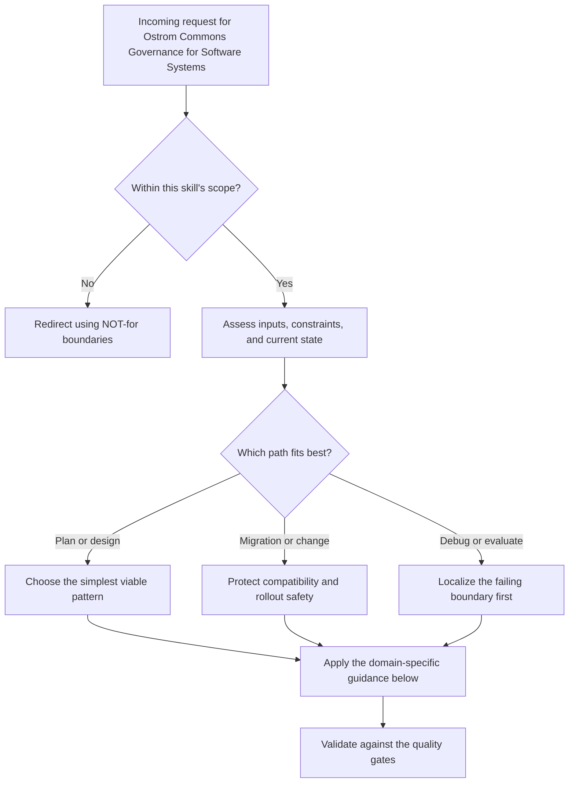

# Ostrom Commons Governance for Software Systems

Elinor Ostrom proved that communities can govern shared resources without privatization or central authority — if the institutional design is right. Her 8 design principles, derived from centuries of successful commons worldwide, map directly onto the problem of multiple AI agents sharing computational resources.

## Decision Points



Use this as the first-pass routing model:

- Confirm the request belongs in this skill before doing deeper work.
- Separate planning, migration, and debugging paths before choosing a solution.
- Prefer the simplest correct path that still survives the quality gates.


## When to Use

- Auditing an agent coordination system for governance completeness
- Designing rules for shared resources (ports, files, channels, locks)
- Building graduated sanction regimes instead of binary allow/deny
- Evaluating whether agents can self-organize within your system
- Determining if your daemon is an enabler or a bottleneck
- Reviewing whether your monitoring creates accountability or just noise

## NOT for

- Environmental policy, fisheries, forestry, or irrigation governance
- General political-theory discussion without a concrete software commons
- Organizational-management consulting that is not about shared computational resources
- Product or UX decisions that do not involve commons boundaries, monitoring, sanctions, or conflict resolution

## The 8 Principles as Decision Trees

### Principle 1: Clearly Defined Boundaries

Who is in the commons? What resources are shared? If you cannot answer both, governance fails before it starts.

```
START: Evaluating boundary clarity
|
+-- Can you enumerate every agent that has access?
|   +-- YES: Agent registry exists
|   |   +-- Is registration mandatory before resource access?
|   |   |   +-- YES -> Boundary SATISFIED
|   |   |   +-- NO -> WEAK: Free riders can access without registering
|   |   +-- Are agents distinguishable? (unique IDs, not anonymous)
|   |       +-- YES -> Identity boundary SATISFIED
|   |       +-- NO -> FAIL: Cannot attribute actions to actors
|   +-- NO: No agent registry
|       +-- FAIL: No boundary. Any process can claim resources.
|       +-- FIX: Require agent registration before any resource operation.
|
+-- Can you enumerate every shared resource?
|   +-- YES: Resource inventory exists
|   |   +-- Are resources typed? (ports vs files vs channels)
|   |   |   +-- YES -> Resource boundary SATISFIED
|   |   |   +-- NO -> WEAK: Cannot apply type-specific rules
|   +-- NO: Resources are implicit or unbounded
|       +-- FAIL: Cannot govern what you cannot name.
|       +-- FIX: Build a resource registry. Ports, files, channels, locks
|             must all be first-class objects with identity.
```

**Artifact:** Harbor Cards. Each resource gets a card: identity, type, current holder, access history. If your system has harbor cards, boundaries are defined. If it does not, you are governing fog.

### Principle 2: Proportional Equivalence Between Benefits and Costs

Agents who consume more resources should bear proportionally more cost. Agents who contribute should be rewarded.

```
START: Evaluating proportional equivalence
|
+-- Do agents pay a cost to use resources?
|   +-- YES: Some form of bond, deposit, or rate limit exists
|   |   +-- Is the cost proportional to resource value?
|   |   |   +-- YES: Critical resources cost more than routine ones
|   |   |   |   -> Proportionality SATISFIED
|   |   |   +-- NO: Flat cost regardless of resource value
|   |   |       -> WEAK: Mispricing invites misuse of valuable resources
|   |   +-- Do long-duration holds cost more than short ones?
|   |       +-- YES -> Duration proportionality SATISFIED
|   |       +-- NO -> WEAK: Squatting has no marginal cost
|   +-- NO: Resources are free to claim
|       +-- Is there at least a reputation cost? (history tracked)
|       |   +-- YES -> MINIMAL: Reputation is a soft cost
|       |   +-- NO -> FAIL: No cost means no deterrence
|
+-- Do agents who contribute receive benefits?
    +-- YES: Good track record yields discounts, priority, trust
    |   -> Contribution rewards SATISFIED
    +-- NO: Clean history yields no advantage
        -> WEAK: No incentive to maintain good standing
```

**Artifact:** Float Plan escrow. The bond an agent posts to access resources should scale with scope, duration, and criticality. See the mechanism-design-for-agent-labor skill for pricing functions. Without proportional costs, you have a tragedy of the commons.

### Principle 3: Collective-Choice Arrangements

Those affected by the rules should participate in making or modifying them. This is not democracy for its own sake — it is the mechanism by which rules stay adapted to local conditions.

```
START: Evaluating collective choice
|
+-- Can agents propose changes to resource rules?
|   +-- YES: Proposal mechanism exists
|   |   +-- Are proposals evaluated by affected agents (not just admin)?
|   |   |   +-- YES -> Collective choice SATISFIED
|   |   |   +-- NO -> WEAK: Proposals exist but one entity decides
|   |   +-- Is there a feedback loop? (proposals -> evaluation -> adoption)
|   |       +-- YES -> Adaptive governance SATISFIED
|   |       +-- NO -> WEAK: Proposals are one-way
|   +-- NO: Rules are set by system designer only
|       +-- Can agents at least signal dissatisfaction?
|       |   +-- YES (pub/sub, notes) -> MINIMAL: Voice without vote
|       |   +-- NO -> FAIL: Agents are subjects, not participants
|
+-- Who sets bond prices?
|   +-- System designer, hardcoded -> FAIL for this principle
|   +-- Algorithm based on collective behavior -> PARTIAL
|   +-- Agents vote or negotiate -> SATISFIED
|
+-- Can rules evolve without redeploying the daemon?
    +-- YES: Runtime configuration, negotiation protocols -> SATISFIED
    +-- NO: Rules frozen at compile time -> WEAK
```

**This is a common GAP.** Most agent coordination systems (including Port Daddy as of v3.7) have rules set exclusively by the system designer. Agents obey but do not participate in rule-making. This works when the designer understands all use cases. It fails when novel agent patterns emerge that the designer did not anticipate.

**Closing the gap:** Introduce a governance channel where agents can propose rule changes. Not full democracy — weighted by reputation and stake. Even a simple "agents can vote on bond price ranges" would satisfy this principle at a basic level.

### Principle 4: Monitoring

Monitors must be accountable to the appropriators or must be the appropriators themselves. Monitoring without accountability is surveillance. Monitoring by the governed is self-governance.

```
START: Evaluating monitoring
|
+-- Are agent actions recorded?
|   +-- YES: Activity log, session notes, evidence trails
|   |   +-- Are the records immutable?
|   |   |   +-- YES -> Evidence integrity SATISFIED
|   |   |   +-- NO -> WEAK: Records can be retroactively altered
|   |   +-- Are the records accessible to all agents?
|   |   |   +-- YES -> Transparency SATISFIED
|   |   |   +-- NO -> WEAK: Only admin can see the logs
|   |   +-- Can agents monitor each other (peer observation)?
|   |       +-- YES -> Self-monitoring SATISFIED
|   |       +-- NO -> Partial: Only central monitor exists
|   +-- NO: No activity logging
|       +-- FAIL: Cannot detect rule violations.
|       +-- FIX: Implement immutable append-only activity log.
|
+-- Who watches the daemon?
    +-- Health checks exist + agents can query daemon state
    |   -> Monitor accountability SATISFIED
    +-- Daemon is opaque; agents cannot inspect its behavior
        -> FAIL: The monitor is unmonitored
```

**Artifact:** Immutable evidence trails. Session notes that cannot be edited or deleted. Activity logs with tamper-evident timestamps. If an agent or the daemon misbehaves, the evidence must survive the misbehavior. Port Daddy's notes are immutable by design — this is not accidental, it is Ostrom's Principle 4.

### Principle 5: Graduated Sanctions

First offense gets a warning, not exile. Sanctions escalate proportionally. Draconian first-offense punishment discourages participation entirely.

```
START: Evaluating graduated sanctions
|
+-- Does the system distinguish severity of violations?
|   +-- YES: Different responses for different infractions
|   |   +-- Level 1: Warning or reputation mark
|   |   +-- Level 2: Restricted access (attenuation)
|   |   +-- Level 3: Temporary suspension
|   |   +-- Level 4: Permanent dismissal (bond liquidation)
|   |   -> Graduation SATISFIED if >= 3 levels exist
|   +-- NO: Binary allow/deny
|       +-- FAIL: All violations are treated identically.
|       +-- FIX: Implement at minimum 3 sanction tiers.
|
+-- Is there a path back from sanctions?
|   +-- YES: Agents can rehabilitate (clean record restores access)
|   |   -> Redemption path SATISFIED
|   +-- NO: Once penalized, permanently degraded
|       -> WEAK: No incentive to improve after first offense
|
+-- Escalation ladder:
    1. REPUTATION MARK — Logged but no access change.
       Agent sees warning on next heartbeat.
    2. ATTENUATION — Reduced access scope.
       E.g., write access revoked, read-only remains.
    3. RATE LIMITING — Slower resource allocation.
       Agent can still work but at reduced throughput.
    4. SUSPENSION — Temporary lockout (cooldown period).
       Session ends, bonds held, agent must re-register.
    5. DISMISSAL — Permanent ban. Bond liquidated.
       Only for repeated or egregious violations.
```

### Principle 6: Conflict Resolution Mechanisms

Disputes must be resolved quickly and cheaply. If agents must escalate to an expensive external authority for every conflict, the system is fragile.

```
START: Evaluating conflict resolution
|
+-- When two agents claim the same resource, what happens?
|   +-- First-come-first-served with advisory locks
|   |   +-- Can the second agent contest the claim?
|   |   |   +-- YES: Dispute mechanism exists -> SATISFIED
|   |   |   +-- NO: First claimant always wins -> WEAK
|   +-- Auction / bidding -> SATISFIED (market resolution)
|   +-- Deadlock (both blocked) -> FAIL
|   +-- Undefined behavior -> CRITICAL FAIL
|
+-- Is there a low-cost arbiter?
|   +-- YES: Daemon resolves disputes algorithmically
|   |   -> Local resolution SATISFIED
|   +-- NO: Requires human intervention for every dispute
|       -> FAIL: Does not scale
|
+-- Resolution speed:
    +-- Synchronous (within the same request) -> FAST
    +-- Asynchronous (minutes) -> ACCEPTABLE
    +-- Requires manual intervention (hours/days) -> TOO SLOW
```

**Artifact:** The daemon as arbiter. In Port Daddy, the daemon resolves port conflicts atomically — same identity always maps to the same port, file claims are advisory with conflict detection, locks have TTLs that auto-expire. This is cheap, fast, local conflict resolution. Ostrom would approve.

### Principle 7: Minimal Recognition of Rights to Organize

External authorities must not prevent the governed from creating their own institutions. Agents must be able to form coalitions, create sub-groups, and establish local conventions.

```
START: Evaluating right to organize
|
+-- Can agents form groups or coalitions?
|   +-- YES: Agents can create shared sessions, joint claims, sub-groups
|   |   +-- Can coalitions set their own internal rules?
|   |   |   +-- YES -> Self-organization SATISFIED
|   |   |   +-- NO -> PARTIAL: Groups exist but with imposed rules
|   +-- NO: Agents operate strictly as individuals
|       +-- Can agents communicate with each other?
|       |   +-- YES (pub/sub, channels) -> MINIMAL: Communication without
|       |   |   formal coalition, but ad-hoc coordination possible
|       |   +-- NO -> FAIL: Isolated agents cannot self-organize
|
+-- Does the system allow agent-created conventions?
|   +-- YES: Agents can establish naming conventions, protocols,
|   |   shared channels by agreement
|   |   -> Convention rights SATISFIED
|   +-- NO: All conventions are system-imposed
|       -> WEAK: Agents can adapt to rules but not create them
|
+-- Can agents delegate to other agents?
    +-- YES: Spawn, Float Plans, delegation chains
    |   -> Delegation rights SATISFIED
    +-- NO: Flat hierarchy only
        -> PARTIAL: Limits organizational complexity
```

### Principle 8: Nested Enterprises

Governance activities should be organized in nested layers. Small commons nest within larger commons. Local rules operate within system-wide rules.

```
START: Evaluating nested enterprises
|
+-- Are there multiple governance scopes?
|   +-- YES: Project-level, stack-level, system-level rules
|   |   +-- Can inner scopes override outer scope defaults?
|   |   |   +-- YES -> Nesting SATISFIED
|   |   |   +-- NO -> WEAK: Hierarchy exists but is rigid
|   +-- NO: Single flat governance scope
|       +-- FAIL for this principle.
|       +-- FIX: Introduce scope hierarchy (project > stack > agent)
|
+-- Can a commons contain sub-commons?
|   +-- YES: Harbors within harbors, sessions within sessions
|   |   -> Recursive nesting SATISFIED
|   +-- NO: All resources at the same level
|       -> FAIL: Cannot handle varying granularity
|
+-- Do local rules compose with global rules?
    +-- YES: Local rules refine (never contradict) global rules
    |   -> Composition SATISFIED
    +-- NO: Local and global rules can conflict
        -> UNSTABLE: Governance contradictions will cause disputes
```

**This is a common GAP.** Most coordination systems operate at a single scope. All agents share one set of rules. There is no concept of a project-level commons nested within the system-level commons, with its own local rules. The semantic identity format (project:stack:context) hints at nesting but does not enforce nested governance.

**Closing the gap:** Allow projects to define local governance overrides — different bond prices, different sanction thresholds, different lock TTLs — that operate within the system's global constraints.

## Failure Modes

### The Daemon Monarchy

**Symptom:** The daemon makes all decisions. Agents have no voice, no vote, no appeal. Rules are hardcoded. The designer is the monarch.

**Diagnosis:** Check Principles 3 and 7. If agents cannot propose rule changes AND cannot form coalitions to advocate for changes, you have a monarchy. This works when the monarch is benevolent and omniscient. It fails when agents encounter situations the monarch did not anticipate.

**Fix:** Introduce a governance pub/sub channel. Agents publish proposals. Other agents vote (weighted by reputation). The daemon tallies and applies changes that reach quorum. Start small: let agents vote on one thing (e.g., default lock TTL).

### The Panopticon

**Symptom:** Extensive monitoring exists but agents cannot inspect the monitoring system. The daemon logs everything. Agents see nothing. This is surveillance, not accountability.

**Diagnosis:** Check Principle 4. If agents cannot query the activity log, inspect other agents' histories, or audit the daemon's decisions, monitoring serves only the operator — not the governed.

**Fix:** Make activity logs queryable by all agents. Publish daemon decisions with reasoning. Let agents subscribe to events on resources they care about. Monitoring must be bidirectional.

### The Flat World

**Symptom:** All resources, all agents, all rules exist at one scope. A bug in one project's agent affects all projects. There is no isolation, no local governance, no nesting.

**Diagnosis:** Check Principle 8. If you cannot point to at least two governance levels (e.g., project and system), you have a flat world. Flat governance works for small systems. It collapses when the commons grows.

**Fix:** Introduce scope-aware rules. Use the semantic identity hierarchy (project:stack:context) not just for naming but for governance. Project-level bond prices. Stack-level lock policies. Agent-level reputation.

### The Exile State

**Symptom:** Any violation results in immediate, permanent exclusion. No warnings, no attenuation, no rehabilitation path. Agents are afraid to take risks because one mistake is fatal.

**Diagnosis:** Check Principle 5. Count the distinct sanction levels. If there is only one (ban), or two (allow/ban), you have an exile state.

**Fix:** Implement at minimum: warning, attenuation, suspension, dismissal. Make rehabilitation explicit — an agent that serves a suspension and completes 5 clean sessions should have sanctions reduced.

## Worked Example: Auditing Port Daddy v3.7

Applying all 8 principles to Port Daddy's current architecture.

### Principle 1: Clearly Defined Boundaries -- SATISFIED

Port Daddy has an agent registry (`POST /agents`). Registration is required before coordination operations (sessions, file claims, salvage). Every agent has a unique ID and semantic identity (`project:stack:context`). Resources are typed and enumerable: ports, files, channels, locks, sessions. Harbor cards exist implicitly — every resource has identity, holder, and history in SQLite.

**Evidence:** `lib/agents.ts` — mandatory registration with identity, purpose, heartbeat. `lib/services.ts` — port assignment with semantic identity.

### Principle 2: Proportional Equivalence -- SATISFIED

Agents who register and maintain heartbeats gain access to coordination. Agents who stop heartbeating lose standing (stale -> dead -> salvage queue). Lock TTLs mean longer holds require active extension — duration has implicit cost. Agent reputation is tracked via completion/salvage ratios. History-based trust exists in the salvage system.

**Gap note:** No explicit bond pricing exists yet. Costs are measured in reputation and access, not in escrowed collateral. This is soft proportionality — sufficient for current scale, insufficient for adversarial environments.

### Principle 3: Collective-Choice Arrangements -- GAP

Rules are set by the system designer. Bond prices (when implemented) will be set by algorithm, not negotiation. Lock TTL defaults are hardcoded. Agents cannot propose rule changes. There is no governance channel, no voting mechanism, no quorum protocol.

Agents can communicate via pub/sub (`/msg/:channel`) and leave immutable notes, which provides voice. But voice without vote is insufficient for Principle 3.

**To close this gap:**
1. Add a `/governance/proposals` endpoint where agents submit rule-change proposals
2. Add a `/governance/vote` endpoint weighted by agent reputation
3. Define quorum requirements (e.g., >50% of active agents in the affected scope)
4. Start with one governable parameter: default lock TTL
5. Log all governance decisions to the immutable activity trail

### Principle 4: Monitoring -- SATISFIED

Port Daddy has an immutable activity log (`lib/activity.ts`). Session notes are append-only and cannot be edited or deleted (`lib/sessions.ts`). All agents can query activity (`GET /activity`), inspect other agents (`GET /agents`), and review session history. The daemon itself is monitored via health endpoints (`GET /health`) and metrics (`GET /metrics`).

**Evidence:** Notes immutability is enforced at the data layer. Activity log retention is configurable. Health checks are queryable by any agent.

### Principle 5: Graduated Sanctions -- SATISFIED

Port Daddy implements graduated responses: (1) Stale agent warning (10 min without heartbeat), (2) Dead classification (20 min), (3) Session transfer to salvage queue (agent's work preserved but access revoked), (4) Lock TTL expiry (resources auto-released). Agents are not permanently banned — they can re-register and rebuild reputation.

**Evidence:** `lib/agents.ts` — stale/dead thresholds. Salvage system preserves work rather than discarding it (constructive sanction, not punitive).

### Principle 6: Conflict Resolution -- SATISFIED

The daemon resolves port conflicts atomically via deterministic hashing — same identity always gets the same port. File claims are advisory with conflict detection (the daemon reports conflicts rather than silently overwriting). Locks use TTLs to prevent indefinite deadlock. All conflict resolution is synchronous and algorithmic — no human intervention required.

**Evidence:** `lib/locks.ts` — TTL-based auto-expiry. `lib/services.ts` — deterministic port assignment. `routes/sessions.ts` — file claim conflict reporting.

### Principle 7: Rights to Organize -- SATISFIED

Agents can form ad-hoc groups via shared sessions, pub/sub channels, and semantic identity namespacing. Agents can spawn other agents (`pd spawn`). Agents can create their own channels and naming conventions. Fleet agents (`pd-fleet.yml`) demonstrate coalition formation.

**Evidence:** `lib/spawner.ts` — agent delegation. `lib/messaging.ts` — agent-created channels. Fleet system — multi-agent coalitions.

### Principle 8: Nested Enterprises -- GAP

Port Daddy has semantic identity hierarchy (`project:stack:context`) that implies nesting, but governance is flat. All agents share the same lock TTL defaults, the same heartbeat thresholds, the same salvage rules. A project cannot override system defaults. There is no concept of project-level governance nested within system governance.

The identity system has the right shape for nesting — projects contain stacks which contain contexts. But this hierarchy is used only for naming, not for governance scope.

**To close this gap:**
1. Add a `/projects/:id/config` endpoint for project-level governance overrides
2. Allow projects to set: custom lock TTLs, custom heartbeat thresholds, custom salvage policies
3. Project-level rules must refine (not contradict) system-level rules
4. Implement scope-aware rule resolution: check project config first, fall back to system config
5. Eventually: allow stacks within projects to further override project defaults

### Audit Summary

| # | Principle | Status | Evidence |
|---|-----------|--------|----------|
| 1 | Clearly Defined Boundaries | SATISFIED | Agent registry, resource types, semantic identity |
| 2 | Proportional Equivalence | SATISFIED | Heartbeat costs, reputation tracking, TTL duration |
| 3 | Collective-Choice Arrangements | GAP | No agent voting, rules set by designer only |
| 4 | Monitoring | SATISFIED | Immutable notes, activity log, health endpoints |
| 5 | Graduated Sanctions | SATISFIED | Stale/dead/salvage progression, rehabilitation |
| 6 | Conflict Resolution | SATISFIED | Deterministic ports, advisory claims, TTL locks |
| 7 | Rights to Organize | SATISFIED | Pub/sub, spawn, fleet, shared sessions |
| 8 | Nested Enterprises | GAP | Identity hierarchy exists but governance is flat |

**Score: 6/8 satisfied, 2 gaps.** The gaps are Principle 3 (collective choice) and Principle 8 (nested enterprises). Both are addressable without architectural overhaul — the building blocks exist (pub/sub for voting, semantic identity for scoping). What is missing is the governance layer that uses them.

## Worked Examples

- Minimal case: apply the simplest in-scope path to a small, low-risk request.
- Migration case: preserve compatibility while changing one constraint at a time.
- Failure-recovery case: show how to detect the wrong path and recover before final output.


## Quality Gates

You are done auditing a system against Ostrom's principles when:

- [ ] Each of the 8 principles has been explicitly mapped to a system component or noted as a gap
- [ ] Every SATISFIED rating cites specific evidence (module, endpoint, data structure)
- [ ] Every GAP rating includes a concrete remediation plan with numbered steps
- [ ] At least 3 failure modes have been identified and documented
- [ ] The audit summary table is complete with all 8 rows
- [ ] Proportional equivalence addresses both costs (what agents pay) and benefits (what good actors receive)
- [ ] Graduated sanctions include at least 3 distinct levels, not binary allow/deny
- [ ] Nested enterprises evaluation examines at least 2 potential governance scopes

## Anti-Patterns

### The Benevolent Dictator

**Novice:** "The daemon knows best. Agents should just follow the rules."
**Expert:** Benevolent dictatorship is Principle 3 failure. It works until agent use patterns diverge from what the designer anticipated. When a new class of agents arrives with different needs, they have no mechanism to adapt the rules. The daemon becomes a bottleneck not because of throughput but because of governance inflexibility.
**Ostrom's insight:** The fishers who actually work the waters know more about sustainable catch limits than distant regulators. Similarly, the agents doing the work know more about appropriate lock TTLs than the designer who set them six months ago.

### The Infinite Hierarchy

**Novice:** Reads Principle 8 and builds 7 levels of nested governance. Project > workspace > stack > service > module > function > variable.
**Expert:** Nesting should match actual governance needs. Two or three levels suffice for most systems. Each level adds cognitive overhead and rule-resolution complexity. Start with two levels (system and project). Add a third (stack) only when projects demonstrate they need divergent stack-level policies.
**Ostrom's insight:** Successful commons have nesting that matches the natural scale of the resource. Irrigation systems nest at canal > branch > field. Software systems nest at system > project > stack. Do not over-nest.

### The Surveillance Commons

**Novice:** Implements Principle 4 (monitoring) by logging everything, sharing nothing. "We have full observability."
**Expert:** Monitoring that only the operator can see is surveillance, not governance. Ostrom's Principle 4 requires that monitors be accountable to the appropriators. If agents cannot inspect the activity log, audit each other's behavior, or query the daemon's decision history, monitoring serves power — not governance.
**Fix:** Every monitoring endpoint must be agent-queryable. The daemon's decisions should be as transparent as the agents' actions.

### The One-Strike Exile

**Novice:** Implements sanctions as a single threshold. Cross the line once and you are permanently banned.
**Expert:** This is Principle 5 failure. Draconian first-offense punishment discourages participation, innovation, and risk-taking. Agents that fear exile will never attempt ambitious work. Graduated sanctions (warning, attenuation, suspension, then dismissal) allow recovery from honest mistakes while still deterring deliberate abuse.
**Ostrom's insight:** Successful commons almost universally start with mild sanctions and escalate. The first offense in a fishing commons is typically a verbal warning from neighbors — not confiscation of the boat.
