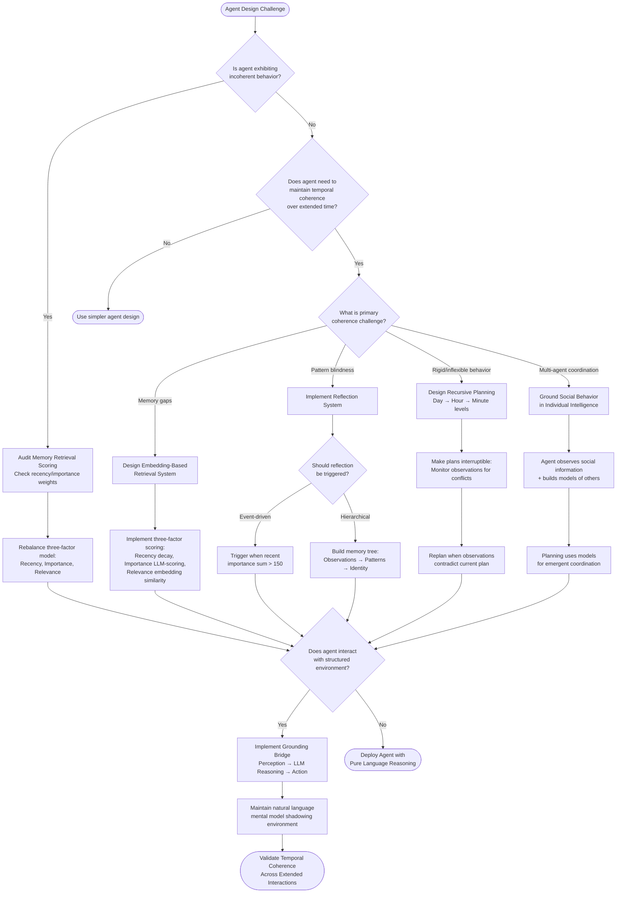

# Agent Coherence Decision Tree

```mermaid
flowchart TD
    Start([Agent Design Challenge]) --> Q1{Is agent exhibiting<br/>incoherent behavior?}
    
    Q1 -->|Yes| A1["Audit Memory Retrieval Scoring<br/>Check recency/importance weights"]
    A1 --> A1a["Rebalance three-factor model:<br/>Recency, Importance, Relevance"]
    
    Q1 -->|No| Q2{Does agent need to<br/>maintain temporal coherence<br/>over extended time?}
    
    Q2 -->|Yes| Q3{What is primary<br/>coherence challenge?}
    
    Q2 -->|No| End1([Use simpler agent design])
    
    Q3 -->|Memory gaps| A2["Design Embedding-Based<br/>Retrieval System"]
    A2 --> A2a["Implement three-factor scoring:<br/>Recency decay, Importance LLM-scoring,<br/>Relevance embedding similarity"]
    
    Q3 -->|Pattern blindness| A3["Implement Reflection System"]
    A3 --> Q4{Should reflection<br/>be triggered?}
    Q4 -->|Event-driven| A3a["Trigger when recent<br/>importance sum > 150"]
    Q4 -->|Hierarchical| A3b["Build memory tree:<br/>Observations → Patterns → Identity"]
    
    Q3 -->|Rigid/inflexible behavior| A4["Design Recursive Planning<br/>Day → Hour → Minute levels"]
    A4 --> A4a["Make plans interruptible:<br/>Monitor observations for conflicts"]
    A4a --> A4b["Replan when observations<br/>contradict current plan"]
    
    Q3 -->|Multi-agent coordination| A5["Ground Social Behavior<br/>in Individual Intelligence"]
    A5 --> A5a["Agent observes social information<br/>+ builds models of others"]
    A5a --> A5b["Planning uses models<br/>for emergent coordination"]
    
    A1a --> Q5{Does agent interact<br/>with structured environment?}
    A2a --> Q5
    A3a --> Q5
    A3b --> Q5
    A4b --> Q5
    A5b --> Q5
    
    Q5 -->|Yes| A6["Implement Grounding Bridge<br/>Perception → LLM Reasoning → Action"]
    A6 --> A6a["Maintain natural language<br/>mental model shadowing environment"]
    
    Q5 -->|No| End2([Deploy Agent with<br/>Pure Language Reasoning])
    
    A6a --> End3([Validate Temporal Coherence<br/>Across Extended Interactions])
```
