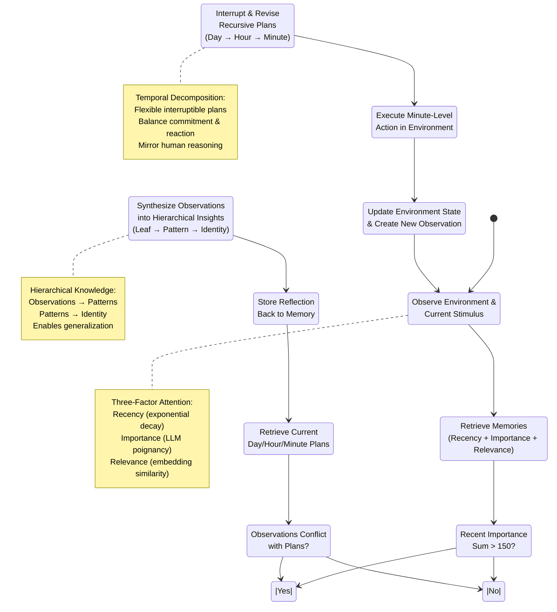

# Agent Behavior Loop: Memory-Reflection-Planning Cycle

```mermaid
stateDiagram-v2
    [*] --> Observe
    
    Observe: Observe Environment &<br/>Current Stimulus
    Observe --> RetrieveMemory
    
    RetrieveMemory: Retrieve Memories<br/>(Recency + Importance + Relevance)
    RetrieveMemory --> CheckReflectionThreshold
    
    CheckReflectionThreshold: Recent Importance<br/>Sum > 150?
    CheckReflectionThreshold -->|Yes| Reflect
    CheckReflectionThreshold -->|No| PlanCheck
    
    Reflect: Synthesize Observations<br/>into Hierarchical Insights<br/>(Leaf → Pattern → Identity)
    Reflect --> StoreReflection
    
    StoreReflection: Store Reflection<br/>Back to Memory
    StoreReflection --> PlanCheck
    
    PlanCheck: Retrieve Current<br/>Day/Hour/Minute Plans
    PlanCheck --> ConflictDetection
    
    ConflictDetection: Observations Conflict<br/>with Plans?
    ConflictDetection -->|Yes| Replan
    ConflictDetection -->|No| ExecuteAction
    
    Replan: Interrupt & Revise<br/>Recursive Plans<br/>(Day → Hour → Minute)
    Replan --> ExecuteAction
    
    ExecuteAction: Execute Minute-Level<br/>Action in Environment
    ExecuteAction --> UpdateEnvironment
    
    UpdateEnvironment: Update Environment State<br/>& Create New Observation
    UpdateEnvironment --> Observe
    
    note right of Observe
        Three-Factor Attention:
        Recency (exponential decay)
        Importance (LLM poignancy)
        Relevance (embedding similarity)
    end note
    
    note right of Reflect
        Hierarchical Knowledge:
        Observations → Patterns
        Patterns → Identity
        Enables generalization
    end note
    
    note right of Replan
        Temporal Decomposition:
        Flexible interruptible plans
        Balance commitment & reaction
        Mirror human reasoning
    end note
```
